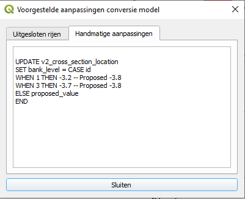
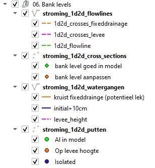

# Gebruikershandleiding

Deze pagina is bedoeld als handleiding om de HHNK Toolbox te gebruiken. 

Voor inhoudelijke uitleg van de tests, zie [Documentatie](tests_documentation.md)
Voor uitleg over de benodigde data, zie [Bron data](needed_data.md)
Voor uitleg over de interpretatie van resultaten, zie !!!

## Plugin overzicht


1. [Polder selecteren](#polder_selection_usage)
2. [Nieuw project aanmaken](#new_project_usage)
3. [Modelstaat aanpassen](#model_state_conversion_usage)
4. [Sqlite tests](#sqlite_tests_usage)
5. [0d1d tests](#0d1d_tests_usage)
6. [Bank levels](#bank_levels_test_usage)
7. [1d2d tests](#1d2d_tests_usage)

(polder_selection_usage)=
## 1. Polder selecteren

Selecteer een project map (zie [Standaard project indeling](tests_documentation.md) voor uitleg over de 
standaard indeling voor een project). Het is handig maar niet noodzakelijk om een project volgens de standaard indeling 
in te richten. De meeste functionaliteit van de plugin is alleen beschikbaar wanneer een project 
is geselecteerd.

(new_project_usage)=
## 2. Nieuw project aanmaken

Wanneer je op deze knop klikt open zich een nieuw venster:


Selecteer een map om het nieuwe project in aan te maken (veld 1). Geef het nieuwe project een naam (de conventie is om 
het project de naam van het gebied waar het model een weergave van is te geven) in veld 2.

Wanneer je op 'Project aanmaken' klikt wordt er een lege mappenstructuur aangemaakt volgens de standaard projectindeling 
(zie [project indeling](tests_documentation.md)). In de verschillende mappen worden ```readme``` files 
aangemaakt waarin staat welke files in welke map wordt gezocht.

Het resultaat ziet er als volgt uit:


(model_state_conversion_usage)=
## 3. Modelstaat aanpassen

Wanneer je op deze knop klikt open zich een nieuw venster:


1. Selecteer een model
   
2. Zodra een model is geselecteerd wordt de huidige staat gedetecteerd (zie 
   [Modelstaat aanpassen](tests_documentation.md)). Het is belangrijk dat de gedetecteerde staat 
   klopt.
3. Kies de staat om het model naar om te zetten
4. Deze sectie wordt beschikbaar als we bij 3 '1d2d toets' als nieuwe staat hebben geselecteerd. Er zijn twee opties 
   wanneer we het model omzetten naar de 1d2d toets staat: <br>
   4a. We can calculate the correct configuration from a 3di result 
   * 4a.1 <br>
     Bereken de 1d2d staat op basis van een 3di resultaat:
     Selecteer een 3d1 resultaat map (bevat een ```.nc``` en een ```.h5``` file). Dit resultaat wordt alleen gebruikt om 
     het rekengrid te bepalen. Het maakt dus niet uit of het resultaat een 0d1d of 1d2d som betreft.
       
    * 4a.2 <br>
    Selecteer de datachecker geodatabase die bij het model hoort. <br>
     
    4b. Je kunt er ook voor kiezen om een eerdere 1d2d staat te gebruiken voor het omzetten van het model, mits er een 
    backup beschikbaar is. Deze backup is ook beschikbaar als de ```bank levels``` al eerder zijn berekend.
   
Wanneer je op 'OK' klikt worden alle benodigde aanpassingen berekend en voorgelegd aan de gebruiker:


In sommige gevallen kunnen de nieuwe waarden handmatig worden aangepast. In sommige gevallen kunnen bepaalde rijen 
worden uitgesloten zodat ze niet worden meegenomen in het aanpassen van het model.

Controleer de voorgestelde aanpassingen en klik op 'Aanpassingen uitvoeren' om ze door te voeren. Als er handmatige 
aanpassingen zijn gedaan of er rijen zijn uitgesloten dan worden deze wijzigingen weergegeven zodat ze kunnen worden 
opgeslagen:



(sqlite_tests_usage)=
## 4. Sqlite tests

De sqlite tests zijn bedoeld om het model te controleren op (potentiële) fouten in de data en deze te corrigeren waar 
nodig. Na de sqlite tests is het model klaar om op te bouwen en om de 0d1d toets te draaien (zie 
[0d1d toets/Hydraulische toets](tests_documentation.md)). Voor de inhoudelijke uitleg van de tests, zie:
[Sqlite tests](tests_documentation.md)

Wanneer je op deze knop klikt open zich een nieuw venster:


1. Polder: alleen-lezen veld waarin de huidige project map wordt weergegeven
2. Output map: selecteer de map waar de resultaten in worden opgeslagen (hoeft geen bestaande map te zijn)
3. Model: selecteer een model (```*.sqlite```)
4. DEM: selecteer het DEM raster (```*.tif```)
5. Datachecker: selecteer datachecker output (```*.gdb```)
6. Channel surface from profiles: selecteer shapefile (```*.shp```)
7. HDB: selecteer HDB database (```*.gdb```)
8. DAMO: selecteer DAMO database (```*.gdb```)
9. Polder shapefile: selecteer polder shapefile (```*.shp```)
10. Data verificatie: selecteer tests
11. Eenmalige tests: selecteer tests

Klik op 'OK' om de tests te starten. De resultaten worden weergegeven als de tests uitgevoerd zijn:


1. De resultaten van sommige tests worden gevisualiseerd als ```QGIS``` lagen. Deze lagen worden toegevoegd aan het 
   ```layers panel``` in ```QGIS```. De bronnen voor deze lagen zijn ```geopackages (.gpkg)```. Deze files worden 
   automatisch aangemaakt en opgeslagen in de gekozen ```Output map```, in de ```Layers``` submap.
   
2. Een overzicht van de test resultaten wordt weergegeven in de ```Sqlite tests``` tab in de toolbox.

De test resultaten worden ook als ```.csv``` files in de gekozen ```Output map``` in de ```Logs``` submap.

(0d1d_tests_usage)=
## 5. 0d1d tests


De ```0d1d tests``` zijn bedoeld om de resultaten van de 
[0d1d toets/Hydraulische toets](tests_documentation.md) te analyseren.

1. Selecteer 3di resultaten map: map waarin de 0d1d/hydraulic 3di test resultaten per revisie staan opgeslagen
   
2. Selecteer 3di revisie: format is normaal gesproken {polder name}{revision number}{type of test} (map die 
   ```.nc``` en ```.h5``` files bevat).
   
3. Toont de geselecteerde revisie
4. Selecteer map om resultaten in op te slaan

Wanneer je op 'Begin tests' klikt word je gevraagd het 3di scenario te bevestigen. Het scenario moet overeenkomen met 
het 0d1d toets/hydraulische toets scenario om geldige resultaten te genereren. Als het scenario bevestigd is worden de 
tests gestart.


Resultaten van de tests worden als lagen toegevoegd aan ```QGIS```:


De bronnen voor deze lagen zijn ```geopackages (.gpkg)```. Deze files worden automatisch aangemaakt en opgeslagen in de 
gekozen ```Output map```, in de map met de naam van de geselecteerde ```revisie```, in de ```Layers``` submap. De test 
resultaten worden ook als ```.csv``` files in de gekozen ```Output map```, in de map met de naam van de geselecteerde 
```revisie```, in de ```Logs``` submap.

(bank_levels_test_usage)=
## 6. Bank levels test


Voor meer informatie over de inhoud van de test, zie: [Bank levels](tests_documentation.md)

1. Selecteer 3di resultaten map: map waarin de 0d1d/hydraulic 3di test resultaten per revisie staan opgeslagen
   
2. Selecteer 3di revisie: format is normaal gesproken {polder name}{revision number}{type of test} (map die 
   ```.nc``` en ```.h5``` files bevat).
   
3. Toont de geselecteerde revisie
4. Selecteer model (```*.sqlite```)
5. Selecteer datachecker output geodatabase (```.gdb```)
6. Selecteer map om resultaten in op te slaan

Klik op 'Begin tests' om de tests te starten. De bank levels test genereert voorgestelde aanpassingen aan het model, die 
aan de gebruiker worden voorgelegd:


Je kunt manholes deselecteren die je niet aan het model wil toevoegen. Waar nodig kun je de voorgestelde bank levels 
handmatig aanpassen. Klik op 'Aanpassingen uitvoeren' om de voorgestelde wijzigingen door te voeren. Als er handmatige 
aanpassingen zijn gemaakt of er rijen zijn uitgesloten, dan worden die wijzigingen weergegeven zodat de gebruiker ze 
kan opslaan.


Resultaten van de tests worden als lagen toegevoegd aan ```QGIS```:



De bronnen voor deze lagen zijn ```geopackages (.gpkg)```. Deze files worden automatisch aangemaakt en opgeslagen in de 
gekozen ```Output map```, in de ```Layers``` submap. De test resultaten worden ook als ```.csv``` files in de gekozen 
```Output map``` in de ```Logs``` submap.

(1d2d_tests_usage)=
## 7. 1d2d tests


De ```1d2d tests``` zijn bedoeld om de resultaten van de 
[1d2d toets](tests_documentation.md) te analyseren.

1. Selecteer 3di resultaten map: map waarin de 0d1d/hydraulic 3di test resultaten per revisie staan opgeslagen
   
2. Selecteer 3di revisie: format is normaal gesproken {polder name}{revision number}{type of test} (map die 
   ```.nc``` en ```.h5``` files bevat).
   
3. Toont de geselecteerde revisie
4. Selecteer DEM raster (```.tif```) 
5. Selecteer model (```.sqlite```)
6. Selecteer map om resultaten in op te slaan

Wanneer je op 'Begin tests' klikt word je gevraagd het 3di scenario te bevestigen. Het scenario moet overeenkomen met 
het 1d2d toets scenario om geldige resultaten te genereren. Als het scenario bevestigd is worden de 
tests gestart.


Resultaten van de tests worden als lagen toegevoegd aan ```QGIS```:


De bronnen voor deze lagen zijn ```geopackages (.gpkg)```. Deze files worden automatisch aangemaakt en opgeslagen in de 
gekozen ```Output map```, in de map met de naam van de geselecteerde ```revisie```, in de ```Layers``` submap. De test 
resultaten worden ook als ```.csv``` files in de gekozen ```Output map```, in de map met de naam van de geselecteerde 
```revisie```, in de ```Logs``` submap.
