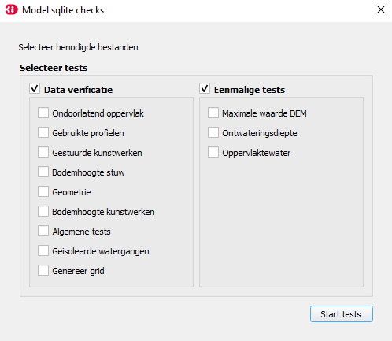

## **Sqlite checks**
 LN: *Nadat de modelbuilder feedback test is uitgevoerd, kunnen de sqlite testen worden uitgevoerd.*.
De sqlite testen zijn bedoeld om het model te controleren op (potentiële) fouten in de data en deze te corrigeren waar nodig. Na de sqlite testen is het model klaar om op te bouwen en om de 0d1d test te draaien (zie [0d1d test](4_0d1d_test.md)).

De sqlite testen bestaan uit negen data verificatie testen en drie eenmalige testen. 

### **Werkwijze HHNK 3Di plugin**
Wanneer in de 'main' van de HHNK toolbox de juiste modellen folder en polder zijn geselecteerd, kunnen de sqlite testen uitgevoerd worden. Volg onderstaande stappen:

1. Ga naar 'Checks' in de HHNK Toolbox
2. Kies voor 'Sqlite tests'
3. Selecteer in het Model sqlite check venster alle testen van ondoorlatend oppervlak tot en met oppervlaktewater. Zorg er ook voor dat data verificatie en eenmalige tests zelf zijn geselecteerd.
4. Klik op 'Start tests'
5. QGIS laadt vervolgens de resultaten in onder de sqlite checks in de HHNK toolbox en in 'Lagen'

 LN: *Hier hoort een foto waar alle testen zijn aangevinkt.*.

### **Uitkomsten van de test**

### **Beoordeling resultaten**
Voor iedere test moet nagegaan worden of de waarden in het model voldoen. Hieronder wordt uitgelegd waar je bij iedere test op moet letten.
#### Data verificatie testen
* Test 1: Ondoorlatend oppervlak

  Hier typen

* Test 2: Gebruikte profielen

  Hier typen 
  
* Test 3: Gestuurde kunstwerken 

  Hier typen

* Test 4: Bodemhoogste stuw

  Hier typen

* Test 5: Geometrie

  Hier typen 
  
* Test 6: Bodemhoogte kunstwerken 

  Hier typen

* Test 7: Algemene tests

  Hier typen

* Test 8: Geïsoleerde watergangen

  Hier typen 
  
* Test 9: Genereer grid

  Hier typen 

#### Eenmalige testen
De eenmalige tests zijn er om een aantal randvoorwaarden te controleren. Als geverifieerd is dat hieraan is voldaan, dan hoeven ze niet opnieuw te worden gedraaid.
* Test 1: Maximale waarde DEM

  Hier typen

* Test 2: Ontwateringsdiepte

  Hier typen 
  
* Test 3: Oppervlaktewater 

  Hier typen