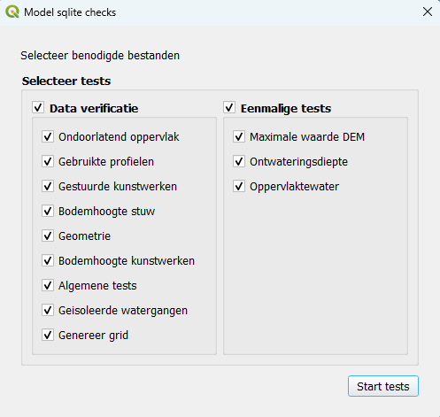
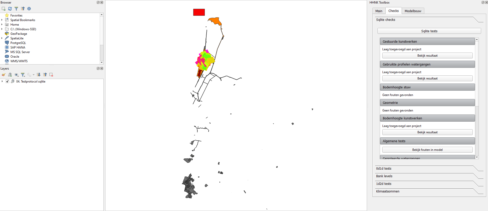

## **Sqlite checks**
Nadat de modelbuilder feedback test is uitgevoerd, kunnen de sqlite testen worden uitgevoerd. De sqlite testen zijn bedoeld om het model te controleren op (potentiële) fouten in de data en deze te corrigeren waar nodig. Na de sqlite testen is het model klaar om op te bouwen en om de 0d1d test te draaien (zie [0d1d test](4_0d1d_test.md)).

De sqlite testen bestaan uit negen data verificatie testen en drie eenmalige testen. 

### **Werkwijze HHNK 3Di plugin**
Wanneer in de 'main' van de HHNK toolbox de juiste modellen folder en polder zijn geselecteerd, kunnen de sqlite testen uitgevoerd worden. Volg onderstaande stappen:

1. Ga naar 'Checks' in de HHNK Toolbox.
2. Kies voor 'Sqlite tests'.


3. Selecteer in het Model sqlite check venster alle testen van ondoorlatend oppervlak tot en met oppervlaktewater. Zorg er ook voor dat data verificatie en eenmalige tests zelf zijn geselecteerd. Het 'Model sqlite checks' venster zou er dan zo uit moeten zien als op onderstaande afbeelding.



4. Klik op 'Start tests'.
5. QGIS laadt vervolgens de resultaten in onder de sqlite checks in de HHNK toolbox en in 'Lagen'.


### **Uitkomsten van de test**
De uitkomsten van de testen worden geladen in 'lagen', maar zijn ook zichtbaar aan de rechterzijde van het scherm bij 'sqlite checks' onder 'checks' in de HHNK toolbox. De uitkomsten van de testen kunnen er zo uit zien als op onderstaande afbeelding.


Onder 'Lagen' zijn verschillende groepen zichtbaar die elk één of meerdere kaarten laden als resultaat van een test. 
*   De eerste groep is de gebruikte profielen groep. Hier zijn de breedte en  diepte van de watergangen zichtbaar. Dit is het resultaat van de gebruikte profielen test.
* De tweede groep is de aereaal waterberging op streefpeil groep. Hierin wordt onder andere het verschil oppervlaktewater weergegeven wat het resultaat is van de oppervlaktewater test.
* De derde is een kaart die de resultaten van de geïsoleerde watergangen test weergeeft.
* De vierde is een kaart die de resultaten van de gestuurde kunstwerken test weergeeft.
* De vijfde is een kaart die de resultaten van de bodemhoogte kunstwerken test weergeeft.
* De zesde is een kaart die de resultaten van de bodemhoogte stuw test weergeeft.
* De zevende groep is de ontwateringdiepte kaart. Deze kaart geeft het resultaat van de ontwateringsdiepte test weer.

### **Beoordeling resultaten**
Voor iedere test moet nagegaan worden of de waarden in het model voldoen. Hieronder wordt uitgelegd waar je bij iedere test op moet letten.

#### Data verificatie testen

* Test 1: Ondoorlatend oppervlak

  Deze test berekent het oppervlak van de polder op basis van de ```polder_shapefile``` en het ondoorlatend oppervlak (impervious surface, 0d) in het model. Het resultaat is zichtbaar onder sqlite checks (in het rechter menu in het screenshot hierboven). Het verschil tussen de twee zou niet te groot moeten zijn. Bij de modelbuilder feedback zit een laag die ```impervious_surface_simple``` heet. Hierin kun je zien welk deel van de peilgebieden naar welke connection nodes zijn gegaan. Dit zou overeen moeten komen met de peilgebieden. Als dat niet zo is kun je zien waar je oppervlakte moet toevoegen in impervious surface lagen.
  

* Test 2: Gebruikte profielen

   Het resultaat van deze toets is een weergave van de breedtes en dieptes van watergangen in het model. Deze breedtes en dieptes kunnen gevonden worden onder sqlite checks in de HHNK toolbox. Via de 'visability presets' kies je voor *SQLight test: Verschil Oppervlaktewater*.
  
  De laag helpt bij visuele controle; hebben de watergangen in het model realistische breedte ten opzichte van de luchtfoto of de waterdelen uit de BGT. Wanneer dit niet zo is kunnen profielen aangepast worden. Zie ook hieronder beschreven bij 'Oppervlaktewater berging', een test waarin de berging per peilgebied te vergelijken is.
  
  Indien deze waardes niet voldoen, kunnen de breedtes van de watergangen aangepast worden in v2_cross_section_definition tabel. De dieptes van de watergangen kunnen aangepast worden in de v2_cross_section_location tabel door het reference level aan te passen. Let op dat wanneer er te weinig berging (het oppervlakte open water) in een peilgebied aanwezig is in de 1D channels en profielen, dit is aangevuld in de connection nodes. Dus wanneer de watergangen breder gemaakt worden, moet het corresponderende oppervlakte van het berging van de connection nodes afgetrokken worden.

  Onder 'Lagen' zijn de resultaten van deze test ook zichtbaar.
    
* Test 3: Gestuurde kunstwerken 

  Deze test selecteert alle gestuurde kunstwerken (uit de v2_culvert, v2_orifice en v2_weir tabellen van het model) op basis van de v2_control_table. Per kunstwerk worden actiewaarden opgevraagd. Per gevonden gestuurd kunstwerk wordt ook relevante informatie uit de HDB database toegevoegd, zoals het streefpeil en minimale en maximale kruinhoogtes. De resultaten van deze test kunnen gevonden worden onder sqlite checks in de HHNK toolbox. Hier kun je klikken op 'Bekijk resultaat' onder het kopje 'Gestuurde kunstwerken'. Er wordt dan een tabel geopend met de naam 'gestuurde_kunstwerken'. Hier moeten de waarden waarop een kunstwerk start met pompen (start_action_value), de minimale actie waarde van een kunstwerk (min_action_value), de maximale actie waarde van een kunstwerk (max_action_value) en het streefpeil gecontroleerd worden (hdb_streefpeil). Vergelijk deze met de werking van de kunstwerken volgens de gebiedsregeling.

  Onder 'Lagen' zijn de resultaten van deze test ook zichtbaar.

* Test 4: Bodemhoogte stuw

  Deze test vergelijkt de minimale kruinhoogte uit de sturingstabel met de aanliggende watergangen. De resultaten van deze test kunnen gevonden worden onder sqlite checks in de HHNK toolbox. Hier kun je klikken op 'Bekijk resultaat' onder het kopje 'Bodemhoogte stuw'. Als de bodemhoogte van de watergang hoger ligt dan de minimale kruinhoogte moet hier nog iets in worden aangepast door in de v2_cross_section_location tabel het reference_level aan te passen. Deze aanpassingen worden automatisch gegenereerd en ter goedkeuring aan de gebruiker voorgelegd. Deze voorgelegde aanpassingen kun je vinden onder sqlite checks in de HHNK toolbox als je klikt op 'Bekijk voorgestelde aanpassingen' bij het kopje 'Bodemhoogte stuw'. Deze aanpassingen kunnen goedgekeurd worden door te klikken op 'aanvaard aanpassingen'.

* Test 5: Geometrie

  Deze test controleert of de geometrie van een object in het model correspondeert met de start- of end node in de v2_connection_nodes tabel. Als de verkeerde id's worden gebruikt geeft dit fouten in het model. De resultaten van deze test kunnen gevonden worden onder sqlite checks in de HHNK toolbox. Hier kun je klikken op 'Bekijk resultaat' onder het kopje 'Geometrie'. Pas de ligging of de connection node id van de betreffende kunstwerken aan. Meestal ligt het kunstwerk omgekeerd, dat wil zeggen dat het beginpunt van de lijn op de connection node ligt die als eindpunt is aangegeven (en andersom). Dan is het makkelijker om de node id's van het kunstwerk aan te passen.
  
* Test 6: Bodemhoogte kunstwerken 

  Deze test controleert of de kruinhoogte of bodemhoogte van een kunstwerk hoger ligt dan de bodemhoogte van aanliggende watergangen. Als dit niet zo is moet dat worden aangepast om met het model te kunnen rekenen. De resultaten van deze test kunnen gevonden worden onder sqlite checks in de HHNK toolbox. Hier kun je klikken op 'Bekijk resultaat' onder het kopje 'Bodemhoogte kunstwerken'. Er wordt dan een tabel geopend met de naam 'bodemhoogte_kunstwerken' waarin alle gevallen worden getoond waar de kruinhoogte of bodemhoogte van een kunstwerk lager ligt dan de bodemhoogte van aanliggende watergangen. De kruinhoogte of bodemhoogte wordt weergegeven door de kolom 'struct_reference_level'. De bodemhoogte van de watergangen wordt weergegeven door de kolom 'cross_reference_level'. Aanpassingen kunnen gedaan worden in v2_culvert, v2_orrifice of v2_weir voor het aanpassen van de kruinhoogte of bodemhoogte van een kunstwerk en in v2_cross_section_definition voor een aanpassing in de bodemhoogte van de aanliggende watergang. Als elk van de aanliggende watergangen min of meer dezelfde bodemhoogte hebben is het aannemelijker dat de kruinhoogte van het kunstwerk fout is en dat deze dus moet worden verhoogd. Als één van de aanliggende watergangen een afwijkende bodemhoogte heeft van de andere aanliggende watergangen waardoor de kruinhoogte van het kunstwerk onder de desbetreffende bodemhoogte van de watergang komt te liggen, is het aannemelijker dat deze watergang een foute bodemhoogte heeft en moet deze worden aangepast.

* Test 7: Algemene tests

  De algemene tests is een collectie van checks op fouten die ervoor zorgen dat het model niet kan worden opgebouwd of waardoor er niet meer gerekend kan worden. De resultaten van deze test kunnen gevonden worden onder sqlite checks in de HHNK toolbox. Hier kun je klikken op 'Bekijk fouten in model' onder het kopje 'Algemene tests'. In het resultaat wordt onderscheid gemaakt tussen fouten en waarschuwingen. Fouten moeten worden opgelost, waarschuwingen zijn aandachtspunten. In de resultaten wordt omschreven wat het probleem is. Waar nodig kunnen de waardes worden aangepast door naar de bijbehorende tabel te gaan die wordt aangegeven in de table_name kolom.

* Test 8: Geïsoleerde watergangen

  Deze test bepaalt welk aandeel van watergangen geen verbinding heeft met het maaiveld (isolated). Het aandeel mag niet te groot zijn omdat neerslag de watergangen dan onvoldoende kan bereiken. De resultaten van deze test kunnen direct bij het kopje 'Geïsoleerde watergangen' onder de sqlite checks in the HHNK toolbox gevonden worden. Bekijk ook visueel welke watergangen isolated zijn via de v2_channels laag in het model. Klik rechts en selecteer bij stijlen ```calculation type``` voor een voorbeeld opmaak. 

#### Eenmalige testen
De eenmalige tests zijn er om een aantal randvoorwaarden te controleren. Als geverifieerd is dat hieraan is voldaan, dan hoeven ze niet opnieuw te worden gedraaid.
* Test 1: Maximale waarde DEM

  Als de maximale waarde in de DEM te hoog is, duidt dat meestal op een fout in het bestand (de nodata waarde is waarschijnlijk verkeerd ingevoerd). Deze test berekent deze maximale waarde. Deze maximale waarde kan direct bij het kopje 'Geïsoleerde watergangen' onder de sqlite checks in the HHNK toolbox gevonden worden. Als er bij staat 'voldoen aan de norm' dan hoeft er niks aangepast te worden. Als dat niet zo is...
  
  <span style="color:yellow"> WE: * @Jelle: foute nodata is toch meestal een heel groot negatief getal? Dan vind je die niet met de max denk ik. Ook toevoegen dat 10 meestal de max is omdat watergangen daarop worden dicht gesmeerd.*</span>

  <span style="color:yellow"> LN: @Wouter @Jelle *Wat staat er als er geen 'voldoet aan de norm staat', en hoe kan het dan aangepast worden?*</span> Er zit misschien een realisctisch bereik in de code. @Jelle weet jij dat?

* Test 2: Ontwateringsdiepte

  Deze test controleert of het initiële waterpeil per polder onder de maaiveldhoogte (DEM) ligt. Het initiële waterpeil moet onder het oppervlak liggen. Het resultaat van deze test kan gevonden worden onder 'Lagen'. Hier bevindt zich een kaart met de naam 'ontwateringsdiepte'. Deze kaart geeft aan of het peil boven het maaiveld ligt (rood), of het peil net onder het maaiveld ligt (oranje) of dat het peil ruim voldoende onder het maaiveld ligt (groen). Bij grote rode gebieden is het belangrijk om de peilgebiedenkaart te controleren. Als hier fouten in zitten is het verstandig het model opnieuw op te bouwen aangezien het streefpeil wordt gebruikt voor aannames voor kunstwerken en profielen.

  
* Test 3: Oppervlaktewater berging

  Deze test controleert per peilgebied het oppervlakte open water in het model ten opzichte van de waterdelen in de BGT.. Dit totaal is opgebouwd uit de ```storage_area``` uit de ```v2_connection_nodes``` tabel opgeteld bij het oppervlak van de watergangen (uitgelezen uit de ```channel_surface_from_profiles```) shapefile. Vervolgens worden de 
   totalen per peilgebied vergeleken met diezelfde totalen uit de DAMO database waterdelen (bron BGT). De resultaten geven een indicatie van over- of onderschatting van het oppervlakte open water in het model. De resultaten van deze test kunnen gevonden worden onder 'Lagen'. Hier bevindt zich een kaart met de naam 'Verschil oppervlaktewater' onder 'Areaal waterberging op streefpeil'. Ideaal gezien zouden de afwijking in tussen het model en de DAMO database zo klein mogelijk moeten zijn.  

   Deze test is goed samen te bekijken met de breedte van watergangen zoals hierboven beschreven onder 'Gebruikte profielen'. Bij grote verschillen kan dit aan incomplete waterdelen liggen of aan verkeerde profielen. Controleer de inputdata goed en bouw eventueel het model opnieuw op. Voor individuele plassen of meren die niet goed in het model zijn gekomen kan de storage area in enkele connection nodes worden opgehoogd.
