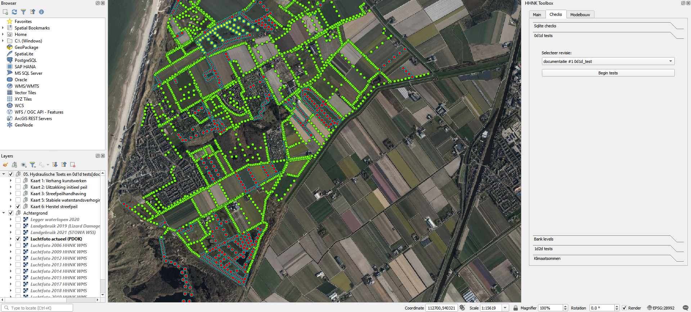

## **0d1d test**
Als de sqlite tests zijn uitgevoerd, eventueel aanpassingen zijn gemaakt en het model is opgebouwd voor rekenen met 3Di, is het tijd om de 0d1d test uit te voeren. Deze toets is een test bui ontworpen om het 1d watersysteem in het model te controleren. De test bui begint met een droge dag, vijf dagen neerslag gelijk aan de maalcapaciteit (in de meeste polders is dit 14,4 mm/dag) en dan twee dagen droog, zoals in onderstaande afbeelding is weergegeven. Deze bui is zo ontworpen dat we een aantal eigenschappen van het watersysteem kunnen toetsen:

- **streefpeil handhaving**: blijven waterpeilen constant tijdens de droge dag?
- **stationaire afvoer**: stabiliseert het peil en de afvoer na de 5 dagen neerslag?
- **herstel streefpeil**: herstelt het streefpeil na de natte periode?

### **Werkwijze HHNK 3Di plugin**
Om deze test uit te kunnen voeren, is een 0d1d model noodzakelijk. Indien er nog geen 0d1d model is gemaakt, kun je [hier](../../4_gebruik_plugin/c_modelstaat_aanpassen.md) lezen hoe een 0d1d model gemaakt kan worden. 

In de 0d1d modelstaat zitten alleen watergangen met de bijbehorende kunstwerken en aan de watergangen zijn afvoervlakken verbonden. Na het succesvol uploaden en aanmaken van het 3Di model kan via de [calculation gui](../../4_gebruik_plugin/d_berekeningen_uitvoeren.md) op de Jupyter notebook server de berekening worden gestart. Selecteer het juiste model en start de 0d1d test.

Download na de berekening de resultaten met de [download gui](../../4_gebruik_plugin/e_downloaden_resultaten.md). Kies voor raw output en grid administration en zorg dat de resultaten in de map 0d1d_results terecht komen.

Om het resultaat in de HHNK Toolbox te laden kies je onder checks voor 0d1d tests. Selecteer daaronder de revisie van de gemaakte berekening en klik op Begin tests. Er worden hiermee een aantal kaartlagen aan het project toegevoegd in een groep met de naam: *05. Hydraulische Toets en 0d1d tests [polder revisie model]*. De afbeelding hieronder geeft een beeld hoe dat eruit kan zien.

### **Uitkomsten van de test**
De 0d1d test genereert een aantal resultaten die inzicht geven in de werking van het systeem tijdens een stationaire bui. De 1d nodes uit het 3Di resultaat worden gefilterd en op vaste tijdstappen wordt de waterstand voor deze nodes uitgelezen. De tijdstappen zijn:
* Aan het begin van de som
* Aan het begin van de regen
* Een dag voor het einde van de regen
* Aan het einde van de regen
* Aan het einde van de som

Op basis van deze informatie worden de volgende waarden bepaald (in centimeters):
* Het verschil in waterstand tussen het begin van de som en het begin van de regen (uitzakking initieel peil). Dit wordt gedaan om te controleren of het model 'lek' is.
* Het verschil in waterstand tussen het begin van de regen en het einde van de regen (streefpeilhandhaving). Dit wordt gedaan om te controleren of berekende peilstijgingen acceptabel zijn in relatie tot drooglegging.
* Het verschil in waterstand tussen het einde van de regen en een dag daarvoor (stabiele waterstandsverhoging einde regen). Dit wordt gedaan om te controleren of het systeem zich in een stationaire situatie bevindt.
* Het verschil in waterstand tussen het einde van de regen en het einde van de som (herstel streefpeil). Dit wordt gedaan om te controleren of het watersysteem weer terug gaat naar het streefpeil.

* Hydraulische test (verhang kunstwerken)
In deze test worden eveneens de 1d nodes uit het 3Di resultaat gefilterd. Voor kunstwerken en watergangen corresponderend met deze nodes worden de waterstanden aan het begin en einde van het scenario uitgelezen. Voor deze watergangen en kunstwerken wordt het volgende bepaald:
  
    * Het debiet in m3/s (q)
    * Het verhang (cm/km)
    * De stroomsnelheid in m/s (u)
    * De stroomrichting

 BvL: @WE/JK klopt het dat alleen het verhang wordt weergegeven in de resultaten en kaart? 

### **Beoordeling resultaten**
De resultaten die de 0d1d tests genereert, moeten beoordeeld worden om te bevestigen dat het model naar behoren werkt. Hieronder wordt per onderdeel beschreven wat realistische waarden/uitkomsten zouden moeten zijn. 

* Het verschil in waterstand tussen het begin van de som en het begin van de regen (uitzakking initieel peil) 
*De waterstand zou tot aan het begin van de neerslagsituatie niet moeten uitzakken. Indien de waterstand zakt, zit er mogelijk een lek in het model. Dit zou een gemaal met een verkeerd aanslagpeil kunnen zijn of een stuw op de grens met een ander peilgebied staat te laag, waardoor het naar een ander peilgebied 'lekt'*  
* Het verschil in waterstand tussen het begin van de regen en het einde van de regen (streefpeilhandhaving) 
*Gedurende de neerslagsituatie is het normaal dat de waterstand in de watergangen stijgt. Tot 25 cm stijging is een acceptabele waarde. Daarnaast hangt het van de grondslag af of een bepaalde peilstijging acceptabel is. In veengebieden kunnen peilstijgingen groter dan 25 cm al voor problemen zorgen, terwijl in zandgebieden grotere peilstijgingen (>25 cm) zonder directe overlast mogelijk zijn.*
* Het verschil in waterstand tussen het einde van de regen en een dag daarvoor (stabiele waterstandsverhoging einde regen) 
*In de laatste dag van de neerslagsituatie zou de waterstand niet meer verder moeten stijgen, omdat er een stationaire situatie is bereikt. Als de waterstand niet stabiel is  BvL: @WE/JK kunnen jullie dit aanvullen?*
* Het verschil in waterstand tussen het einde van de regen en het einde van de som (herstel streefpeil) 
*In de laatste dag van de simulatie, waar geen regen meer valt, zou de waterstand weer moeten zakken naar het streefpeil (of mogelijk nog wat lager door de afslagpeilen van de gemalen). Wanneer de waterstand nog meer dan 2 cm boven het streefpeil ligt, zit er mogelijk een fout in het model. Dit kan dan gaan over verkeerde hoogtes van stuwen, waardoor het water niet meer kan wegstromen of  BvL: @WE/JK kunnen jullie dit aanvullen?*

Om te beoordelen of het watersysteem hydraulisch functioneert, is hieronder per onderdeel beschreven welke waarden/uitkomsten per onderdeel realistisch zijn
* Het debiet in m3/s (q) 
* BvL: Wouter of Jelle toelichting *
* Het verhang (cm/km) 
*Het verhang in een correct gedimensioneerde watergang ligt onder de 4 cm/km. Zodra het verhang boven de 4 cm/km ligt, is bijvoorbeeld de watergang (te) krap gedimensioneerd of de gemaalcapaciteit (te) laag.*
* De stroomsnelheid in m/s (u) 
* BvL: Wouter of Jelle toelichting *
* De stroomrichting 
* BvL: Wouter of Jelle toelichting *

Als er voldoende vertrouwen in de uitkomsten van het model is, kun je naar de [Banklevel test](5_banklevel_test.md).

 WE: *Wie keurt dit model goed? Beschrijf ook de werkwijze voor de watersysteemanalyse, in dit geval overleg met watersysteemadviseurs en gebiedsbeheerders* * BvL: Wouter kun jij dit zelf beantwoorden?*
