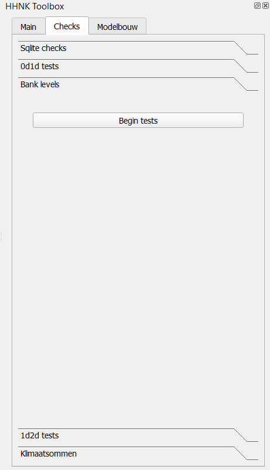
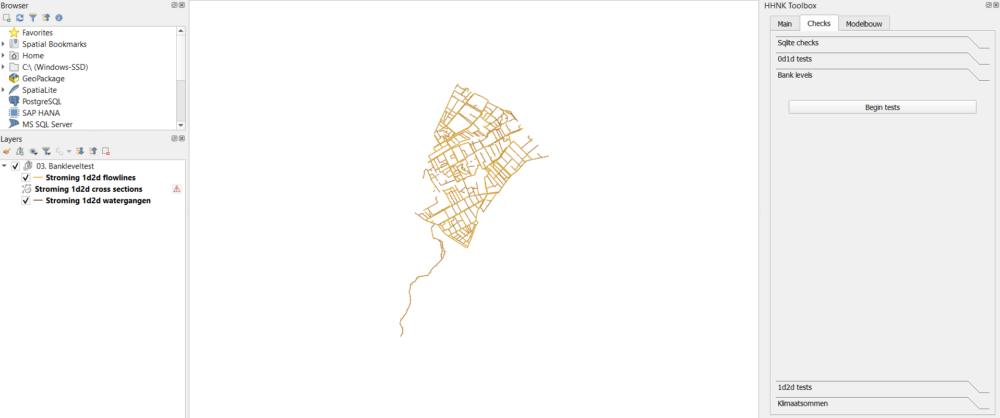

## **Banklevel test**
Als het 0d1d model is goedgekeurd (zie [0d1d test](../../2_werkwijze_bwn/e_model_controleren_verbeteren/4_0d1d_test.md)),
kan deze test worden gedraaid. De bank levels test is grotendeels bedoeld om het model klaar te maken voor 3Di simulaties waarbij uitwisseling plaatsvindt tussen het watersysteem (1d) en het maaiveld (2d). Als deze test is voltooid kan de [1d2d test](../../2_werkwijze_bwn/e_model_controleren_verbeteren/6_1d2d_test.md) worden uitgevoerd.

In de Bankleveltest wordt gecontroleerd of de bank levels hoog genoeg liggen. Dit is noodzakelijk omdat 1d2d verbindingen niet kijken naar de hoogte van de levee maar naar de hoogte van de banklevel. Als de bank levels van de channels lager liggen ontstaat lekkage over de peilgrenzen heen.

Er kunnen zich drie situaties voor doen;
*   De eerste situatie die voor kan komen is dat de 1d2d verbinding een levee verbinding kruist. In dit geval krijgt de banklevel de hoogte van de grootste levee hoogte binnen 40 meter. In dit geval wordt er ook voorgesteld hier een manhole aan toe te voegen met een drain level gelijk aan de levee hoogte.

* De tweede situatie die zich voor kan doen is dat een 1d2d verbinding kruist met een fixeddrainagelevelarea. In dit geval is de banklevel gelijk aan het streefpeil + 10cm. Het streefpeil wordt bepaald aan de hand van de ```connection_node_start_id``` die correspondeert met de watergang.

* De derde situatie die zich voor kan doen is dat er geen 1d2d verbinding kruist met een levee of fixeddrainagelevelarea. De banklevel is in dit geval ook gelijk aan het streefpeil + 10cm. Het streefpeil wordt hier op dezelfde manier bepaald als in de tweede situatie.

### **Werkwijze HHNK 3Di plugin**
Het draaien van de bank levels test kan worden gedaan met elk 3Di resultaat zolang het rekengrid niet is veranderd. De inhoud van het scenario is hierbij niet relevant.

Wanneer in de 'main' van de HHNK toolbox de juiste modellen folder en polder zijn geselecteerd, kunnen de sqlite testen uitgevoerd worden. Volg onderstaande stappen:

1. Ga naar 'Checks' in de HHNK Toolbox.
2. Kies voor 'Bank levels' en klik op 'Begin tests'.

 

3. QGIS laadt vervolgens de resultaten in 'Lagen' als 03.Bankleveltest.



### **Uitkomsten van de test**
Als uitkomst van deze test worden drie groepen ingeladen. 
* De eerste groep heet 'Stroming 1d2d flowlines' en geeft de stromingen tussen het maaiveld en de watergangen weer. In de attributen tabel van deze groep kan in de kolom type gezien worden of de 1d2d verbinding een levee kruist of niet. In het geval dat de 1d2d verbinding een levee kruist kan de levee hoogte gezien worden in de kolom 'levee_height'.
* De tweede groep heet 'Stroming 1d2d cross sections' en geeft de stroming op de kruisingen tussen het maaiveld en de watergangen weer.
* De derde groep heet 'Stroming 1d2d watergangen' en geeft de watergangen weer. In de attributentabel van deze groep kan in de kolom 'bank_level_source' gezien worden of dat de banklevel gelijk wordt aan het streefpeil + 10cm of dat de banklevel de hoogte van de grootste levee hoogte binnen 40 meter krijgt afhankelijk van het kruisen van een 1d2d verbinding met een levee of niet. De nieuwe banklevel kan gezien worden in de kolom new_bank_level. 

### **Beoordeling resultaten**
Oranje stippen en ruiten zijn voorgestelde veranderingen die nog niet in de sqlite staan. De stippen zijn manholes die toegevoegd worden. Inzoomen geeft weer waarom er een manhole toegevoegd wordt. De ruiten zijn de cross section locations die een nieuwe banklevel krijgen. De labeling geeft aan hoeveel meter de banklevel verandert. In dit voorbeeld dus vier keer 0.98m lagere banklevel. Oranje lijnelementen zijn plekken waar er wel een kruising is met een fixeddrainagelevelarea maar niet met een levee. Controleer hier of het terecht is dat de banklevel op streefpeil + 10cm gezet moet worden of juist hoger wilt hebben. Deze specifieke aanpassing is geen scripting voor. 

Als je geen manholes wilt op bepaalde connection nodes, maak dan een lijst aan van de connection node id's. Deze kunnen meegegeven worden in het script zodat ze overgeslagen worden.  