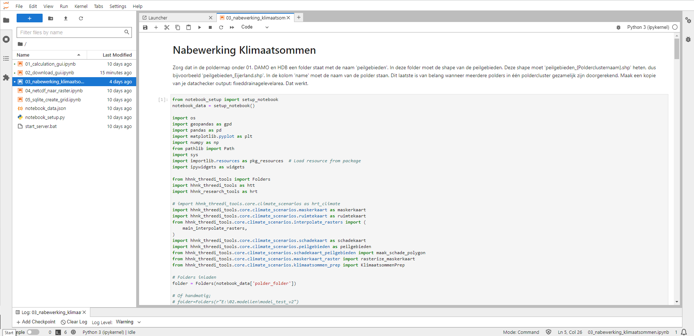
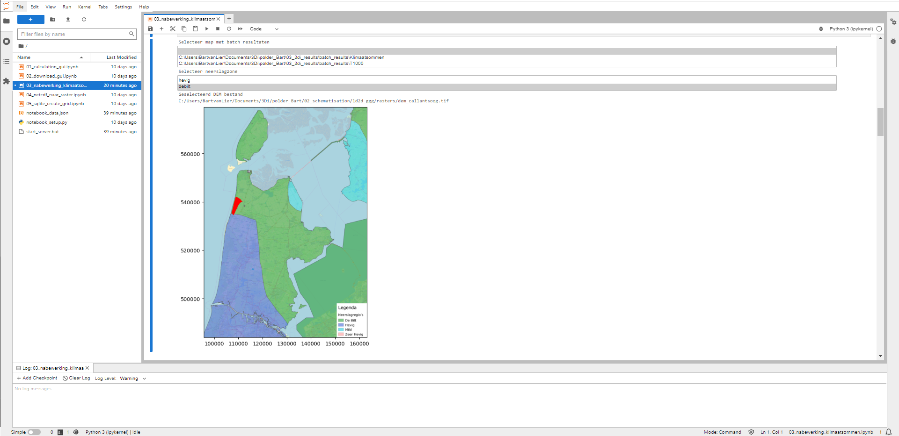

## **Werkwijze HHNK 3Di plugin**
Als alle testen succesvol zijn afgerond, kunnen de klimaatsommen gesimuleerd worden. Voor meer informatie over de klimaatsommen, klik [hier](../../3_achtergronden_en_uitgangspunten/g_klimaatsommen/1_klimaatsommen.md).

### **Werkwijze HHNK 3Di plugin**
Voor het simuleren van de klimaatsommen, is het noodzakelijk om tenminste een GLG, GGG of GHG model te hebben. Indien deze niet aanwezig is/zijn, kun je via [hier](../../4_gebruik_plugin/c_modelstaat_aanpassen.md) meer informatie over het genereren van modellen met verschillende grondwater condities lezen.

Zodra er een of meerdere modellen met grondwaterconditie gemaakt zijn, kunnen via de [calculation gui](../../4_gebruik_plugin/d_berekeningen_uitvoeren.md) de klimaatsommen gestart worden. Klimaatsommen zijn alleen via de batch calculation te draaien.

De resultaten zijn vervolgens via de [download gui](../../4_gebruik_plugin/e_downloaden_resultaten.md) te downloaden. 

Na het downloaden van de restultaten moeten nog een aantal nabewerkingen worden gedaan om de kaarten in de plugin te laden. Dit gebeurt ook via het notebook. Kies in het notebook voor ``03_nabewerking_klimaatsommen``. Dit geeft het onderstaande scherm:

 BvL: tekst onder nabewerking klimaatsommen niet meer up to date? Ik kan de map 01. DAMO en HDB niet vinden. 01_source_data wel. 

1. Gebruik ctrl + enter om het veld onder ``Nabewerking Klimaatsommen`` te doorlopen. 
2. De volgende stap bevindt zich onder ``Selectie neerslagzone en dem``. Draai het veld met ctrl + enter. Dit levert het een plaatje op met de ligging van de polder in het beheergebied:

    
    Kies bij ``Selecteer een map met batch resultaten`` de map waar de downoalds zijn weggeschreven.
    Kies bij ``Selecteer een neerslagzone`` de neerslagzone die je wil gebruiken. In bovenstaand afbeelding is de keuze tussen twee zones, omdat het modelgebied in twee zones valt. Kies in dergelijke geval voor de zone waar het grootste deel van de polder in valt.
3. Stap 3 gaat over het lokaliseren van de polder folder. Run het veld  met ctrl + enter.  
*Bij deze stap is het belangrijk dat alle folders goed staan. Als de resultaten in een folder in een andere map staat of als het notebook vanuit een ander model wordt geopend dan welke je wil analyseren, zal een foutmelding ontstaan.*
4. Draai de 4de stap middels ctrl + enter. Deze stap zet input klaar voor volgende stappen. Het duurt een tijd voordat deze stap doorlopen is.  
*Het klaarzetten van de input kan alleen via de server van HHNK plaatsvinden.*
5. 

### **Uitkomsten van de test**

 BvL: 

