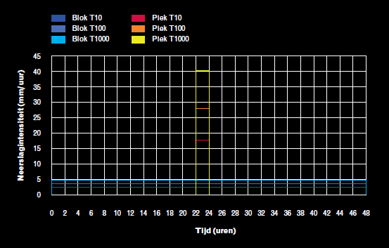

## **Klimaatsommen**
De gevolgen van klimaatverandering worden steeds beter merkbaar. Onder andere in de vorm van hevigere (piek) en/of langdurige (blok) neerslagsituaties. Om de gevolgen van deze neerslagevenementen in beeld te brengen, worden een aantal scenario's met verschillende herhalingstijden doorgerekend. De drie herhalingstijden die gesimuleerd kunnen worden zijn:

1. T10 (neerslagsituatie die zich statistisch gezien 1x in de 10 jaar voordoet)
2. T100 (neerslagsituatie die zich statistisch gezien 1x in de 100 jaar voordoet)
3. T1000 (neerslagsituatie die zich statistisch gezien 1x in de 10 jaar voordoet)

Voor deze herhalingstijden zijn twee verschillende neerslagduren mogelijk:

1. Piek: hevige neerslagsituatie die in 2 uur valt
2. Blok: langdurige neerslagsituatie met een lage neerslagintensiteit die 48 uur duurt 

Hieronder is voor zes scenario's van herhalingstijd en neerslagduur de opbouw weergegeven:

 
Bron: Brede Methodiek Wateroverlast

Daarnaast is de grondwater conditie voorafgaand aan de neerslagsituatie van invloed op het verloop van het scenario. De volgende drie grondwater condities kunnen worden toegepast: 
1. Gemiddeld laagste grondwaterstand (GLG): de gemiddeld laagste grondwaterstand wordt vastgesteld op basis van metingen van grondwaterstanden op de 14e en 28e van de maand. Per jaar worden de drie laagste grondwaterstanden geselecteerd en gemiddeld over minimaal 8 jaar.
2. Gemiddelde grondwaterstand (GGG): de gemiddelde grondwaterstand wordt vastgesteld op basis van metingen van grondwaterstanden op de 14e en 28e van de maand. Deze metingen worden over het jaar gemiddeld en vervolgens gemiddeld over minimaal 8 jaar.
3. Gemiddeld hoogste grondwaterstand (GHG): de gemiddeld hoogste grondwaterstand wordt vastgesteld op basis van metingen van grondwaterstanden op de 14e en 28e van de maand. Per jaar worden de drie hoogste grondwaterstanden geselecteerd en gemiddeld over minimaal 8 jaar.

Klik [hier](../../4_gebruik_plugin/c_modelstaat_aanpassen.md) voor meer informatie over het genereren van modellen met verschillende grondwater condities.

Start via de [calculation gui](../../4_gebruik_plugin/d_berekeningen_uitvoeren.md) klimaatsommen en download de resultaten via de [download gui](../../4_gebruik_plugin/e_downloaden_resultaten.md). 

 BvL: @WE/JK hier moet ook nog een beschrijving komen over hoe het inladen in de plugin werkt. Bij mij werkt het helaas niet.