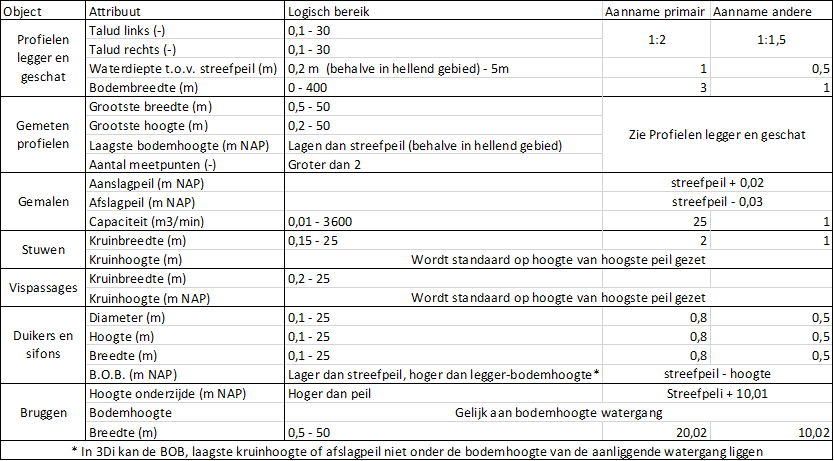

## **Logisch bereik**
 *LN: @Wouter, @Jelle, Na het overleg van vorige week heb ik deze weggehaald bij kunstwerken en naar voren gehaald als algemeen kopje aangezien het ook betrekking heeft op de watergangen en profielen.* 

Om de afmetingen van kunstwerken, watergangen en profielen in het model te implementeren wordt er vaak gebruik gemaakt van aangeleverde gegevens. Deze aangeleverde gegevens worden gecontroleerd op logische waarden om te voorkomen dat typefouten in de modellen worden verwerkt. De waardes van verschillende attributen moeten telkens voldoen aan een logisch bereik zoals aangegeven in onderstaande tabel. Waardes buiten het logische bereik worden aangemerkt als onbetrouwbaar en vervangen door een aanname.

