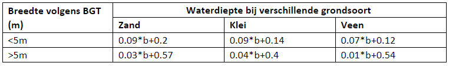

## **Dwarsprofielen**
Voor de dwarsprofielen in het model worden verschillende bronnen gebruikt. Voor de meeste primaire waterlopen zijn om de 250 meter gemeten dwarsprofielen beschikbaar. Deze worden zoveel mogelijk gebruikt. Voor het bepalen van het model-profiel worden alleen dieptemetingen aan de bovenkant van de baggerlaag (Z2) gebruikt in plaats van dieptemetingen bij de harde bodem (Z1). Ook worden er alleen 'natte' dieptemetingen gebruikt om dubbele berging en stroming op het droge talud te voorkomen.

### Gegevens
Als geen gemeten dwarsprofiel beschikbaar is worden BGT, leggerprofielen of aannames gebruikt. Onderstaande opsomming geeft aan welke DAMO kolommen zijn gebruikt en vormt gelijk de prioritering naar gelang beschikbaarheid van de gegevens.  

1. Gemeten profielen uit DAMO*

    a. GW_PBP 

    b. GW_PRO 

    c. GW_PRW 

    d. IWS_GEO_BESCHR_PROFIELPUNTEN 

2. Zelf afgeleide profielen o.a. uit BGT. De breedte op basis van dwarslijnen op de Hydroobjecten binnen de BGT vlakken waterdeel. De diepte van onderstaande tabel. 

3. Leggerprofielen uit DAMO.**

    a. In kolommen HydroObject: 

        i. WS_BODEMBREEDTE 

        ii. WS_BODEMHOOGTE 

        iii. WS_TALUD_LINKS

        iv. WS_TALUD_RECHTS 
          


*Voordat de gemeten DAMO-profielen aangeleverd zijn, zijn ze gefiltreerd op:
* Datachecker crossprofile hoogte mag niet 0,0 zijn 
* Datachecker crossprofile diepte mag niet <0,3m 
* Datachecker crossprofile breedte mag niet <2m 
* Datachecker crossprofile aantal punten mag niet <5
* Continuïteit x-richting profielpunten
* Profiel moet wel koppelbaar zijn met watergang (moet hydroobject_id hebben) 
* Profiel moet in gebied liggen met streefpeil in DAMO 
* Leeftijd 2009 en jonger.

**De leggerprofielen worden omgerekend volgens:
``` 
Bodembreedte = breedte_op_streefpeil - 
            ((streefpeil tov NAP - bodemhoogte tov NAP) *(talud_links+talud_rechts))
```
### Logisch bereik diepte
Er worden enkele controles toegepast om te zorgen dat de waarden voor waterdiepte en breedte binnen een logisch bereik vallen. Voor de waterdiepte geldt dat deze binnen dit bereik moet vallen:
```
< 0,2 meter of > 20 meter
```
Uitzondering hierop geldt voor profielen in hellend gebied.

### Aannames
Als bovenstaande geen of geen valide waarde geeft zijn onderstaande aannames toegepast.
De bodemhoogte van een watergang in een watergang wordt bepaald door onderstaande volgorde:
1. De legger ws_bodemhoogte van hydroobject (in geval schatting foute waarde geeft maar deze wel beschikbaar is).
2. Aanname primaire watergangen: streefpeil - 1m indien geen bodemhoogte bekend OF .
3. Zelfde als 2 maar voor niet primaire watergangen: streefpeil - 0.5 meter. In hellend gebied wordt hij 10.5 meter onder streefpeil gezet bij ontbrekende waarde. 
4. -10 meter indien nog steeds niets is ingevuld.

### Implementatie in model
De plaatsing van profielen in het model is afhankelijk van de opbouw van het netwerk van watergangen en van de BOB's van kunstwerken. Door deze verwevenheid is niet altijd duidelijk waar een gemodelleerd profiel op gebaseerd is. 

#### Plaatsing profielen
Ten eerste kunnen de gemeten dwarsprofielen niet zonder meer op ingemeten locatie in het model worden geplaatst. Door kunstwerken en aftakkingen zijn watergangen in het model veel verder opgeknipt. Om te voorkomen dat in het model telkens afwisselend een gemeten of geschat/leggerprofiel wordt toegepast, terwijl in de praktijk de primaire watergang door loopt, is een speciaal bestand gebruikt dat primaire watergangen over langere afstand verbind. Dit bestand heet in de datacheker ```channel-linemerge```.
 Hiermee worden de gemeten profielen over een aantal kruispunten en kunstwerken heen getild. Er wordt vanuit gegaan dat het profiel van (bijvoorbeeld) de primaire watergang niet wijzigt over het kruispunt met een secundaire watergang. Profielen worden tot maximaal 250 meter buiten de waterloop geëxtrapoleerd. In oudere modellen kan het voorkomen dat een profiel door deze methodiek over een peilgrens heen wordt getrokken. Dit is inmiddels niet meer mogelijk.

Watergangen waar geen gemeten profiel geplaatst kan worden krijgen op 10% en 90% van de lengte een geschat of legger profiel. Watergangen korter dan 10 m krijgen op 50% één profiel.

#### Aanpassingen aan bodemhoogte
In 3Di moeten de bodemhoogtes van kunstwerken hoger liggen van die van watergangen. Duikers morgen dus niet deels in de baggerlaag liggen. Wanneer dit wel wordt ingesteld in het model, kan het crashes als de waterstand in de duiker zakt tot onder de bodemhoogte van de watergang. Om deze reden zijn profielen in het model in zijn geheel verlaagd naar de bodemhoogte van het kunstwerk. Dit kan zijn de BOB van een duiker of sifon, maar ook een minimale kruinhoogte van een stuw of het afslagpeil van een gemaal (deze laatste is onwaarschijnlijk omdat beide zijn gebaseerd op streefpeil).

Bij het maken van nieuwe modellen geeft de modelbuilder middels de laag model_feedback.shp aan waar de bodemhoogte is aangepast.

Helaas kan het voorkomen dat gemeten dwarsprofielen worden verlaagd aan de hand van aannames van een BOB. Het verbeteren hiervan is complex en nog niet opgepakt. Opties zijn:
* BOB en dwarsprofiel van kunstwerken aanpassen als gemeten profiel (baggerlaag) hoger ligt
* Profielen niet in geheel verlagen maar alleen een smal segment in het midden.
