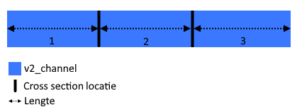

## **Compensatie te weinig oppervlaktewaterberging**
De berging in 1D (connection nodes + profielen watergangen) wordt per peilgebied vergeleken met het oppervlak van de BGT-waterdelen (vlakken). Een tekort aan berging wordt gelijk verdeeld toegekend als bergingsoppervlak aan secundaire connection nodes.

De berging kan berekend worden met de volgende formule.

Berging in profielen = 	profielbreedte 1 x lengte 1 + gemiddelde profielbreedte 1&2 x lengte 2	+ profielbreedte 2 x lengte 3  

Bij het berekenen van de 1D-berging in het profiel wordt minder dan 2 m2 per connection node niet toegekend (en vervalt dus), om instabiliteit te voorkomen. Het is niet bekend hoe groot dit risico op instabiliteit is. 
Daarnaast wordt een bergingsoverschot niet gecorrigeerd. Er kan geen negatieve berging worden toegekend. In dit geval moeten profielen worden gecorrigeerd. Als laatste toont de waterbreedtekaart die wordt meegeleverd, opgeloste watervlakken. De bergingscompensatie wordt echter berekend adhv profielbreedte op v2_channel over de gehele lengte. Dit wordt niet opgelost voor de hierboven beschreven compensatie, maar dus wel voor deze knappe kaart.

 *LN: @Wouter, @Jelle, wat wordt er bedoeld met knappe kaart (dit komt uit uitganspuntennotitie)? Misschien niet helemaal juiste benaming?* 