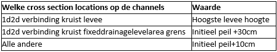

## **Bank level**
De bank level van een watergang bepaalt vanaf welke waterstand het 1d netwerk en het 2d netwerk kunnen uitwisselen. Alle watergangen krijgen bank levels mee op basis van de volgende tabel: 

Deze benadering is conservatief om lekken te voorkomen. Het risico bestaat hierdoor dat water van maaiveld niet naar de watergang kan stromen. In de [bank level test](../../4_gebruik_plugin/h_banklevel_test.md) worden 1d2d verbindingen nog een beoordeeld en waar mogelijk lager ingesteld.