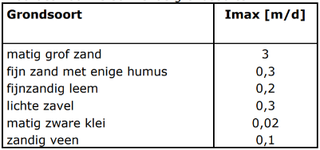
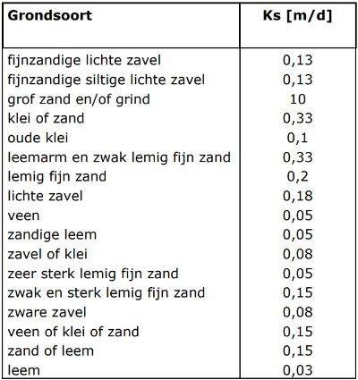

## **Onderliggende rasterdata**
In de 3Di poldermodellen zitten de volgende 4 rasterkaarten:
1. DEM
2. Weerstand
3. Infiltratie
4. Bodemberging

Hoe deze kaarten zijn opgebouwd wordt hieronder beschreven.
Alle rasters bevatten waardes op subgridniveau (0,5 m bij 0,5 m) die door 3Di op een verantwoorde
manier worden opgeschaald tot de veel grotere rekencellen.

### **Maaiveldhoogte DEM**
In het 3Di model wordt een hoogtekaart ofwel Digital Elevation Model (DEM) gebruikt voor de berging op en stroming over het maaiveld. De DEM wordt eveneens gebruikt om waterdieptes te berekenen die vervolgens worden gebruikt voor het afleiden van schade. De DEM is gebaseerd op de maaiveldhoogtekaart ofwel het Actuele Hoogtekaart Nederland (Ten tijde van het BWN2-project was dit AHN versie 3, inmiddels zijn alle modellen bijgewerkt naar AHN4). De AHN moet echter bewerkt worden voordat deze geschikt is voor toepassing als DEM in 3Di. 

De AHN kent twee typen. Het DSM (digital surface model) is een ongefilterde vertaling van de ingevlogen hoogtemetingen naar een raster van 0,5 bij 0,5 m. Het DTM (digital terrain model) is een rasterkaart waarbij ingevlogen hoogtemetingen die geen maaiveld representeren (bv, daken, water, bomen, auto's en rietkragen) eerst uit de meetdata zijn gefilterd alvorens de rasterkaart is aangemaakt. Deze laatste kaart wordt gebruikt voor het aanmaken van de DEM. 

Beide rasters bevatten gaten op plekken waar geen of onvoldoende maaiveld meetdata beschikbaar was. 

Voor het aanmaken van een DEM uit de AHN zijn de volgende voorbereidingen gedaan in ons basis DEM: 
1. Gaten dicht interpoleren; 
2. Alle gebouwen (BGT Pand_v en BGT OverigBouwwerk_v) een hoogte mee te geven die gelijk is aan het 75e percentiel van de omliggende maaiveldhoogtes (binnen een buffer van 1 m) + 5 cm (drempel/vloerpeil);  
3. Alle watervlakken (BGT Waterdeel_v en BGT OverigBouwwerk_v [BGTPlusType = 'bassin' OR BGTPlusType = 'opslagtank' OR BGTPlusType = 'bezinkbak']) ophogen tot NAP +10 m (om dubbeltelling van waterberging in de 1D en de 2D module te voorkomen). 

Wat niet vooraf gebeurt is:
1. Maaiveldcorrecties door te voeren voor bouwputten, inritten, tunnelbakken en maaiveldveranderingen (bv recent aangelegde waterberging);

Dit kan in de model DEM aangepast worden en in de HDB worden bijgehouden in de laag `dem_edits` voor nieuwe modellen.

### **Rasterkaart Weerstand**
Het weerstandsraster heeft betrekking op de stroming over maaiveld en wordt uitgedrukt in Manning waarde die veel wordt toegepast voor het modelleren van ondiep water stroming. Hoe lager de Manningwaarde (s/m1/3) hoe lager de weerstand. Er wordt ook wel eens gebruik gemaakt van de inverse Manningswaarde wat de Stricklerwaarde wordt genoemd (s/m1/3). De stricklerwaarde wordt op basis van onderstaande punten toegekend.

Waterlopen
* 45-30: Zeer schoon;
* 35-20: Schoon;
* 25-15: Licht begroeid;
* 20-10: Matig begroeid;
* 16-5: Vrij sterk begroeid;
* <10: Zeer sterk begroeid;

Betonnen duikers
* 75-100: Duiker recht en schoon;
* 70-90: Duiker met bochten, verbindingen en enige verontreiniging;
* 55-75: Rioolbuis met mangaten, inlaten e.d. recht;
* 70-85: Niet afgewerkt bij stalen bekisting;
* 60-85: Niet afgewerkt bij gladde houten bekisting;
* 50-65: Niet afgewerkt bij ruwe houten bekisting;

Er wordt voorgesteld om de weestandskaart op te bouwen uit de BGT kaart en daarbij de volgende uitgangspunten aan te houden <!--TODO  *LN: @Wouter, @Jelle, Is dit voorgestelde ook doorgevoerd?*-->:
* Wegdeel_v: 100 m1/3/s;
* Overbruggingsdeel_v: 100 m1/3/s;
* Pand_v: 5 m1/3/s;
* OverigBouwwerk_v: 15 m1/3/s;
* OnbegroeidTerreindeel_v: 15 m1/3/s;
* BegroeidTerreindeel_v: 15 m1/3/s;

Met behulp van bovenbenoemde uitgangspunten, die beschreven staan in _'Conversietabel_landgebruik_2018.csv'_, wordt er vanuit het landgebruiksraster per model een weerstandsraster aangemaakt. Deze waardes zijn uitgedrukt als Manningsweerstand in m1/3/s (Let op: dat is dus niet hetzelfde als hierboven).

Nb. De conversietabel is beschikbaar op het systeem van HHNK onder: `\\corp.hhnk.nl\data\Hydrologen_data\Data\01.basisgegevens\rasters\Conversietabel_landgebruik_2018.csv`

### **Rasterkaart Infiltratie**
Voor het maken van de infiltratiekaart is een combinatie gebruikt van de BGT en de bodemkaart. Verhard oppervlak en water heeft een infiltratiesnelheid van 0 mm/u mee gekregen, overig stedelijk gebied een infiltratie van 2 mm/u en divers onverhard gebied (bv grasland agrarisch, bouwland en fruitteelt) heeft een infiltratiewaarde gekregen van 5 mm/u, 10 mm/u of 20 mm/u.

#### **Onverharde infiltratiekaart**
Er wordt voorgesteld om de onverhard infiltratiekaart te maken op basis van de Imax waarde per grondsoort <!--TODO *LN: @Wouter, @Jelle, Is dit voorgestelde ook doorgevoerd?*-->. De Imax waarde is de initiële verticale infiltratiesnelheid die optreedt na plasvorming en een vochtfront direct onder het maaiveld. Dit is de maximale infiltratiesnelheid die kan optreden en die wordt gedreven door een maximale drukhoogte gradiënt in combinatie met capillaire krachten. 

De infiltratiesnelheid zal snel afnemen als het vochtfront verder onder het maaiveld komt te liggen omdat de drukhoogte gradiënt dan afneemt. De snelheid neemt geleidelijk af tot de minimale infiltratiecapaciteit Ks, ook wel de verzadigde doorlatendheid genoemd. Als wordt uitgegaan van de infiltratiecapaciteit Imax dan wordt bij modelberekeningen met extreme neerslag de gemiddelde infiltratiesnelheid tijdens een neerslaggebeurtenis overschat.

In onderstaande tabellen zijn Imax en Ks waardes gegeven voor onverharde gebieden.

Op basis van bovenstaande tabellen is aan iedere PAWN grondsoort die in het beheergebied van HHNK voor komt een infiltratiecapaciteit toegekend. De toekenning is los gebaseerd op bovenstaande tabellen en houdt er rekening mee dat de bodemsoorten beter doorlatend zijn naarmate ze meer zandig zijn en slechter doorlatend naar mate ze meer lemig of kleiig zijn.

De onverharde infiltratiecapaciteit wordt vermenigvuldigd met drie reductiekaarten: 
1. Verhardings reductiekaart

    Deze kaart reduceert de onverharde infiltratiecapaciteit ter plaatse van verharding en water. 

2. Erf reductiefactor kaart.

    Deze kaart reduceert de onverharde infiltratiecapaciteit op particuliere erven ten gevolge van partiële verharding. 

3. Riolering reductiefactor kaart 

    Deze kaart geeft een additionele infiltratie reductie in stedelijk gebied om een oppervlakkige afvoercomponent te creëren waarmee het weglaten van riolering wordt gecompenseerd. 

Kaarten 2 en 3 worden afgeleid uit een kaart die de dichtheid van bebouwing aangeeft: de bebouwingsfractie kaart.

### **Rasterkaart Bodemberging**
De hoeveelheid bodemberging hangt af van het grondgebruik, het bodemprofiel en de ontwateringsdiepte. In de 3Di poldermodellen worden 3 bodemberging rasters aangemaakt, behorend bij 3 verschillende grondwaterstanden (GLG, GHG en het gemiddelde daarvan GGG). Omdat het GGG raster het gemiddelde is van het GHG en GLG raster zijn alleen de GHG en GLG rasters getoond.

Voor gedetailleerde regionale toepassingen bestaan er geen betrouwbare gebiedsdekkende databronnen voor GLG/GHG. Er bestaan wel gebiedsdekkende GLG/GHG kaarten maar die zijn dusdanig onnauwkeurig dat ze voor regionale toepassingen lokaal grote fouten kunnen introduceren. Voor het beheergebied van HHNK bestaan er 2 gebiedsdekkende GLG/GHG producten: 
1. Alterra GLG/GHG kaart

    De GLG/GHG kaart van Alterra is een rasterkaart van 25 m bij 25 m met de grondwaterstanden in m minus maaiveld. De grondwaterstanden zijn gebaseerd op meetreeksen, de AHN1 en de bodemkaart.

2. De GLG/GHG uit het grondwatermodel van HHNK. 

    Deze (100m bij 100 m) raster kaarten zijn in 2014 gegenereerd met het (MODFLOW/ SEAWAT) grondwatermodel van HHNK en hebben een grove modelschaal (ca. 100 bij 100 m). Deze modelversie betreft een modelvernieuwing van het oorspronkelijke model uit het project Leven met Zout Water uit 2012.

Nb: de grondwatertrappen uit de bodemkaart zijn een oudere en minder geavanceerde aanpak op basis van dezelfde brondata als de Alterra kaart en vormt dus geen additionele bron van informatie. 

Naast dit kaartbeeld bestaan er twee methoden waarmee gebiedsdekkend een inschatting gemaakt kan worden van de GLG/GHG standen: 
1. GHG kaart op basis van ontwateringsnormen:

2. GLG/GHG op basis van drainagebasis.

Tijdens het BWN2-project zijn bergingskaarten gebaseerd op de Alterra grondwaterstanden en bergingscoëfficiënten uit SOBEK. Deze zijn voor het laatst bijgewerkt in 2020. De bestanden zijn te vinden op `\\corp.hhnk.nl\data\Hydrologen_data\Data\01.basisgegevens\rasters`. HHNK werkt aan het verbeteren van de input voor de bodembergingskaarten voor toekomstige analyses.