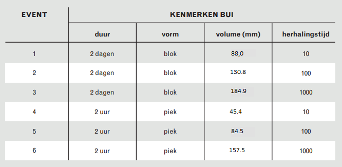
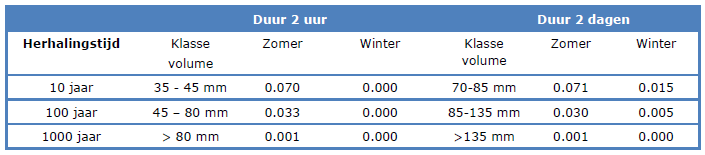
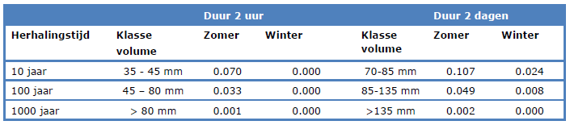
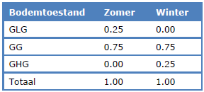
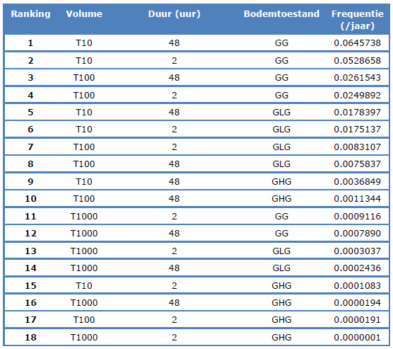
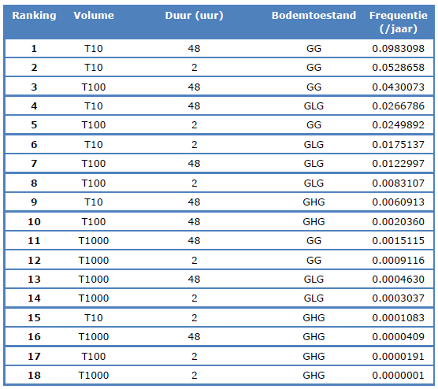

## <o>Update klimaatstatistiek<o>
<o>Om beter aan te sluiten bij landelijke ontwikkelingen op het gebied van klimaatstatistiek worden momenteel extremere buivolumes toegepast dan in de BMW van Deltaris (2017). Er is destijds uitgebreid onderzocht welke frequenties horen bij welke bui- en grondwatercondondities. Dit zal in de toekomst herhaald moeten worden, maar momenteel hanteren we een andere aanpak. Er is gekozen om de frequenties momenteel niet aan te passen, maar de buivolumes daarentegen wel. Hierdoor sluiten we aan bij de landelijke ontwikkelingen voor buivolumes en kunnen we de frequenties in de toekomst nog actualiseren.</o>

## **Klimaatsommen**
De gevolgen van klimaatverandering worden steeds beter merkbaar. Onder andere in de vorm van hevigere (piek) en/of langdurige (blok) neerslagsituaties. Om de gevolgen van deze neerslagevenementen in beeld te brengen, worden een aantal scenario's met verschillende herhalingstijden doorgerekend. De drie herhalingstijden die gesimuleerd worden zijn:

1. T10 (neerslagsituatie die zich statistisch gezien 1x in de 10 jaar voordoet)
2. T100 (neerslagsituatie die zich statistisch gezien 1x in de 100 jaar voordoet)
3. T1000 (neerslagsituatie die zich statistisch gezien 1x in de 1000 jaar voordoet)

Voor deze herhalingstijden gebruiken we twee neerslagpatronen:

1. Piek: hevige neerslagsituatie die in 2 uur de eerste 2 uur valt, vervolgens 46 uur droog
2. Blok: langdurige neerslagsituatie met een lage neerslagintensiteit die 48 uur duurt 

Hieronder is voor zes scenario's van herhalingstijd en neerslagtype het neerslagvolume weergegeven:

 
Bron: Brede Methodiek Wateroverlast, Deltares (Met update buivolumes o.b.v. STOWA neerslagstatistiek uit 2024)

Daarnaast is de grondwater conditie voorafgaand aan de neerslagsituatie van invloed op het verloop van het scenario. De volgende drie grondwater condities kunnen worden toegepast: 
1. Gemiddeld laagste grondwaterstand (GLG): de gemiddeld laagste grondwaterstand wordt vastgesteld op basis van metingen van grondwaterstanden op de 14e en 28e van de maand. Per jaar worden de drie laagste grondwaterstanden geselecteerd en gemiddeld over minimaal 8 jaar.
2. Gemiddelde grondwaterstand (GGG): Dit is het gemiddelde tussen de GLG en de GHG.
3. Gemiddeld hoogste grondwaterstand (GHG): de gemiddeld hoogste grondwaterstand wordt vastgesteld op basis van metingen van grondwaterstanden op de 14e en 28e van de maand. Per jaar worden de drie hoogste grondwaterstanden geselecteerd en gemiddeld over minimaal 8 jaar.

Bij het analyseren van de resultaten die uit de klimaatsommen volgen, is het tevens van belang om te weten hoe vaak een bepaalde combinatie van variabelen (herhalingstijd, neerslagtype en grondwaterconditie) zich voordoet. De neerslagregio's die in Nederland zijn vastgesteld geven daar inzicht in. Onderstaand figuur laat de neerslagregio's in het beheergebied van HHNK zien. 

In het beheergebied van HHNK bevinden zich drie neerslagregio's:
1. Hoog
2. Referentie
3. Laag (wordt niet gebruikt in de berekeningen)

Aan de hand van de neerslagregio's is bepaald wat de frequentie van de herhalingstijden van piek- en blokbuien in de zomer en de winter is. Deze frequenties zijn nodig voor het bepalen van de netto contante waarde van de schade. 

<o>----------------------------------------------------------------------------------------------------------------------------------------------------------------------------------------------------------------<o>

<o>Ter illustratie zijn in de onderstaande figuren de frequenties van voorkomen opgenomen van een combinatie van buivolume uit de BWN van **2017**, buivorm en seizoen voor twee neerslagregios.<o>

<o>*Neerslagregio gemiddeld*<o>

 
<o>*Neerslagregio hevig*<o>

<o>----------------------------------------------------------------------------------------------------------------------------------------------------------------------------------------------------------------<o>

Het onderscheid tussen zomer en winter is gemaakt, omdat de beschikbare bodemberging een andere kans heeft in de zomer en winter en de kans op neerslag in de zomer en winter sterk uiteen loopt. In het figuur hieronder is de kans op het optreden van een bepaalde bodemtoestand in de zomer en winter weergegeven.

Al deze kansen leiden tot een overzicht met de frequentie van elk van de 18 scenario's. In de afbeelding hieronder is weergegeven wat de frequenties van de scenario's zijn voor de neerslagregio `Referentie`.

In de afbeelding hieronder is weergegeven wat de frequenties van de scenario's zijn voor de neerslagregio `Hoog`.

