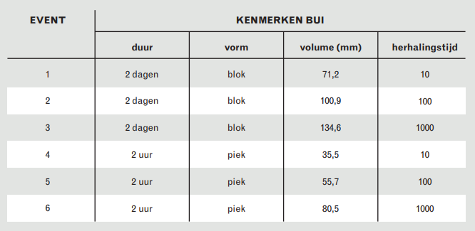

## **Klimaatsommen**
De gevolgen van klimaatverandering worden steeds beter merkbaar. Onder andere in de vorm van hevigere (piek) en/of langdurige (blok) neerslagsituaties. Om de gevolgen van deze neerslagevenementen in beeld te brengen, worden een aantal scenario's met verschillende herhalingstijden doorgerekend. De drie herhalingstijden die gesimuleerd kunnen worden zijn:

1. T10 (neerslagsituatie die zich statistisch gezien 1x in de 10 jaar voordoet)
2. T100 (neerslagsituatie die zich statistisch gezien 1x in de 100 jaar voordoet)
3. T1000 (neerslagsituatie die zich statistisch gezien 1x in de 1000 jaar voordoet)

Voor deze herhalingstijden zijn twee verschillende neerslagtypen mogelijk:

1. Piek: hevige neerslagsituatie die in 2 uur valt
2. Blok: langdurige neerslagsituatie met een lage neerslagintensiteit die 48 uur duurt 

Hieronder is voor zes scenario's van herhalingstijd en neerslagtype de opbouw weergegeven:

 
Bron: Brede Methodiek Wateroverlast

Daarnaast is de grondwater conditie voorafgaand aan de neerslagsituatie van invloed op het verloop van het scenario. De volgende drie grondwater condities kunnen worden toegepast: 
1. Gemiddeld laagste grondwaterstand (GLG): de gemiddeld laagste grondwaterstand wordt vastgesteld op basis van metingen van grondwaterstanden op de 14e en 28e van de maand. Per jaar worden de drie laagste grondwaterstanden geselecteerd en gemiddeld over minimaal 8 jaar.
2. Gemiddelde grondwaterstand (GGG): Dit is het gemiddelde tussen de GLG en de GHG.
3. Gemiddeld hoogste grondwaterstand (GHG): de gemiddeld hoogste grondwaterstand wordt vastgesteld op basis van metingen van grondwaterstanden op de 14e en 28e van de maand. Per jaar worden de drie hoogste grondwaterstanden geselecteerd en gemiddeld over minimaal 8 jaar.

Bij het analyseren van de resultaten die uit de klimaatsommen volgen, is het tevens van belang om te weten hoe vaak een bepaalde combinatie van variabelen (herhalingstijd, neerslagtype en grondwaterconditie) zich voordoet. De neerslagregio's die in Nederland zijn vastgesteld geven daar inzicht in. Onderstaand figuur laat de neerslagregio's in het beheergebied van HHNK zien. 

In het beheergebied van HHNK bevinden zich drie neerslagregio's:
1. Hevig
2. De Bilt (gemiddeld)
3. Mild (wordt niet gebruikt. Bovengrensbenadering Mild is toegepast, waardoor neerslagregio Gemiddeld (De Bilt) is gekozen)

Aan de hand van de neerslagregio's is bepaald wat de frequentie van de herhalingstijden van piek- en blokbuien in de zomer en de winter is. Deze frequenties zijn nodig voor het bepalen van de netto contante waarde van de schade. In het figuur hieronder is te zien wat de frequentie van een bepaalde herhalingstijd van piek- en blokbuien in de zomer en winter in de neerslagregio gemiddeld.

In het figuur hieronder is te zien wat de frequentie van een bepaalde herhalingstijd van piek- en blokbuien in de zomer en winter in de neerslagregio hevig.

Het onderscheid tussen zomer en winter is gemaakt, omdat de GHG, GGG en GLG andere kansen hebben in de zomer en winter en de kans op neerslag in de zomer en winter sterk uiteenloopt. In het figuur hieronder is de kans op het optreden van een bepaalde bodemtoestand in de zomer en winter weergegeven.

Al deze kansen leiden tot een overzicht met de frequentie van elk van de 18 scenario's. In de afbeelding hieronder is weergegeven wat de frequenties van de scenario's zijn voor de neerslagregio ``Gemiddeld``.

In de afbeelding hieronder is weergegeven wat de frequenties van de scenario's zijn voor de neerslagregio ``Hevig``.

