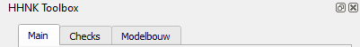

# **Introductie HHNK-3Di-plugin**
HHNK heeft de werkwijze voor het controleren van modellen en de toetsing van het watersysteem binnen het project BWN2 vastgelegd in een plugin voor QGIS of de 3Di Modeler Interface. De HHNK plugin is beschikbaar via github en kan worden geïnstalleerd aan de hand van deze [installatiehandleiding](..\installatie\installatie_handleiding.md). 

## Plug-in-scherm
Na installatie kan de plugin worden geopend via het HHNK-symbool in de werkbalk van QGIS. Na het aanklikken opent er een 'docked' plug-in-scherm rechts in beeld. De HHNK Toolbox is opgedeeld in drie delen:



* Main: via dit onderdeel wordt het project en andere lagen ingeladen en is het mogelijk om simulaties te starten.
* Checks: dit onderdeel geeft de gebruiker de mogelijkheid om controles uit te voeren voor het model of nabewerking te draain.
* Modelbouw: Voor het draaien van de datachecker en modelbuilder, werkt alleen op de server van HHNK.

In de hoofdstukken hieronder is de BWN2-werkwijze stap-voor-stap uitgewerkt. Vooraf wijst de auteur de gebruiker nog graag op het gebruik van een logboek.

## Logboek
Gedurende het gehele modelleerproces is het van belang een logboek bij te houden van gemaakte stappen en wijzigingen in het model. Neem in het logboek op door wie, wanneer en in welke modelrevisie de wijzigingen zijn gemaakt. Daarnaast heeft het de voorkeur om wijzigingen in het model via SQL aan te brengen en in het logboek te noteren, zodat deze eenvoudig opnieuw uitgevoerd kunnen worden. Het logboek ziet er bijvoorbeeld zo uit:

``` sql
-------Revisie 4------------
-- Wouter van Esse, 25 oktober 2021
-- Duiker vervangen door stuw op aangeven gebiedsbeheerder
DELETE FROM v2_orifice WHERE code LIKE 'KDU-JL-3420'
;
INSERT INTO v2_cross_section_definition (code, id,width,shape)
VALUES ("KST-Q-23237", 9999001,1,1)
;
INSERT INTO v2_weir (zoom_category, code, display_name,
    discharge_coefficient_negative, sewerage, 
    discharge_coefficient_positive, external, crest_type, 
    friction_type, friction_value,
	connection_node_start_id, connection_node_end_id, 
    crest_level, cross_section_definition_id) 
VALUES (4, "KST-Q-23237", "KST-Q-23237", 0.8, 0, 0.8, 0, 4, 2, 
        0.03,2597, 1051, -0.6, 9999001)
;
```
Geef ook aan wanneer het model is gebruikt voor het maken van de hydraulische toets of klimaatsommen en of dit om de referentie situatie of een maatregel scenario gaat.

<!---
TODO aanvullen? Nieuwe methode model governance?
-->


## Leeswijzer plug-in
Onderstaande hoofdstukken vormen samen de BWN2-werkwijze en leggen telkens de benodigde stappen uit in de plugin. Het eerste hoofdstuk [Brongegevens](a_brongegevens.md) dient als naslagwerk voor de benodigde gegevens en een aantal definities. De overige hoofdstukken zijn een handleiding voor het gebruik:

* [Project starten](b_project_starten.md)
* [Sqlite checksuitvoeren](c_sqlite_checks.md)
* [Modelstaten aanpassen](d_modelstaat_aanpassen.md)
* [Berekeningen uitvoeren](e_berekeningen_uitvoeren.md)
* [Resultaten downloaden](f_downloaden_resultaten.md)
* [0d1d test uitvoeren](g_0d1d_test.md)
* [Bank level test uitvoeren](h_banklevel_test.md)
* [1d2d test uitvoeren](i_1d2d_test.md)
* [Klimaatsommen uitvoeren](j_werkwijze_klimaatsommen.md)