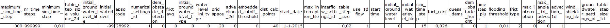

## **Brongegevens**
Hieronder vind je een beschrijving van alle brongegevens die worden gebruikt. Daarnaast is hier informatie te vinden over modelinstellingen.

1. Model

   Het model bevat de meeste informatie over de polder, zoals welke watergangen en kunstwerken zich in het gebied bevinden. Als er, bij het aanpassen van de modelstaat, backups worden aangemaakt worden die toegevoegd aan het model.

2. DAMO

   De `DAMO` database is de gestandaardiseerde informatiebron waarvan de Waterschappen gebruik maken. De data uit DAMO die gaat over het gebied dat het model beslaat, is opgeslagen in de `DAMO.gdb` file. Het model is in de meeste gevallen opgebouwd vanuit deze database.
   
   Gegevens uit DAMO worden gebruikt in verschillende tests die er op zijn gericht de brongegevens te vergelijken met wat er in het model zit. De `DAMO.gdb` worden gebruikt in onderstaande tests:
   
   * `oppervlaktewater` test om het oppervlaktewater in het model mee te 
   vergelijken (de gebruikte laag uit DAMO is `Waterdeel`). 
   
   * `Bodemhoogte kunstwerken` test om informatie over de hoogte op bepaalde punten van objecten toe te voegen (de gebruikte laag uit de `DAMO.gdb` is `DuikerSifonHevel`). 
   
   Beide tests maken deel uit van de `Sqlite tests`

3. HDB
   
   De `HDB` database (`.gdb`) bevat aanvullende informatie over het gebied dat het model representeert. Het gaat hier om informatie die niet in DAMO kan worden opgeslagen, maar die wel relevant is voor hydrologische analyse. De HDB wordt gebruikt in de `gestuurde kunstwerken` test om informatie toe te voegen over de kunstwerken, zoals de object code, het streefpeil en de minimale en maximale kruinhoogtes. De gebruikte laag is 
   `Sturing_3Di`. 
   
4. 3Di resultaten

   De 3Di resultaten (`.nc` en `.h5`) worden gebruikt in de `0d1d tests`, `bank level tests` en `1d2d test`. De resultaten bevatten informatie over het gedrag van een model op verschillende tijdstappen tijdens het gesimuleerde scenario.

5. DEM
   
   Het DEM raster (Digital Elevation Model) bevat informatie over de maaiveldhoogte binnen het gebied dat het model beslaat. Deze informatie wordt gebruikt in de `maximale waarde dem` check, om te verifieren dat het raster klopt. Vervolgens wordt de informatie gebruikt in de `ontwateringsdiepte` test om het verschil tussen de bodemhoogte en het grondwaterniveau te berekenen. De DEM wordt ook gebruikt in de `1d2d tests` om de waterstanden op verschillende tijdstippen te berekenen.

6. Polder shapefile
   
   De polder shapefile (`.shp`) bevat informatie over de grootte van het gebied waarvan het model een representatie is. Het wordt gebruikt in de `ondoorlatend oppervlak` test (`sqlite tests`) om te bepalen of het ondoorlatend oppervlak in het model redelijk is ten opzichte van de grootte van het gehele gebied.

7. Datachecker output
   
   De output van de datachecker bevat veel gegevens die overeenkomen met DAMO aangevuld met gecombineerde en gecontroleerde gegevens. Deze gegevens worden gebruikt in de volgende tests:
   
   * `Ontwateringsdiepte` test om de waterstanden van de verschillende peilgebieden te bepalen (de gebruikte laag is `fixeddrainagelevelarea`). 
   
   * `Oppervlaktewater` test om het oppervlaktewater te berekenen voor de verschillende peilgebieden (de gebruikte laag is `fixeddrainagelevelarea`). 
   
   * `Bodemhoogte kunstwerken` test om informatie over aannames (waar van toepassing) toe te voegen aan kunstwerken. De laag die daarvoor wordt gebruikt is `culvert`.
   
8. Channel surface from profiles
   
   De channel surface from profiles shapefile (`.shp`) bevat informatie over de breedte van de watergangen. Deze informatie wordt gebruikt in de `oppervlaktewater` test om het totale oppervlaktewater van de watergangen in het model te berekenen. Dit bestand is een output van de modelbuilder.
   
9. Model instellingen

   In ``{Modellenmap}\Polder_X\02_schematisation`` staan per model twee Excel documenten waarmee de modelinstellingen en modelstaten geconfigureerd kunnen worden. De instellingen in de sqlite-database van het model worden ten dele overschreven door de waarden in deze excel bestanden. In de tabel hieronder zijn een aantal default instellingen voor de schematisatie weergegeven.

   

   Deze gegevens dienen in een Excel met de naam ``model_settings_default`` ingevoerd te worden, zodat ze in 3Di uitgelezen kunnen worden en de juiste invoerwaarden worden gebruikt.

   De instellingen voor modelstaten staan in de een Excel met de naam ``model_settings``. Dit wordt verder toegelicht onder [Modelstaten](d_modelstaat_aanpassen.md).

Klik [hier](b_project_starten.md) om van start te gaan met de plug-in.