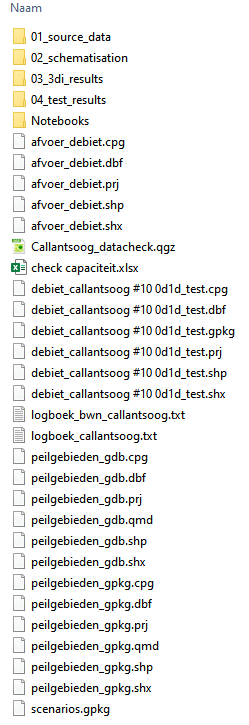
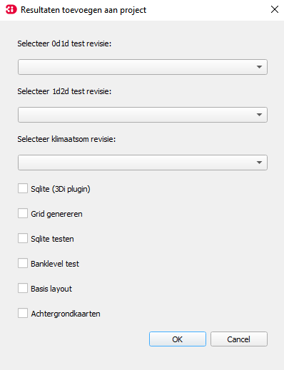
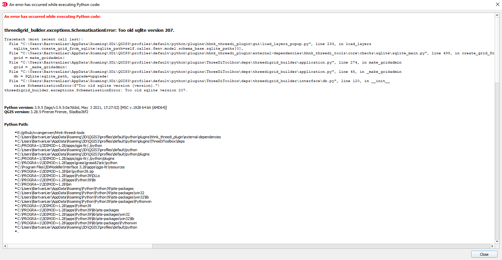
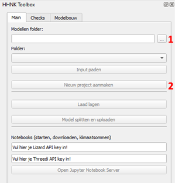
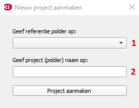
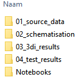
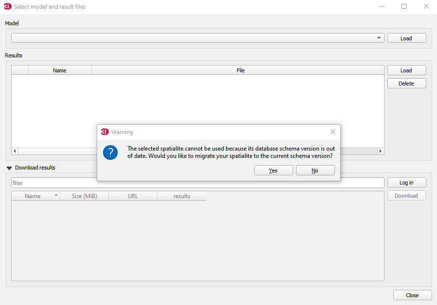

## **Overzicht plugin**
De HHNK Toolbox is opgedeeld in drie delen:


1. Main: hier wordt het model ingeladen, kunnen resultaten worden ingeladen en is het mogelijk om simulaties te starten
2. Checks: dit onderdeel geeft de gebruiker de mogelijkheid om controles uit te voeren voor het model
3. Modelbouw: werkt alleen op de server van HHNK <span style="color:red"> BvL: @WE/JK wordt later toegevoegd aan handleiding toegevoegd? Of gaan we hier niet op in?</span> 

Er zijn twee mogelijkheden om met de toolbox aan de slag te gaan:
1. HHNK levert de benodigde data (model) aan (klik [hier](#1-data-aangeleverd-door-hhnk))
2. Gebruiker van de plugin bouwt een model vanaf de 'grond' op (klik [hier](#2-zelf-een-model-maken))

### **1. Data aangeleverd door HHNK**
Volg onderstaande werkwijze als HHNK de benodigde data (model) aanlevert (optie 1). Als je zelf een model vanaf de 'grond' gaat bouwen, klik dan [hier](#2-zelf-een-model-maken) (optie 2)

1. [Map aanmaken](#1-map-aanmaken)
2. [Data kopiëren](#2-data-kopiëren)
3. [Model inladen](#3-model-inladen)

### 1. Map aanmaken 
<span style="color:yellow"> WE: *verouderd, kan inmiddels met toolbox*</span> <span style="color:red"> BvL: het klopt inderdaad dat als je vanaf 'scratch' een project start dat de mappen automatisch worden aangemaakt. Echter had ik het model via Jelle toegestuurd gekregen en moest ik die data wel in onderstaande structuur zetten om het zichtbaar te krijgen in de plugin.</span> 
Maak een nieuwe map aan in de verkenner (locatie staat vrij, maar raadzaam om lokaal te werken) met de naam van het aangeleverde gebied (bijvoorbeeld polder_X). Dat kan er als volgt uit zien: `C:\Users\{gebruiker}\Documents\3Di\polder_X`. 

`{gebruiker}` is de naam van de Windows-gebruiker.

### 2. Data kopiëren 
Kopieer de aangeleverde data naar de map die in stap 1 is gemaakt. Hieronder is een voorbeeld te zien waaruit de aangeleverde data (deze kan qua inhoud verschillen) is opgebouwd.



   ### 3. Model inladen
Het model kan vervolgens ingeladen worden door bij `modellen folder` (1) door de volgende handeling: als je in stap 1 de map hebt aangemaakt in het pad: `C:\Users\{gebruiker}\Documents\3Di\polder_X`, kies je bij `modellen folder` het volgende pad om het model in te kunnen laden: `C:\Users\{gebruiker}\Documents\3Di`. Vervolgens kan bij `polder` (2) gekozen worden voor `polder_X`. 

`{gebruiker}` is de naam van de Windows-gebruiker.


### 4. Inladen lagen
Via de knop ``laad lagen`` (3) kun je diverse lagen inladen om inzicht te geven in het model.


Vervolgens verschijnt het onderstaande scherm met een aantal keuzes: 



Afhankelijk van de tests die zijn uitgevoerd, kan er gekozen worden tussen het inladen van de van 0d1d, 1d2d of de klimaatsom resultaten. Indien er nog modelstaten zijn gemaakt, klik [hier](c_modelstaat_aanpassen.md). Wanneer er nog geen testberekeningen of klimaatsommen zijn gemaakt, klik dan [hier](d_berekeningen_uitvoeren.md).

Daarnaast kunnen nog een aantal andere opties aangevinkt worden:
* [Sqlite (3Di plugin)](#sqlite-3di-plugin)
* [Grid genereren](#grid-genereren)
* [Sqlite testen](#sqlite-testen)
* [Banklevel test](#banklevel-test)
* [Basis layout](#basis-layout)
* [Achtergrondkaarten](#achtergrondkaarten)

#### Sqlite (3Di plugin)
Deze optie geeft de mogelijkheid om de schematisatie (.sqlite) van het model in te laden.

#### Grid genereren
<span style="color:red"> BvL: @WE/JK kunnen jullie dit aanvullen?</span> 

Bij het genereren van het grid kan het voorkomen dat er een foutmelding wordt weergegeven dat de .sqlite te oud is.  
Ga naar [bekende problemen](#bekende-problemen) om de oplossing te bekijken.  

#### Sqlite testen
De sqlite tests zijn bedoeld om het model te controleren op (potentiële) fouten in de data en deze te corrigeren waar nodig. Na de sqlite tests is het model klaar om op te bouwen en om de 0d1d toets te draaien ([0d1d test](../2_werkwijze_bwn/e_model_controleren_verbeteren/4_0d1d_test.md)).

#### Banklevel test
Door de ``banklevel test`` in te laden, kun je de resultaten inzien die volgen uit de test die is uitgevoerd. Verdere toelichting over de ``banklevel test`` is te vinden in [Banklevel test](../2_werkwijze_bwn/e_model_controleren_verbeteren/5_banklevel_test.md).

#### Basis layout
Met het inladen van de ``basis layout`` krijg je inzicht in de resultaten die volgen uit controles die zijn uitgevoerd om te kijken of het model goed is opgebouwd vanuit de brondata of dat er nog data mist.

#### Achtergrondkaarten
Met de optie ``achtergrondkaarten`` kun je verschillende soorten kaarten als achtergrond onder de schematisatie leggen. Dit is bijvoorbeeld handig om te controleren of een breedte van een watergang in het model overeenkomt met de breedte op de luchtfoto. 

Klik [hier](c_modelstaat_aanpassen.md) om de stappen te volgen om modelstaten aan te passen.

## **Zelf een model maken**
Volg onderstaande werkwijze als je het model vanaf de 'grond' gaat opbouwen (optie 2)

### 1. Modellen folder selecteren
Voordat een nieuw project aangemaakt kan worden, moet een modellen folder gekozen worden. Op deze locatie wordt alle data in het vervolg opgeslagen. Hieronder is te zien op welke plek de modellen folder (1) zich bevindt:



Kies een locatie in de verkenner waar alles opgeslagen gaat worden (raadzaam om een lokale map te kiezen). Dit kan bijvoorbeeld in de map `C:\Users\{gebruiker}\Documents\3Di`. Je kunt ook een nieuwe map in de verkenner (locatie staat vrij, maar raadzaam om lokaal te werken) aanmaken. 

`{gebruiker}` is de naam van de Windows-gebruiker.

Kies de locatie van de hierboven aangemaakte map om ervoor te zorgen dat ``Nieuw project aanmaken`` (2) geactiveerd wordt. 

### 2. Nieuw project aanmaken

Wanneer je op ``Nieuw project aanmaken`` (2) klikt, opent zich een nieuw venster:



Hier kun je een referentie polder (1) opgeven als je die hebt. Het is niet noodzakelijk om deze op te geven. Geef de schematisatie die je gaat aanmaken een naam (2). 

Wanneer je op ``Project aanmaken`` klikt, wordt er een lege mappenstructuur aangemaakt volgens de standaard projectindeling. In de verschillende mappen worden ```readme``` files aangemaakt waarin staat welke files in welke map wordt gezocht.

Het resultaat in de verkenner ziet er als volgt uit:



Volg hierna de stappen die [hier](#4-inladen-lagen) zijn toegelicht.  

<span style="color:red"> BvL: is het een idee om voor bekende problemen ook een aparte md file te maken?</span>
## **Bekende problemen**
### Oude sqlite error
Wanneer in de aangeleverde data nog een .sqlite zit die in een oudere versie van 3Di is gemaakt, kan het voorkomen dat onderstaande foutmelding wordt weergegeven:


Deze error kan op de volgende manier opgeloste worden:

1. Ga naar ``select 3Di results`` (1)

      

2. Klik op ``load`` (2)

   

3. Ga naar de map waar je data hebt opgeslagen, zie ook [map aanmaken](#1-map-aanmaken)
4. Vervolgens ga je naar het volgende pad: `C:\Users\{gebruiker}\Documents\3Di\'polder_x'\02_schematisation\00_basis` en dubbelklik je op het .sqlite bestand. 
5. Nadat je hier op hebt geklikt, krijg je onderstaande waarschuwing: 

   

   Klik op `yes`. De .sqlite staat nu in een versie die ingeladen kan worden in 3Di zonder foutmelding. 

   `{gebruiker}` is de naam van de Windows-gebruiker.