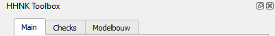

## **Overzicht plugin**

De HHNK Toolbox is opgedeeld in drie delen:



1. Main: hier wordt het model ingeladen, kunnen resultaten worden ingeladen en is het mogelijk om simulaties te starten
2. Checks: dit onderdeel geeft de gebruiker de mogelijkheid om controles uit te voeren voor het model
3. Modelbouw: werkt alleen op de server van HHNK <span style="color:red"> BvL: @WE/JK wordt later toegevoegd aan handleiding toegevoegd? Of gaan we hier niet op in?</span> 

Er zijn twee mogelijkheden om met de toolbox aan de slag te gaan:
1. HHNK levert de benodigde data (model) aan (klik [hier](#1-data-aangeleverd-door-hhnk))
2. Gebruiker van de plugin bouwt een model vanaf de 'grond' op (klik [hier](#2-zelf-een-model-maken))

<span style="color:red">Nadere informatie over de inhoud van de testen, benodigde data en het interpreteren van resultaten zijn te vinden via onderstaande links:
* Voor inhoudelijke uitleg van de tests, zie [Documentatie](tests_documentation.md).
* Voor uitleg over de benodigde data, zie [Bron data](needed_data.md).
* Voor uitleg over de interpretatie van resultaten, zie !!!</span> 

### **1. Data aangeleverd door HHNK**
Volg onderstaande werkwijze als HHNK de benodigde data (model) aanlevert (optie 1). Als je zelf een model vanaf de 'grond' gaat bouwen, klik dan [hier](#2-zelf-een-model-maken) (optie 2)

1. [Map aanmaken](#1-map-aanmaken)
2. [Data kopiëren](#2-data-kopiëren)
3. [Model inladen](#3-model-inladen)
4. [Inladen resultaten tests (indien van toepassing)](#4-inladen-resultaten-tests-indien-van-toepassing)
5. [Modelstaten maken](#5)
6. [Berekeningen uitvoeren](#6-berekeningen-uitvoeren)

### 1. Map aanmaken <span style="color:yellow"> WE: *verouderd, kan inmiddels met toolbox*</span> <span style="color:red"> BvL: het klopt inderdaad dat als je vanaf 'scratch' een project start dat de mappen automatisch worden aangemaakt. Echter had ik het model via Jelle toegestuurd gekregen en moest ik die data wel in onderstaande structuur zetten om het zichtbaar te krijgen in de plugin.</span> 
Maak een nieuwe map aan in de verkenner (locatie staat vrij, maar raadzaam om lokaal te werken) met de naam van het aangeleverde gebied (bijvoorbeeld polder_X). Dat kan er als volgt uit zien: `C:\Users\{gebruiker}\Documents\3Di\polder_X`. 

`{gebruiker}` is de naam van de Windows-gebruiker.

### 2. Data kopiëren 
Kopieer de aangeleverde data naar de map die in stap 1 is gemaakt. Hieronder is een voorbeeld te zien waaruit de aangeleverde data (deze kan qua inhoud verschillen) is opgebouwd.


### 3. Model inladen
Het model kan vervolgens ingeladen worden door bij `modellen folder` (1) door de volgende handeling: als je in stap 1 de map hebt aangemaakt in het pad: `C:\Users\{gebruiker}\Documents\3Di\polder_X`, kies je bij `modellen folder` het volgende pad om het model in te kunnen laden: `C:\Users\{gebruiker}\Documents\3Di`. Vervolgens kan bij `polder` (2) gekozen worden voor `polder_X`. 

`{gebruiker}` is de naam van de Windows-gebruiker.


### 4. Inladen lagen
Via de knop ``laad lagen`` (3) kun je diverse lagen inladen om inzicht te geven in het model.


Vervolgens verschijnt het onderstaande scherm met een aantal keuzes: 


<span style="color:red"> BvL: hieronder verder gaan</span> 

Afhankelijk van de tests die zijn uitgevoerd, kan er gekozen worden tussen het inladen van de van 0d1d, 1d2d of de klimaatsom resultaten. Indien er nog geen testberekeningen of klimaatsommen zijn gemaakt, klik dan hier: [Testberekeningen uitvoeren](#5-testberekeningen-uitvoeren)

Daarnaast kunnen nog een aantal andere opties aangevinkt worden:
* [Sqlite (3Di plugin)](#sqlite-3di-plugin)
* [Grid genereren](#grid-genereren)
* [Sqlite testen](#sqlite-testen)
* [Banklevel test](#banklevel-test)
* [Basis layout](#basis-layout)
* [Achtergrondkaarten](#achtergrondkaarten)

#### Sqlite (3Di plugin)
Deze optie geeft de mogelijkheid om de schematisatie (.sqlite) van het model in te laden.

#### Grid genereren
##### NIEUWE FOUTMELDING > ZIE LOGBOEK. GEEN IDEE HOE OP TE LOSSEN.

Bij het genereren van het grid kan het voorkomen dat er een foutmelding wordt weergegeven dat de .sqlite te oud is.  Ga naar [bekende problemen](#bekende-problemen) om de oplossing te bekijken.  

#### Sqlite testen
De sqlite tests zijn bedoeld om het model te controleren op (potentiële) fouten in de data en deze te corrigeren waar nodig. Na de sqlite tests is het model klaar om op te bouwen en om de 0d1d toets te draaien (zie 
[0d1d toets/Hydraulische toets](tests_documentation.md#1d2d-tests)). Voor de inhoudelijke uitleg van de tests, zie:
[Sqlite tests](tests_documentation.md#sqlite-tests)

#### Banklevel test
Door de ``banklevel test`` in te laden, kun je de resultaten inzien die volgen uit de test die is uitgevoerd. Verdere toelichting over de ``banklevel test`` is te vinden in [banklevel test](tests_documentation.md#bank-levels).

#### Basis layout
Met het inladen van de ``basis layout`` krijg je inzicht in de resultaten die volgen uit controles die zijn uitgevoerd om te kijken of het model goed is opgebouwd vanuit de brondata of dat er nog data mist.

#### Achtergrondkaarten
Met de optie ``achtergrondkaarten`` kun je verschillende soorten kaarten als achtergrond onder de schematisatie leggen. Dit is bijvoorbeeld handig om te controleren of een breedte van een watergang in het model overeenkomt met de breedte op de luchtfoto. 

Onderstaande stappen zijn uit te voeren als er nog geen testberekeningen en testen voor het model zijn uitgevoerd.

## 2. Zelf een model maken
Volg onderstaande werkwijze als je het model vanaf de 'grond' gaat opbouwen (optie 2)

### 1. Modellen folder selecteren
Voordat een nieuw project aangemaakt kan worden, moet een modellen folder gekozen worden. Op deze locatie wordt alle data in het vervolg opgeslagen. Hieronder is te zien op welke plek de modellen folder (1) zich bevindt:


Kies een locatie in de verkenner waar alles opgeslagen gaat worden (raadzaam om een lokale map te kiezen). Dit kan bijvoorbeeld in de map `C:\Users\{gebruiker}\Documents\3Di`. Je kunt ook een nieuwe map in de verkenner (locatie staat vrij, maar raadzaam om lokaal te werken) aanmaken. 

`{gebruiker}` is de naam van de Windows-gebruiker.

Kies de locatie van de hierboven aangemaakte map om ervoor te zorgen dat ``Nieuw project aanmaken`` (2) geactiveerd wordt. 

### 2. Nieuw project aanmaken

Wanneer je op ``Nieuw project aanmaken`` (2) klikt, opent zich een nieuw venster:


Hier kun je een referentie polder (1) opgeven als je die hebt. Het is niet noodzakelijk om deze op te geven. Geef de schematisatie die je gaat aanmaken een naam (2). 

Wanneer je op ``Project aanmaken`` klikt, wordt er een lege mappenstructuur aangemaakt volgens de standaard projectindeling (zie [project indeling](tests_documentation.md#indeling-project-map)). In de verschillende mappen worden ```readme``` files aangemaakt waarin staat welke files in welke map wordt gezocht.

Het resultaat ziet er als volgt uit:


Volg hierna de stappen die [hier](#4-inladen-lagen) zijn toegelicht.  

##### Onderstaande stap niet meer actueel? > kijk even of je hier nog handige informatie uit kunt halen
### 3. Modelstaat aanpassen

Wanneer je op deze knop klikt open zich een nieuw venster:


1. Selecteer een model
   
2. Zodra een model is geselecteerd wordt de huidige staat gedetecteerd (zie 
   [Modelstaat aanpassen](tests_documentation.md#modelstaat-aanpassen)). Het is belangrijk dat de gedetecteerde staat    klopt.
3. Kies de staat om het model naar om te zetten
4. Deze sectie wordt beschikbaar als we bij 3 '1d2d toets' als nieuwe staat hebben geselecteerd. Er zijn twee opties 
   wanneer we het model omzetten naar de 1d2d toets staat: <br>
   4a. We can calculate the correct configuration from a 3Di result 
   * 4a.1 <br>
     Bereken de 1d2d staat op basis van een 3Di resultaat:
     Selecteer een 3Di resultaat map (bevat een ```.nc``` en een ```.h5``` file). Dit resultaat wordt alleen gebruikt om 
     het rekengrid te bepalen. Het maakt dus niet uit of het resultaat een 0d1d of 1d2d som betreft.
       
    * 4a.2 <br>
    Selecteer de datachecker geodatabase die bij het model hoort. <br>
     
    4b. Je kunt er ook voor kiezen om een eerdere 1d2d staat te gebruiken voor het omzetten van het model, mits er een 
    backup beschikbaar is. Deze backup is ook beschikbaar als de ```bank levels``` al eerder zijn berekend.
   
Wanneer je op 'OK' klikt worden alle benodigde aanpassingen berekend en voorgelegd aan de gebruiker:


In sommige gevallen kunnen de nieuwe waarden handmatig worden aangepast. In sommige gevallen kunnen bepaalde rijen 
worden uitgesloten zodat ze niet worden meegenomen in het aanpassen van het model.

Controleer de voorgestelde aanpassingen en klik op 'Aanpassingen uitvoeren' om ze door te voeren. Als er handmatige 
aanpassingen zijn gedaan of er rijen zijn uitgesloten dan worden deze wijzigingen weergegeven zodat ze kunnen worden 
opgeslagen:


## Checks

Om te controleren of het model geen fouten bevat, zijn er diverse checks in de HHNK Toolbox gebouwd. 


De tab 'checks' is opgebouwd uit een aantal subonderdelen:

1. [Sqlite checks](#1-sqlite-checks)
2. [0d1d tests](#2-0d1d-tests)
3. [Bank levels](#3-bank-levels-test)
4. [1d2d tests](#4-1d2d-tests)
5. [Klimaatsommen](#5-klimaatsommen)

### 1. Sqlite checks
De sqlite checks zijn bedoeld om het model te controleren op (potentiële) fouten in de data en deze te corrigeren waar nodig. Na de sqlite checks is het model klaar om op te bouwen en om de 0d1d toets te draaien (zie [0d1d toets/Hydraulische toets](tests_documentation.md#0d1d-testshydraulische-toets)). 


Na het klikken op ``Sqlite tests`` wordt het volgende venster getoond:


Voor de inhoudelijke uitleg van de tests, zie: [Sqlite checks](tests_documentation.md#sqlite-checks).

Selecteer de checks die je wil laten uitveroen en klik op 'Start tests' om de tests te starten. De resultaten worden weergegeven als de tests uitgevoerd zijn:
##### Dit werkt nog niet helemaal goed bij mij.


1. De resultaten van sommige tests worden gevisualiseerd als ```QGIS``` lagen. Deze lagen worden toegevoegd aan het ```layers panel``` in ```QGIS```. De bronnen voor deze lagen zijn ```geopackages (.gpkg)```. Deze files worden automatisch aangemaakt en opgeslagen in ```04_test_results``` \ ```sqlite_tests```.
   
2. Een overzicht van de test resultaten wordt weergegeven in de ```Sqlite checks``` tab in de toolbox.

De test resultaten worden ook als ```.csv``` files in ```04_test_results``` \ ```sqlite_tests``` weggeschreven.

### 2. 0d1d tests
De ```0d1d tests``` zijn bedoeld om de resultaten van de [0d1d toets/Hydraulische toets](tests_documentation.md#0d1d-testshydraulische-toets) te analyseren.


Selecteer de revisie die je wil controleren en klik op ``Begin tests``.

Resultaten van de tests worden als lagen toegevoegd aan ```QGIS```:


De bronnen voor deze lagen zijn ```geopackages (.gpkg)```. Deze files worden automatisch aangemaakt en opgeslagen in ```04_test_results``` \ ```0d1d_tests```. De test resultaten worden ook als ```.csv``` files in ```04_test_results``` \ ```0d1d_tests``` geplaatst.

### 3. Bank levels test

Voor meer informatie over de inhoud van de test, zie: [Bank levels](tests_documentation.md#bank-levels)


Klik op 'Begin tests' om de tests te starten. De bank levels test genereert (mogelijk) voorgestelde aanpassingen aan het model, die aan de gebruiker worden voorgelegd:
##### Bij mij werden er geen voorstellen gedaan, ziet het er tegenwoordig nog steeds als onderstaande afbeeldingen uit?


Je kunt manholes deselecteren die je niet aan het model wil toevoegen. Waar nodig kun je de voorgestelde bank levels handmatig aanpassen. Klik op 'Aanpassingen uitvoeren' om de voorgestelde wijzigingen door te voeren. Als er handmatige 
aanpassingen zijn gemaakt of er rijen zijn uitgesloten, dan worden die wijzigingen weergegeven zodat de gebruiker ze kan opslaan.


Resultaten van de tests worden als lagen toegevoegd aan ```QGIS```:


De bronnen voor deze lagen zijn ```geopackages (.gpkg)```. Deze files worden automatisch aangemaakt en opgeslagen in ```04_test_results``` \ ``bank_levels``, in de ```Layers``` submap. De test resultaten worden ook als ```.csv``` files in de gekozen ```04_test_results``` \ ``bank_levels`` in de ```Logs``` submap.

### 4. 1d2d tests

De ```1d2d tests``` zijn bedoeld om de resultaten van de [1d2d toets](tests_documentation.md#1d2d-tests) te analyseren.


Selecteer de revisie die je wil controleren en klik op ``Begin tests``.

Resultaten van de tests worden als lagen toegevoegd aan ```QGIS```:


De bronnen voor deze lagen zijn ```geopackages (.gpkg)```. Deze files worden automatisch aangemaakt en opgeslagen in ```04_test_results``` \ ``1d2d_tests``.

### 5. Klimaatsommen
``Klimaatsommen`` kan gebruikt worden om inundatiekaarten te maken. Meer achtergrondinformatie over de klimaatsommen is [hier](tests_documentation.md#klimaatsommen) te vinden.


Selecteer de revisie die je wil controleren en klik op ``Laad layout``.

Resultaten van de klimaatsommen worden als lagen toegevoegd aan ```QGIS```:


##### nog verder aanvullen...

##### Nabewerking klimaatsommen in notebook? Wat daar mee te doen? > Verder uitwerken, maar eerst foutmeldingen oplossen.

## Bekende problemen
### Oude sqlite error
Wanneer in de aangeleverde data nog een .sqlite zit die in een oudere versie van 3Di is gemaakt, kan het voorkomen dat onderstaande foutmelding wordt weergegeven:


Deze error kan op de volgende manier opgeloste worden:

1. Ga naar ``select 3Di results`` (1)

   

2. Klik op ``load`` (2)

   

3. Ga naar de map waar je data hebt opgeslagen zie ook [map aanmaken](#1-map-aanmaken)
4. Vervolgens ga je naar het volgende pad: `C:\Users\{gebruiker}\Documents\3Di\polder_Bart\02_schematisation\00_basis` en dubbelklik je op het .sqlite bestand. 
5. Nadat je hier op hebt geklikt, krijg je onderstaande waarschuwing: 

   

Klik op `yes`. De .sqlite staat nu in een versie die ingeladen kan worden in 3Di zonder foutmelding. 

   `{gebruiker}` is de naam van de Windows-gebruiker.

##### Input paden uitwerken? Nabewerking klimaatsommen werkt niet door ontbreken polder shapefile in map x?