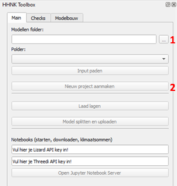
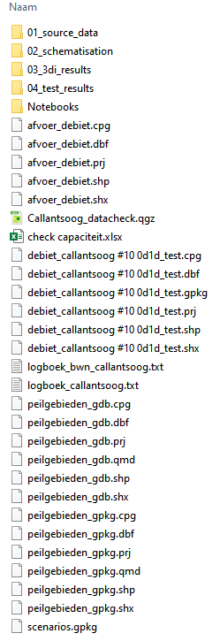

# **Project starten**
Er zijn twee mogelijkheden om met de toolbox aan de slag te gaan:
1. Gebruiker van de plugin begint een [nieuw project](#1-een-nieuw-project-beginnen) 
2. HHNK levert de projectmap inclusief data en model aan (klik [hier](#2-data-aangeleverd-door-hhnk))

Na het [inladen van het project](#3-model-inladen) kunnen de [gegevens worden bekeken](#4-gegevens-bekijken). De [map themes](#5-map-themes) bieden vooraf ingestelde combinaties waarmee snel tussen verschillende thema's gewisseld kan worden.

Niet alle lagen zijn direct beschikbaar. Onder het tabblad Checks worden controles uitgevoerd die daar bekeken kunnen worden in tabellen of als lagen ingeladen kunnen worden. De controles zijn gebaseerd op de schematisatie of op basis van modelresultaten. Voor verdere beschrijving van deze controles zie [Sqlite-checks](c_sqlite_checks.md) en verder.

## **1. Een nieuw project beginnen**
Volg onderstaande werkwijze als je het model vanaf de 'grond' gaat opbouwen.

### Modellen folder selecteren
Voordat een nieuw project aangemaakt kan worden, moet een modellen folder gekozen worden. Op deze locatie wordt alle data in het vervolg opgeslagen. Hieronder is te zien op welke plek de modellen folder (1) zich bevindt:



Kies een locatie in de verkenner waar alles opgeslagen gaat worden (raadzaam om een lokale map te kiezen). Dit kan bijvoorbeeld in de map `C:\Users\{gebruiker}\Documents\3Di`. Je kunt ook een nieuwe map in de verkenner (locatie staat vrij, maar raadzaam om lokaal te werken) aanmaken. 

`{gebruiker}` is de naam van de Windows-gebruiker.

Kies de locatie van de hierboven aangemaakte map om ervoor te zorgen dat ``Nieuw project aanmaken`` (2) geactiveerd wordt. 

### Nieuw project aanmaken
Wanneer je op ``Nieuw project aanmaken`` (2) klikt, opent zich een nieuw venster:


Hier kun je een referentie polder (1) opgeven als je die hebt. <!--- TODO Wat doet dit?--> Het is niet noodzakelijk om deze op te geven. Geef de schematisatie die je gaat aanmaken een naam (2). 

Wanneer je op ``Project aanmaken`` klikt, wordt er een lege mappenstructuur aangemaakt volgens de standaard projectindeling. In de verschillende mappen worden ```readme``` files aangemaakt waarin staat welke files in welke map wordt gezocht.

Het resultaat in de verkenner ziet er als volgt uit:


Nu is het zaak de mappen in de projectstructuur te vullen met bestanden uit de DAMO-export, datachecker en modelbuilder. Zie hiervoor het hoofdstuk [brongegevens](a_brongegevens.md). 

Volg hierna de stappen om [het model in te laden](#3-model-inladen).  

## **2. Data aangeleverd door HHNK**
Volg onderstaande werkwijze als HHNK de benodigde projectmap aanlevert. 

### Map aanmaken 
Maak een nieuwe map aan in de verkenner (locatie staat vrij, maar raadzaam om lokaal te werken) met de naam van het aangeleverde gebied (bijvoorbeeld polder_X). Dat kan er als volgt uit zien: `C:\Users\{gebruiker}\Documents\3Di\polder_X`. 

`{gebruiker}` is de naam van de Windows-gebruiker.

### Data kopiëren 
Kopieer de aangeleverde data naar de map die in stap 1 is gemaakt. Hieronder is een voorbeeld te zien waaruit de aangeleverde data (deze kan qua inhoud verschillen) is opgebouwd.



## **3. Model inladen**
Het model kan vervolgens ingeladen worden door bij `modellen folder` (1) door de volgende handeling: als je in stap 1 de map hebt aangemaakt in het pad: `C:\Users\{gebruiker}\Documents\3Di\polder_X`, kies je bij `modellen folder` het volgende pad om het model in te kunnen laden: `C:\Users\{gebruiker}\Documents\3Di`. Vervolgens kan bij `polder` (2) gekozen worden voor `polder_X`. 

`{gebruiker}` is de naam van de Windows-gebruiker.


## **4. Gegevens bekijken**
Via de knop ``laad lagen`` (3) kun je diverse lagen inladen om inzicht te geven in het model.


Vervolgens verschijnt het onderstaande scherm met een aantal keuzes: 


Bovenaan het scherm kan met kiezen om de resultaten van tests in te laden om te bekijken. Als er nog geen tests zijn uitgevoerd, laat deze leeg en ga hieronder verder. 

Hieonder kunnen nog een aantal andere opties aangevinkt worden:
* [Sqlite (3Di plugin)](#sqlite-3di-plugin)
* [Grid genereren](#grid-genereren)
* [Sqlite testen](#sqlite-testen)
* [Banklevel test](#banklevel-test)
* [Basis layout](#basis-layout)
* [Achtergrondkaarten](#achtergrondkaarten)

### Sqlite (3Di plugin)
Deze optie geeft de mogelijkheid om de schematisatie (.sqlite) van het model in te laden.

### Grid genereren
Deze optie genereert het rekengrid onder andere op basis van grid refinements en rekencel grootte (bepaald in global settings) en deze wordt ingeladen. Voor deze test hoeft er niks gecontroleerd te worden.

<!-- Bij het genereren van het grid kan het voorkomen dat er een foutmelding wordt weergegeven dat de .sqlite te oud is.  
Ga naar [bekende problemen](g_bekende_problemen.md) om de oplossing te bekijken.  <span style="color:yellow"> WE: *@jelle is dit nog zo of wordt er ook automatisch gemigreerd?*</span> -->

### Sqlite testen
De sqlite tests zijn bedoeld om het model te controleren op (potentiële) fouten in de data en deze te corrigeren waar nodig. Als de sqlite tests nog niet zijn uitgevoerd, kunnen deze via [sqlite tests](c_sqlite_checks.md) worden gestart. Als de sqlite tests goed zijn bevonden, is het model klaar om de [0d1d test](g_0d1d_test.md) te draaien. 

### Banklevel test
Door de ``banklevel test`` in te laden, kun je de resultaten inzien die volgen uit de test die is uitgevoerd. Verdere toelichting over de ``banklevel test`` is te vinden in [Banklevel test](h_banklevel_test.md).

### Basis layout
Met het inladen van de ``basis layout`` krijg je inzicht in de resultaten die volgen uit controles die zijn uitgevoerd om te kijken of het model goed is opgebouwd vanuit de brondata of dat er nog data mist.

### Achtergrondkaarten
Met de optie ``achtergrondkaarten`` kun je verschillende soorten kaarten als achtergrond onder de schematisatie leggen. Dit is bijvoorbeeld handig om te controleren of een breedte van een watergang in het model overeenkomt met de breedte op de luchtfoto. 

## **5.  Map themes**
Door op het oogje te klikken onder lagen, kunnen bepaalde kaarten aangevinkt worden om snel een overzicht van de resultaten te krijgen die je wilt bekijken. Op deze manier hoef je niet zelf de juiste lagen aan of uit te vinken voor de resultaten van bepaalde testen, maar wordt dit voor je gedaan. In onderstaande afbeelding staat het oogje met de rode pijl aangegeven.


Klik [hier](c_sqlite_checks.md) om naar sqlite checks te gaan. 