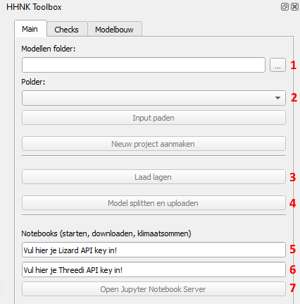

## **Berekeningen uitvoeren**
Nadat de modelstaten zijn gegenereerd, kunnen de (test)berekeningen uitgevoerd worden. Hieronder wordt toegelicht hoe een (test)bereking gestart kan worden:
1. Voer je Lizard API key (5) en 3Di API key (6) in. Indien je nog geen API key(s) hebt, klik <a href="https://demo.lizard.net/management/personal_api_keys" target="_blank">hier</a> voor een Lizard API key en klik <a href="https://management.3di.live/personal_api_keys" target="_blank">hier</a> voor een 3Di API key.

   

2. Klik op ``Open Jupyter Notebook Server`` (7) om het notebook te openen voor het starten van de (test)berekeningen. Je wordt doorverwezen naar een lokale server en het volgende scherm komt tevoorschijn:

   

3. Om een simulatie te starten, kun je het beste gebruik maken van de meest recente versie van ``xx_calculation_gui_vx``. Door te dubbelklikken op de nieuwste versie, word je doorgestuurd naar het volgende scherm:

   

4. Doorloop nu de eerste stap door ergens te klikken in het veld met ``#imports`` en vervolgens crtl + enter. Dit levert het onderstaande invoerscherm op:

   

5. Loop vervolgens stap voor stap de volgende punten af:

   1. ``Login with API keys``: voer hier de Lizard en 3Di API keys in
   2. ``Search for schematisation on 3Di``: typ de naam van het model in waar je een berekening mee wil maken en klik vervolgens op ``Search``.  
   LET OP: om ervoor te zorgen dat de simulatienaam herleidbaar blijft voor nadere analyse, is het noodzakelijk om de gehele naam van de schematisatie te gebruiken. Voorbeeld: met de zoekterm 'Cal' zal het model 'Callantsoog' gevonden worden, maar wordt in de simulatienaam (7) alleen 'Cal' gebruikt. Typ daarom de gehele naam van het door te rekenen model in
   3. ``Select schematisation and model``: kies hier de modelstaat onder ``Schematisation`` en kies bij ``Revision`` voor de door te rekenen revisie. Het ``3Di model`` wordt automatisch ingevoerd, waarna bij ``Organisation`` gekozen kan worden voor de organisatie waar de simulatie gedraaid moet worden
   4. ``Select rain event``: maak hier een keuze voor de neerslagsituatie die bij de modelstaat hoort
   5. ``Select output folder/name``: kies hier de ``Sub folder`` waar de resultaten weggeschreven moeten worden 
   6. ``Select settings to include``: deze stap geeft de mogelijkheid om een aantal opties aan te vinken voor de naverwerking van de resultaten:  
      * Basic processing:  
      * Damage processing:  
      * Arrival processing:  
      * Structure control:  
      * Laterals: 
 BvL: @JK wil jij deze 5 opties invullen? 
   7. ``Start simulation``: de simulatienaam wordt automatisch gegenereerd op basis van de schematisatie die gebruikt wordt. Om de berekening te kunnen starten, moet eerst een simulatie aangemaakt worden middels de ``Create simulation`` knop.

Als je meerdere klimaatsommen wil doorrekenen, kun je ervoor kiezen om in plaats van de tab ``single calculation``, de tab ``batch calculation`` te gebruiken en de scenario's te kiezen welke doorgerekend moeten worden. 

 BvL: @WE/JK is het idee om hier ook nog veelvoorkomende foutmeldingen te noemen? Ik heb namelijk regelmatig dat ik geen simulaties kan draaien, bijvoorbeeld door ModuleNotFoundError of NameError en ik weet niet hoe ik die kan oplossen 

Klik [hier](e_downloaden_resultaten.md) om naar de toelichting van het downloaden van de simulaties te gaan.