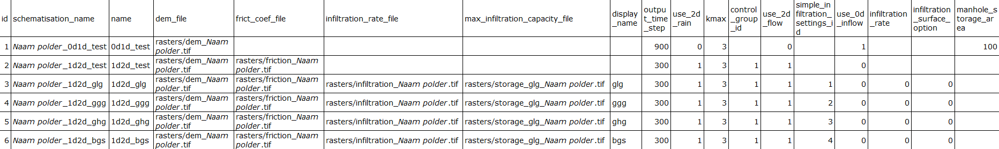
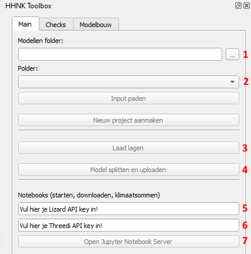
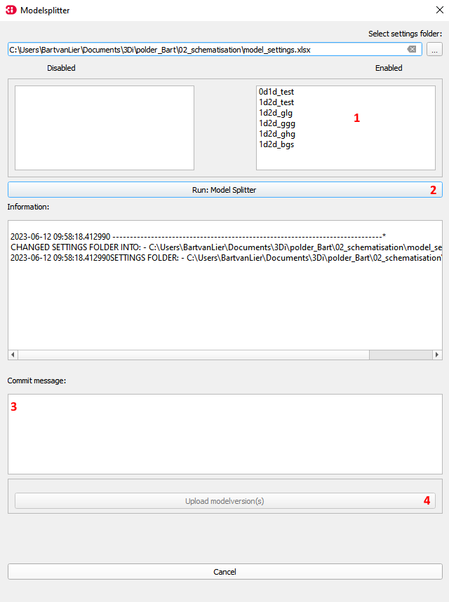

## **Modelstaten**
De modelstaten zijn afgeleide modellen van het basismodel, waarin vastgestelde initiële settings worden meegegeven bij het aanmaken van het model (o.a. GHG/GGG/GLG). De mogelijke modelstaten worden uit een Excel-file gelezen. Dit Excel document moet in de volgende map staan: ``{Modellenmap}\Polder_X\02_schematisation``. In de tabel hieronder zijn voor de verschillende modelstaten de benodigde gegevens te zien. 
   

   
Op de plek waar ``Naam polder`` staat, komt de naam van polder, bijvoorbeeld ``callantsoog_0d1d_test``. Als er andere namen voor rasters worden gebruikt, kunnen deze uiteraard ingevoerd worden in de Excel, zolang ze corresponderen met de namen van de rasters die in ``..\02_schematisation_00_basis\rasters`` zijn opgeslagen. 

De algemene modelinstellingen (tijdstap, gridgrootte etc) settings worden uitgelezen uit een 'model_settings_default.xlsx' in de ...\02_schematisations folder. Indien deze Excel niet aanwezig is kan er geen modelstaat worden geinitiëerd. Als er nog geen Excel aanwezig is in het voorgenoemde pad, zie [brongegevens](a_brongegevens.md) en dan ``9. modelinstellingen`` om de opbouw van de Excel te bekijken.

Volg de volgende stappen voor het aanmaken of splitsen van het basismodel in één of meerdere modelstaten:

1. Controleer de gegeven in de hierboven genoemde Excel-bestanden.

2. Klik op ``Model splitten en uploaden`` (4). 

3. Hierna wordt het volgende scherm weergegeven:

   Afhankelijk van de 'model_settings.xlsx' volgen de verschillende modelstaten (zie vak 1).  De modelsplitter kan vervolgens de modelstaten genereren, zoals in het vak met de ``1`` is te zien. De beschikbare modelstaten staan bij default onder ``Enabled``. De niet gewenste modelstaten sleep je naar ``Disabled``.  
4. Druk op check sqlite om je schematisatie te controleren. (niet in afbeelding)
4. Druk op ``Run: Model Splitter`` (2) om de modelsta(a)t(en) die onder ``Enabled`` staan te initiëren.
5. Geef een ``Commit message`` mee (3).
6. Upload de modelsta(a)t(en) door op ``Upload modelversion(s)`` te klikken (4)
<!---
TODO: update afbeelding
-->

Na het genereren van de modelstaten kunnen (test)berekeningen uitgevoerd worden. Klik [hier](e_berekeningen_uitvoeren.md) om naar de beschrijving van het uitvoeren van (test)berekeningen te gaan.