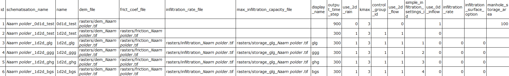
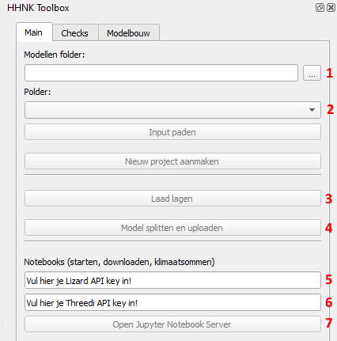
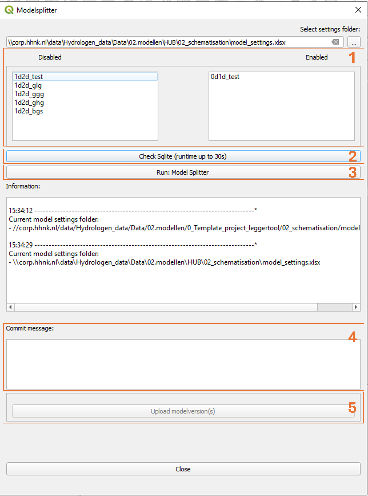

## **Modelstaten**
De modelstaten zijn afgeleide modellen van het basismodel, waarin vastgestelde initiële settings worden meegegeven bij het aanmaken van het model (o.a. GHG/GGG/GLG). De mogelijke modelstaten worden uit een Excel-file gelezen. Dit Excel document moet in de volgende map staan: `{Modellenmap}\Polder_X\02_schematisation\model_settings.xlsx`. In de tabel hieronder zijn voor de verschillende modelstaten de benodigde gegevens te zien. 
   

   
Op de plek waar `Naam polder` staat, komt de naam van polder, bijvoorbeeld `callantsoog_0d1d_test`. Als er andere namen voor rasters worden gebruikt, kunnen deze uiteraard ingevoerd worden in de Excel, zolang ze corresponderen met de namen van de rasters die in `..\02_schematisation_00_basis\rasters` zijn opgeslagen. 

De algemene modelinstellingen (tijdstap, gridgrootte etc) settings worden uitgelezen uit een `02_schematisation\model_settings_default.xlsx`. Indien deze Excel niet aanwezig is kan er geen modelstaat worden geinitiëerd. Als er nog geen Excel aanwezig is in het voorgenoemde pad, zie [brongegevens](a_brongegevens.md) en dan `9. modelinstellingen` om de opbouw van de Excel te bekijken.

Volg de volgende stappen voor het aanmaken of splitsen van het basismodel in één of meerdere modelstaten:

1. Controleer de gegevens in de hierboven genoemde Excel-bestanden.

2. Klik op `Model splitten en uploaden` (4). Daarna wordt het venster Modelsplitter geopend.

3. Hierna wordt het volgende scherm weergegeven:

   Afhankelijk van de 'model_settings.xlsx' worden de verschillende modelstaten getoond. De modelstaten die gegenereerd moeten worden, moeten onder `Enabled` staan. Modelstaten die niet gegenereerd hoeven te worden, kunnen naar `Disabled` worden gesleept.
    
3. Controleer of de gewenste modelstaten onder Enabled staan (8).
4. Klik op Check Sqlite om de schematisatie te controleren. Deze stap is verplicht; als deze stap niet wordt uitgevoerd, kan het model niet worden geüpload (9).
5. Klik op Run: Model Splitter om de modelsta(a)t(en) onder Enabled te genereren (10).
6. Voeg een commit message toe (11).
7. Upload de geselecteerde modelstaten door op Upload modelversion(s) te klikken (12).

Na het genereren van de modelstaten kunnen (test)berekeningen uitgevoerd worden. Klik [hier](e_berekeningen_uitvoeren.md) om naar de beschrijving van het uitvoeren van (test)berekeningen te gaan.