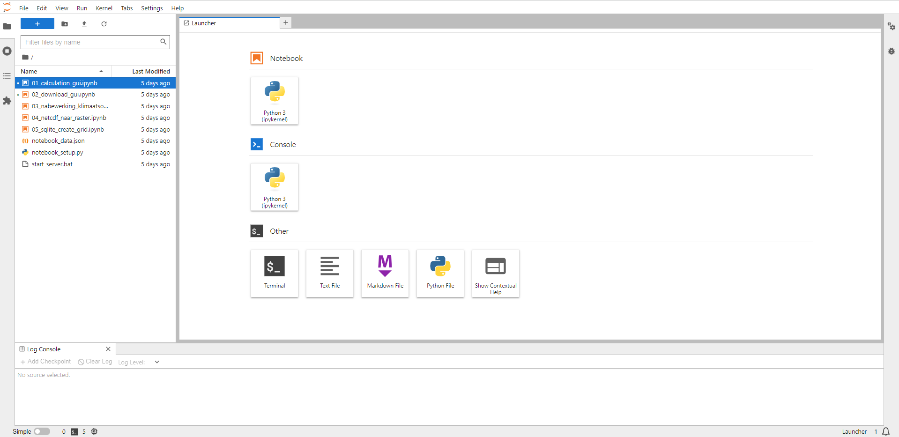
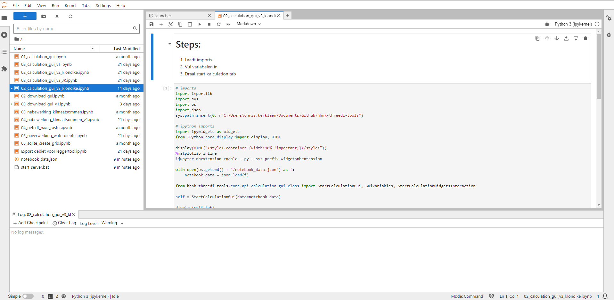
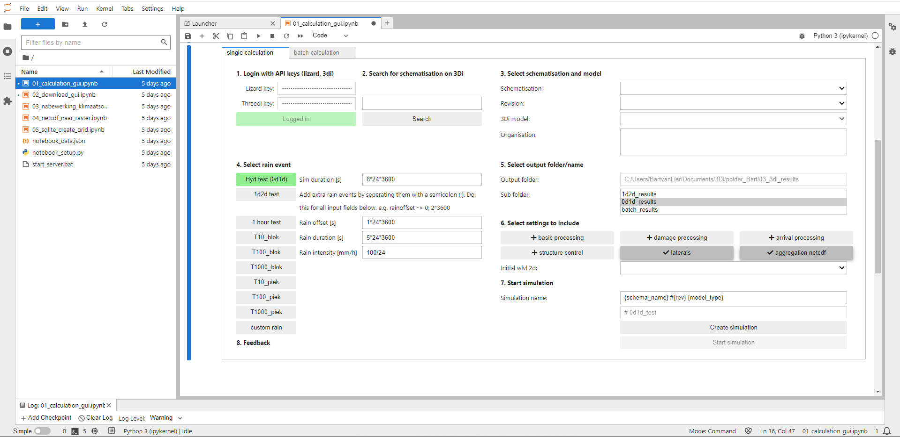
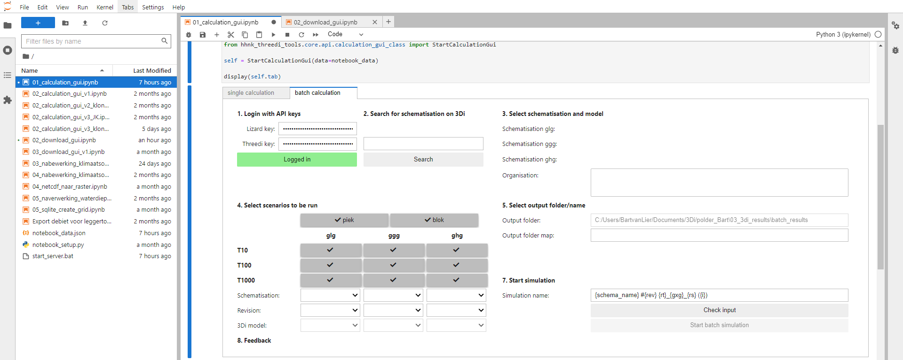

## **Berekeningen uitvoeren**
Nadat de modelstaten zijn gemaakt, kunnen de (test)berekeningen uitgevoerd worden. Hieronder wordt toegelicht hoe een (test)berekening gestart kan worden:
1. Voer je Lizard API key (5) en 3Di API key (6) in. Indien je nog geen API key(s) hebt, klik <a href="https://demo.lizard.net/management/personal_api_keys" target="_blank">hier</a> voor een Lizard API key en klik <a href="https://management.3di.live/personal_api_keys" target="_blank">hier</a> voor een 3Di API key.

   

2. Klik op ``Open Jupyter Notebook Server`` (7) om het notebook te openen voor het starten van de (test)berekeningen. Je wordt doorverwezen naar een lokale server en het volgende scherm komt tevoorschijn:

   

3. Om een simulatie te starten kun je gebruik maken van  ``01_calculation_gui``. Door te dubbelklikken op de nieuwste versie, word je doorgestuurd naar het volgende scherm:

   

4. Doorloop nu de eerste stap door ergens te klikken in het veld met ``#Add qgis plugin deps to syspath and load notebook_data`` en vervolgens crtl + enter. Dit levert het onderstaande invoerscherm op:

   

5. Loop vervolgens stap voor stap de volgende punten af:

   1. ``Login with API keys``: voer hier de Lizard en 3Di API keys in
   2. ``Search for schematisation on 3Di``: typ de naam van het model in waar je een berekening mee wil maken en klik vervolgens op ``Search``. <br>
   LET OP: om ervoor te zorgen dat de simulatienaam herleidbaar blijft voor nadere analyse, is het noodzakelijk om de gehele naam van de schematisatie te gebruiken. Voorbeeld: met de zoekterm 'Cal' zal het model 'Callantsoog' gevonden worden, maar wordt in de simulatienaam (7) alleen 'Cal' gebruikt. Typ daarom de gehele naam van het door te rekenen model in
   3. ``Select schematisation and model``: kies hier de modelstaat onder ``Schematisation`` en kies bij ``Revision`` voor de door te rekenen revisie. Het ``3Di model`` wordt automatisch ingevoerd, waarna bij ``Organisation`` gekozen kan worden voor de organisatie waar de simulatie gedraaid moet worden
   4. ``Select rain event``: maak hier een keuze voor de neerslagsituatie die bij de modelstaat hoort
   5. ``Select output folder/name``: kies hier de ``Sub folder`` waar de resultaten weggeschreven moeten worden 
   6. ``Select settings to include``: deze stap geeft de mogelijkheid om een aantal opties aan te vinken voor de naverwerking van de resultaten: <br>
      * Basic processing(\*): stuur je resultaten naar Lizard en maakt een basisresultatenbestand zoals waterdiepte;<br>
      * Damage processing(\*): voegt schadeberekening toe aan resultaten in Lizard (met behulp van standaard HHNK-instellingen);<br>
      * Arrival processing: voegt aankomsttijd toe aan resultaten in Lizard;<br>
      * Structure control: voegt sturing aan de berekening toe, aan te raden wanneer individuele klimaatsommen gedraaid worden; <br>
      * Laterals: voegt lateralen toe aan de berekening vanuit de sqlite-database, laat aan staan;<br>
      * Aggregation netcdf: voegt aggregatie instellingen uit de sqlite-database toe aan de berekening indien beschikbaar<br>
      * initial wlvl 2d: selecteert initial water level raster file om mee te nemen in de berekening<br>
   7. ``Start simulation``: de simulatienaam wordt automatisch gegenereerd op basis van de schematisatie die gebruikt wordt. Om de berekening te kunnen starten, moet eerst een simulatie aangemaakt worden middels de ``Create simulation`` knop. Als dat is gelukt, kleurt de knop ``Start simulation  `` groen en kan de simulatie aangezet worden.

\* *Lizard abonnement en opslag nodig. Niet nodig voor vervolg BWN werkwijze dus kan uitgelaten worden.* <br>

Als je meerdere klimaatsommen wil doorrekenen, kun je ervoor kiezen om in plaats van de tab ``single calculation``, de tab ``batch calculation`` te gebruiken en de scenario's te kiezen welke doorgerekend moeten worden. 



Zoek opnieuw het gewenste model via stappen 1, 2 en 3. Onder 4. is het mogelijk het juiste model, revisie en benodigde 2D waterstand-rasters bij de juiste initiële condities (gXg) te selecteren. Standaard worden de resultaten opgeslagen onder ```batch results```. Voeg eventueel een eigen map of kenmerk aan de simulatie toe (onder 7) om meerdere klimaat-batches uit elkaar te houden. Met de knop ```check input``` wordt een overzicht gemaakt van de berekeningen. Controleer deze en klik vervolgens op `` start batch simulation``.

Klik [hier](f_downloaden_resultaten.md) om naar de toelichting van het downloaden van de simulaties te gaan.