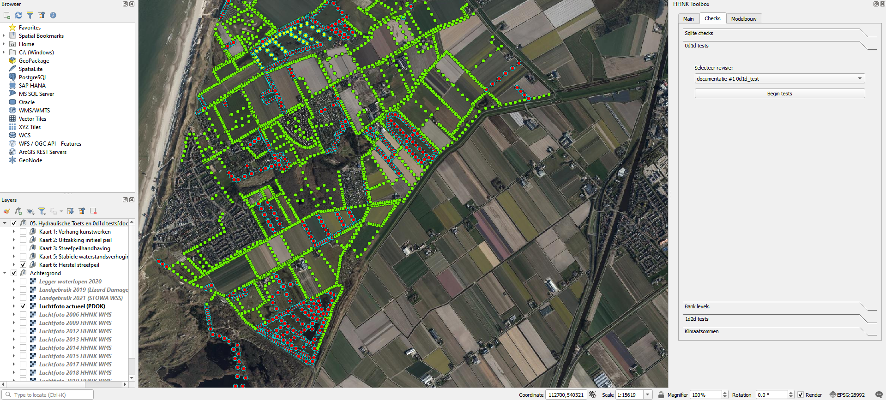

## **0d1d test**
Als de sqlite tests zijn uitgevoerd, eventueel aanpassingen zijn gemaakt en het model is opgebouwd voor rekenen met 3Di, is het tijd om de 0d1d test uit te voeren. Voor deze toets is een test bui ontworpen om het 1d watersysteem in het model te controleren. De test bui begint met een droge dag, vijf dagen neerslag gelijk aan de afvoernorm (in de meeste polders is dit 14,4 mm/dag) en dan twee dagen droog, zoals in onderstaande afbeelding is weergegeven. Deze bui is zo ontworpen dat we een aantal eigenschappen van het watersysteem kunnen toetsen:

- **streefpeil handhaving**: blijven waterpeilen constant tijdens de droge dag?
- **stationaire afvoer**: stabiliseert het peil en de afvoer na de 5 dagen neerslag?
- **herstel streefpeil**: herstelt het streefpeil na de natte periode?

### **Werkwijze HHNK 3Di plugin**
Om deze test uit te kunnen voeren, is een 0d1d model noodzakelijk. Indien er nog geen 0d1d model is gemaakt, kun je [hier](d_modelstaat_aanpassen.md) lezen hoe een 0d1d model gemaakt kan worden.

In de 0d1d modelstaat zitten alleen watergangen met de bijbehorende kunstwerken en aan de watergangen zijn afvoervlakken verbonden. Na het succesvol uploaden en aanmaken van het 3Di model kan via de [calculation gui](e_berekeningen_uitvoeren.md) op de Jupyter notebook server de berekening worden gestart. Selecteer het juiste model en start de 0d1d test.

Download na de berekening de resultaten met de [download gui](f_downloaden_resultaten.md). Kies voor raw output en grid administration en zorg dat de resultaten in de map 0d1d_results terecht komen.

Om het resultaat in de HHNK Toolbox te laden kies je onder checks voor 0d1d tests. Selecteer daaronder de revisie van de gemaakte berekening en klik op Begin tests. Er worden hiermee een aantal kaartlagen aan het project toegevoegd in een groep met de naam: *05. Hydraulische Toets en 0d1d tests [polder revisie model]*. De afbeelding hieronder geeft een beeld hoe dat eruit kan zien.

### **Uitkomsten van de test**
De 0d1d test genereert een aantal resultaten die inzicht geven in de werking van het systeem tijdens een stationaire bui. 

**Hydraulische test (Kaart 1: Verhang kunstwerken)**: Deze test filtert de afvoer en waterstanden aan het einde van de neerslag uit de resultaten. Voor de watergangen en kunstwerken wordt het volgende bepaald:
* Het debiet in m3/s (q)
* Het verhang (cm/km)
* De stroomsnelheid in m/s (u)

Voor 1d waterstandpunten worden resultaten gefilterd op vaste tijdstappen. De tijdstappen zijn:
* Aan het begin van de som
* Aan het begin van de regen
* Een dag voor het einde van de regen
* Aan het einde van de regen
* Aan het einde van de som

Op basis van deze informatie worden de volgende waarden bepaald (in centimeters):
* Het verschil in waterstand tussen het begin van de som en het begin van de regen (Kaart 2: Uitzakking initieel peil). Dit wordt gedaan om te controleren of peilgebieden niet lekken.
* Het verschil in waterstand tussen het begin van de regen en het einde van de regen (Kaart 3: Streefpeilhandhaving). Dit wordt gedaan om te controleren of berekende waterstandstijgingen acceptabel zijn in relatie tot de drooglegging.
* Het verschil in waterstand tussen het einde van de regen en een dag daarvoor (Kaart 5: Stabiele waterstandsverhoging einde regen). Dit wordt gedaan om te controleren of het systeem zich in een stationaire situatie bevindt.
* Het verschil in waterstand tussen het einde van de regen en het einde van de som (Kaart 6: Herstel streefpeil). Dit wordt gedaan om te controleren of het watersysteem weer terug gaat naar het streefpeil.

### **Beoordeling resultaten**
De resultaten die de 0d1d tests genereert, moeten gecontroleerd worden om te bevestigen dat het model naar behoren werkt. Gebruik de verschillende kaarten vooral om de plausibiliteit van het functioneren van het watersysteem in het model te controleren. Voeren de peilgebieden af zoals je verwacht, bijvoorbeeld via de watergangen die primair zijn. Controleer de stroming over de belangrijkste kunstwerken. Bespreek opvallendheden met de regioadviseurs van HHNK.

Om te beoordelen of het watersysteem hydraulisch functioneert, is hieronder per onderdeel beschreven welke waarden/uitkomsten per onderdeel realistisch zijn (Kaart 1: Verhang kunstwerken)
* Het debiet in m3/s (q) 
*Controleer of het afvoerverloop overeenkomt met de verwachting. Bespreek dit in ieder geval met de watersysteem adviseurs van HHNK.*
* Het verhang (cm/km) 
*Het verhang in een correct gedimensioneerde watergang ligt onder de 2-4 cm/km. Zodra het verhang boven de 4 cm/km ligt, is bijvoorbeeld de watergang (te) krap gedimensioneerd of de gemaalcapaciteit (te) laag. Watergangen met een hoog verhang kunnen op een schematisatiefout wijzen*
* De stroomsnelheid in m/s (u) 
*Watergangen of kunstwerken met een heel hoge stroomsnelheid (>0.5 m/s) kunnen wijzen op een schematisatiefout.*
* Het verschil in waterstand tussen het begin van de som en het begin van de regen (Kaart 2: Uitzakking initieel peil) 
*De waterstand zou tot aan het begin van de neerslagsituatie niet meer dan 2 cm moeten stijgen of uitzakken. Indien de waterstand stijgt of zakt, zit er mogelijk een lek in het model. Dit zou een gemaal met een verkeerd aanslagpeil kunnen zijn of een stuw op de grens met een ander peilgebied staat te laag, waardoor het naar een ander peilgebied 'lekt'*  
* Het verschil in waterstand tussen het begin van de regen en het einde van de regen (Kaart 3: Streefpeilhandhaving) 
*Gedurende de neerslagsituatie is het normaal dat de waterstand in de watergangen stijgt. Afhankelijk van de drooglegging, het type gebied, is 15 tot 25 cm stijging een normale waarde. In veengebieden kunnen peilstijgingen groter dan 25 cm al voor problemen zorgen, terwijl in zandgebieden grotere peilstijgingen (>25 cm) zonder directe overlast mogelijk zijn. Bij grotere peilstijgingen moet de gebruikte data of het 1d systeem gecontroleerd worden op fouten.*
* Het verschil in waterstand tussen het einde van de regen en een dag daarvoor (Kaart 5: Stabiele waterstandsverhoging einde regen) 
*In de laatste dag van de neerslagsituatie zou de waterstand niet meer verder dan 1 cm moeten stijgen, omdat er een stationaire situatie is bereikt. Als de waterstand niet stabiel is kan dit opnieuw wijzen op een lekkend peilgebied of een dat een waterloop niet kan afvoeren. In grote polders kan het nodig zijn de neerslagperiode langer te maken (via de calculaiton-gui), de test detecteert het einde van de periode automatisch.*
* Het verschil in waterstand tussen het begin en het einde van de som (Kaart 6: Herstel streefpeil) 
*In de laatste dag van de simulatie, waar geen regen meer valt, zou de waterstand weer moeten zakken naar het streefpeil (of mogelijk nog wat lager door de afslagpeilen van de gemalen). Wanneer de waterstand nog meer dan 2 cm boven het streefpeil ligt, zit er mogelijk een fout in het model. Mogelijke oorzaak is beperkte afvoermogelijkheden bij kunstwerken.*

Als er voldoende vertrouwen in de uitkomsten van het model is, geldt het resultaat van de laatste 0d1d test als hydraulische toets. 

Om klimaatsommen te maken is het nodig de [Banklevel test](h_banklevel_test.md) uit te voeren.
