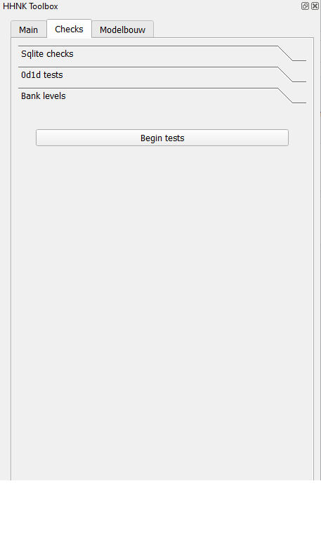
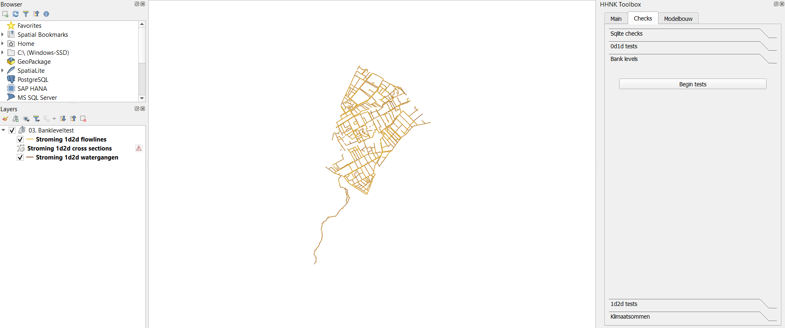

## **Banklevel test**
Als het 0d1d model is goedgekeurd (zie [0d1d test](g_0d1d_test.md)), kan deze test worden gedraaid. De bank levels test is grotendeels bedoeld om het model klaar te maken voor 3Di simulaties waarbij uitwisseling plaatsvindt tussen het watersysteem (1d) en het maaiveld (2d). Als deze test is voltooid kan de [1d2d test](i_1d2d_test.md) worden uitgevoerd.

In de modelbuilder worden bank levels ingesteld op 10 cm boven streefpeil, tenzij de watergang binnen 40 meter van een levee ligt. Dan wordt de bank level gelijk aan de levee. Dit is een zeer conservatieve manier om lekken te voorkomen, omdat de modelbuilder nog niet weet waar de 1d2d verbindingen liggen. Het risico bestaat echter dat bank levels onnodig hoog zijn waardoor water niet niet van maaiveld kan afstromen. 

### Kruising 1d2d verbinding en levee
In de Banklevel test wordt nogmaals gecontroleerd of de bank levels hoog genoeg liggen, maar ook of ze lager kunnen. Hierbij wordt wel gebruik gemaakt van de 3Di gridbuilder, zodat wel duidelijk is waar de 1d2d verbindingen liggen. De bank levels worden alleen aangepast wanneer een 1d2d verbinding van een watergang de levee kruist. 

### Peilscheidend kunstwerk binnen peilgebied
In de schematisatie worden kunstwerken naar het uiteinde van een waterloop verschoven als hierdoor zeer korte segmenten kunnen worden vermeden (max 5 m). Hierdoor kan het gebeuren dat het kunstwerk niet meer op de peilgrens ligt. De banklevel test controleert dit ook en voegd manholes toe waardoor water niet via 2D langs het peilscheidende kunstwerk kan stromen.

Nb. In 2023 is een update doorgevoerd in 3Di waarbij de hoogte van de levee (inmiddels obstacles genoemd) de bank level overschrijft wanneer de 1d2d verbinding een obstacle kruist. De methode is echter nog niet waterdicht, dus is deze banklevel test voorlopig nog nodig. Ook omdat deze ook controleert of peilscheidende kunstwerken binnen een peilgebied vallen.

### **Werkwijze HHNK 3Di plugin**
Het draaien van de bank levels test kan worden uitgevoerd met enkel het sqlite-model. Wanneer in de 'main' van de HHNK toolbox de juiste modellen folder en polder zijn geselecteerd, kunnen de sqlite testen uitgevoerd worden. Volg onderstaande stappen:

1. Ga naar 'Checks' in de HHNK Toolbox.
2. Kies voor 'Bank levels' en klik op 'Begin tests'.

 

 Na enige tijd verschijnt een scherm met daarin voorgestelde aanpassingen. Voer deze niet meteen uit. Het is mogelijk om op de kaart de resultaten te bekijken om te zien of je dit herkend. Ook kun je een lijst maken met connection nodes waar je bewust geen manholes wilt. Deze kun je invoeren in het scherm en worden overgeslagen.

3. QGIS laadt vervolgens de resultaten in 'Lagen' als 03.Bankleveltest.

### **Uitkomsten van de test**
Als uitkomst van deze test worden drie groepen ingeladen. 
* De eerste laag heet 'Stroming 1d2d flowlines' en geeft de stromingen tussen het maaiveld en de watergangen weer. In de attributen tabel van deze groep kan in de kolom type gezien worden of de 1d2d verbinding een levee kruist of niet. In het geval dat de 1d2d verbinding een levee kruist kan de levee hoogte gezien worden in de kolom 'levee_height'.
* De tweede laag heet 'Stroming 1d2d watergangen' en geeft de watergangen weer. In de attributentabel van deze groep kan in de kolom 'bank_level_source' gezien worden of dat de banklevel gelijk wordt aan het streefpeil + 10cm of dat de banklevel de hoogte van de grootste levee hoogte binnen 40 meter krijgt afhankelijk van het kruisen van een 1d2d verbinding met een levee of niet. De nieuwe banklevel kan gezien worden in de kolom new_bank_level. 

### **Beoordeling resultaten**
Oranje stippen en ruiten zijn voorgestelde veranderingen die nog niet in de sqlite staan. De stippen zijn manholes die toegevoegd worden. Inzoomen geeft weer waarom er een manhole toegevoegd wordt. De ruiten zijn de cross section locations die een nieuwe banklevel krijgen. De labeling geeft aan hoeveel meter de banklevel verandert. In dit voorbeeld dus vier keer 0.98m lagere banklevel. Oranje lijnelementen zijn plekken waar er wel een kruising is met een fixeddrainagelevelarea maar niet met een levee. Controleer hier of het terecht is dat de banklevel op streefpeil + 10cm gezet moet worden of juist hoger wilt hebben. Deze specifieke aanpassing is geen scripting voor. 

Als je geen manholes wilt op bepaalde connection nodes, maak dan een lijst aan van de connection node id's. Deze kunnen meegegeven worden in het scherm zodat ze overgeslagen worden.

Wanneer je op aanpassingen uitvoeren klikt wordt het model aangepast. Pas opnieuw de [modelstaat aan](d_modelstaat_aanpassen.md), upload het model en ga verder naar de [1d2d test](i_1d2d_test.md).