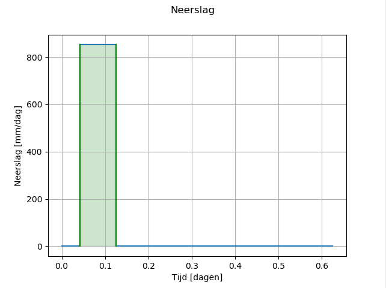
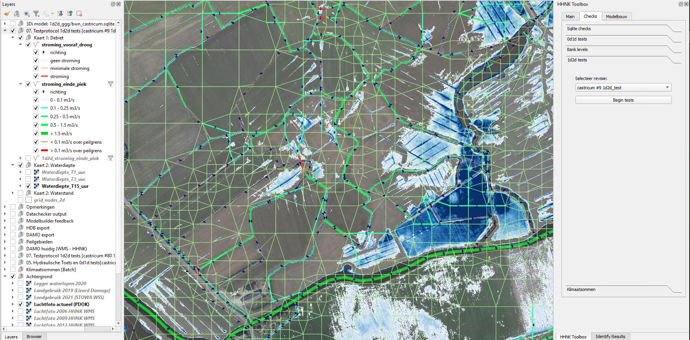

## **1d2d test**
Wanneer de bank levels zijn bijgewerkt en waar nodig manholes zijn toegevoegd kan de 1d2d test worden gedraaid. Dit houdt in dat er opnieuw een test bui wordt gesimuleerd met 3Di.  De test bui begint met een uur droog, dan twee uur regen (17,75 mm/uur), dan 12 uur droog (zie figuur hieronder). Het simuleert daarmee een relatief hevige neerslag waarbij enige wateroverlast is te verwachten. In het 1d2d-test model is infiltratie uitgeschakeld.



Het doel van deze test is het controleren van stromingen in het watersyteem en over maaiveld en oplossen waar dit onrealistisch is. De plug-in zet de testresultaten om in een aantal kaarten die visueel kunnen worden gecontroleerd. Als de 1d2d test resultaten goedgekeurd zijn is het model klaar voor [klimaarsommen](j_werkwijze_klimaatsommen.md).

### **Werkwijze HHNK 3Di plugin**
Deze test werkt alleen wanneer het model in de 1d2d-test-staat is ingesteld (zie [Model staat aanpassen](d_modelstaat_aanpassen.md)).

In het model zijn nu als het goed is de channels connected en is de infiltratie uitgeschakeld. Na het succesvol uploaden en aanmaken van het 3Di model kan via de [berekening worden gestart](e_berekeningen_uitvoeren.md). Selecteer het juiste model en start de 1d2d test. 
[Download de resultaten](f_downloaden_resultaten.md). Kies voor raw output en grid administration en zorg dat de resultaten in de map 1d2d_results terecht komen. 
 
Om het resultaat in de HHNK Toolbox te laden kies je onder checks voor 1d2d tests. Selecteer daaronder de revisie van de gemaakte berekening en klik op ```Begin tests```. Er worden hiermee een aantal kaartlagen aan het project toegevoegd in een groep met de naam: *07. Testprotocol 1d2d tests [polder revisie model]*. De afbeelding hieronder geeft een beeld hoe dat eruit kan zien.



### **Uitkomsten van de test**
De ingeladen kaarten worden gebruikt om eventuele onrealistische resultaten te vinden die worden veroorzaakt door fouten in het model. Hiervoor worden drie typen kaarten ingeladen. 

* Kaart 1: Debiet

  Deze functie leest alle debieten en richting in uit het 3Di resultaat op drie tijdstappen;
  - T1: het begin van de regen
  - T3: het einde van de regen
  - T15: het einde van de som
  
  Vervolgens wordt gekeken naar het type van de lijn (1D2D of 2D). Aan de hand hiervan worden de lagen opgemaakt.

* Kaart 2: Waterdiepte

  Op basis van de DEM en de waterstand op de hierboven genoemde tijdstappen is de waterdiepte bepaald.  
  
* Kaart 3: Waterstanden 

  De waterstanden op de hierboven genoemde tijdstappen op basis van het 3Di resultaat. 

### **Beoordeling resultaten**
Gebruik de kaarten en eventueel de ruwe 3Di resultaten om de het model te controleren. Let hierbij op de volgende zaken:

* Stroming vooraf

  De kaarten stroming vooraf en de waterstand- en waterdieptekaarten aan het begin van de berekeningen (T1) zouden geen stroming of ontstaan van inundatie moeten laten zien. Dit zou namelijk betekenen dat er zonder dat er neerslag valt, water uit het watersysteem het maaiveld op stroomt.

* Afvoerpatroon bij neerslag

  De kaarten stroming einde piek van de waterstanden en waterdieptes op T2 geven aan waar stroming is na de bui. Controleer of het afvoerpatroon vergelijkbaar is met de verwachting uit de 0d1d test. 

* Stroming rond kunstwerken

  Bij de 1d2d berekening kan stroming optreden rondom kunstwerken via de 1d2d verbindingen. Het is moeilijk dit volledig te voorkomen, we hebben hier nog geen goede werkwijze voor. De locaties zijn wel te herkennen met de kaartlaag 1d2d stroming einde piek. Voor belangrijke kunstwerken, bijvoorbeeld op peilgrenzen, onder wegen door of die zijn aangemerkt als belangrijk, is het goed deze langs te lopen. Lokaal kan gekozen worden om roosterverfijning en obstacles of manholes te gebruiken om dit te voorkomen.

* Stroming over obstacles

  In de modellen zijn obstacles geplaatst op alle peilgrenzen en soms over hoger gelegen hoofdwegen. In de stromingskaarten wordt stroming over deze obstacles extra rood gemarkeerd. Peilgrenzen zijn niet per sé altijd waterkeringen en het is dus niet altijd fout als er water over peilgrenzen stroomt, maar het is wel goed deze locaties te controleren. 
 
* Stroming rondom waterbergingen

  In de modellen en brongegevens wordt op de begrenzing van (water)bergingsgebieden niet altijd een obstacle toegevoegd. Stroomt water in of uit de bergingsgebieden via het maaiveld, controleer dan of dit realistisch is en voeg eventueel een obstacle en roosterverfijning toe.
 
* Inundatie einde berekening
  
  De waterdieptekaart aan het einde van de berekening kan je helpen locaties te vinden waar neerslag niet kan afstromen richting het watersysteem. Pas hier mogelijk de bank levels verder aan of zorg voor roosterverfijning. In stedelijk gebied blijft neerslag vaak in tuinen of op wegen staan als gevolg van het ontbreken van riolering. Wees hier kritisch op bij de interpretatie van het resultaat.

Als je tevreden bent met het model kun je verder met de [klimaatsommen](../g_klimaatsommen/1_klimaatsommen.md). Vergeet niet aanpassingen op te slaan en opnieuw via [modestaat aanpassen](d_modelstaat_aanpassen.md) de modellen te uploaden. 


