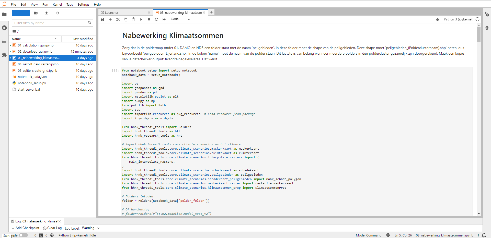
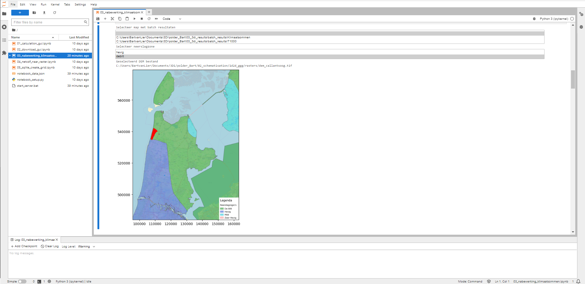
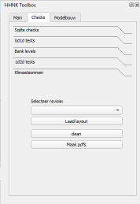
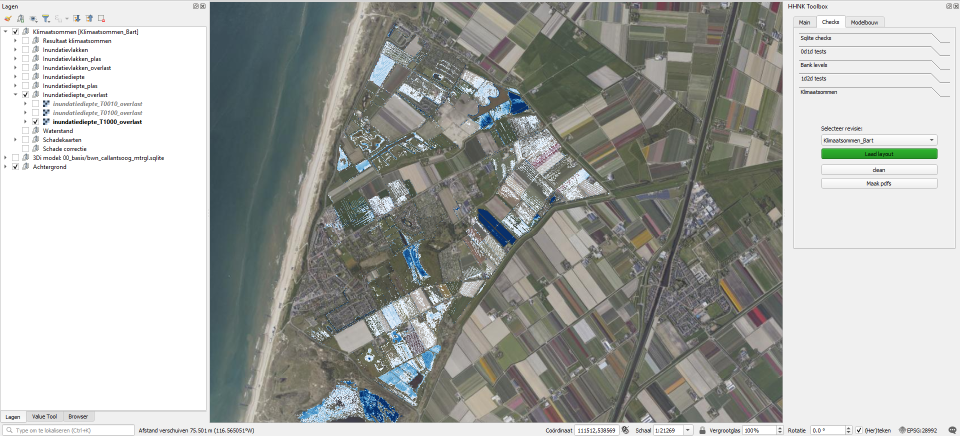

## **Klimaatsommen**
Als alle testen succesvol zijn afgerond, kunnen de klimaatsommen gesimuleerd worden. Voor meer informatie over de klimaatsommen, klik [hier](../3_achtergronden_en_uitgangspunten/g_achtergrond_klimaatsommen/1_achtergrond_klimaatsommen.md).

### **Werkwijze HHNK 3Di plugin**
Voor het simuleren van de klimaatsommen, is het noodzakelijk om tenminste een GLG, GGG en GHG model te hebben. Indien deze niet aanwezig zijn, kun je deze via [modelstaat aanpassen](d_modelstaat_aanpassen.md) aanmaken.

Zodra de modellen met grondwaterconditie gemaakt zijn, kunnen via [berekeningen uitvoeren](e_berekeningen_uitvoeren.md) de klimaatsommen gestart worden. Klimaatsommen zijn alleen via de batch calculation te draaien. [Download de resultaten](f_downloaden_resultaten.md) via de ```Download batch```-knop.

Na het downloaden van de resultaten moeten nog een aantal nabewerkingen worden gedaan om de kaarten in de plugin te laden. Dit gebeurt via een notebook. Kies in het notebook voor ``03_nabewerking_klimaatsommen``. Dit geeft het onderstaande scherm:



<!-- #TODO updaten tekst in notebook <span style="color:red"> BvL: tekst onder nabewerking klimaatsommen niet meer up to date? Ik kan de map 01. DAMO en HDB niet vinden. 01_source_data wel. </span>-->

1. Gebruik ctrl + enter om het veld onder ``Nabewerking Klimaatsommen`` te doorlopen. 
2. De volgende stap bevindt zich onder ``Selectie neerslagzone en dem``. Draai het veld met ctrl + enter. Dit levert het een plaatje op met de ligging van de polder in het beheergebied:

    
    Kies bij ``Selecteer een map met batch resultaten`` de map waar de downloads zijn weggeschreven.
    Kies bij ``Selecteer een neerslagzone`` de neerslagzone die je wil gebruiken. In bovenstaand afbeelding is de keuze tussen twee zones, omdat het modelgebied in twee zones valt. Kies in dergelijk geval voor de zone waar het grootste deel van de polder in valt.
3. Stap 3 gaat over het lokaliseren van de polder folder. Run het veld met ctrl + enter. <br>
*Bij deze stap is het belangrijk dat alle folders goed staan. Als de resultaten in een folder in een andere map staat (ergens anders dan batch_results) of als het notebook vanuit een ander model wordt geopend dan welke je wil analyseren, zal een foutmelding ontstaan.*
4. Draai de 4de stap middels ctrl + enter. Deze stap zet input klaar voor volgende stappen. Het duurt een tijd voordat deze stap doorlopen is. <br>
<!--*Het klaarzetten van de input kan alleen via de server van HHNK plaatsvinden.* Opmerking van Bart, is dat zo, nee toch?-->
5. De stappen die hierna komen tot ``Schade corrigeren``, kunnen allemaal doorlopen worden middels ctrl + enter. De stappen vanaf ``Schade corrigeren`` zijn alleen noodzakelijk als er onrealistische schades zijn berekend op plekken. Deze kunnen dan middels een polygoon verwijderd worden. Zie het notebook voor de precieze stappen.

De stappen die in het notebook zijn doorlopen, hebben resultaten gegenereerd die zijn in te laden in de HHNK plugin. Het inladen van de resultaten gaat als volgt:
1. Selecteer de revisie van het model waar je de resultaten van wil inladen (zie onderstaande afbeelding).<br>

2. Klik op ``Laad layout`` om resultaten in te laden. De verschillende resultaten verschijnen onder ``Lagen``. De afbeelding hieronder geeft een voorbeeld wat de inundatiediepte kan zijn bij een bui die 1x in de 1000 jaar voorkomt.<br>


    Stap 3 en 4 zijn optioneel.

3. <!-- TODO<span style="color:red"> BvL: TODO clean werkt niet </span>-->

4. Met de knop ``Maak pdfs`` kunnen de kaarten uit de lagen naar een pdf geëxporteerd worden. De pdf's worden in de map ``batch results`` weggeschreven. <!-- TODO<span style="color:red"> TODO: BvL: alle kaarten zijn hetzelfde... Is dit een bekende fout?</span>-->

### **Uitkomsten van de test**
De ingeladen kaarten geven een beeld van wat de gevolgen van de diverse klimaatsommen zijn in het modelgebied. Om bepaalde resultaten makkelijk in te laden, is het gebruik van [map themes](b_project_starten.md#5-map-themes) handig. De volgende kaarten zijn getoond:
* Resultaat klimaatsommen: 
    - Ruimtekaart: 
        - De ruimte index is in een bepaalde kleur per peilgebied weergegeven. De kaart laat zien of de schade per m3 gelijk verdeeld is over de polder en/of er ruimte is voor een betere verdeling van water bij extreme neerslag.
        - De absolute berging in het peilgebied geeft een indicatie van de hoeveelheid berging in het peilgebied.<br>
        - De relatieve berging geeft een indicatie van de hoeveelheid berging in het peilgebied ten opzichte van de gehele polder.
    - Peilgebieden: deze kaart geeft de peilgebieden in het modelgebied weer.

* Inundatievlakken: de inundatievlakken bestaan uit de drie herhalingstijden: T10, T100 en T1000. De kaarten geven weer welk gebied bij welke herhalingstijd inundeert. De kaarten maken geen onderscheid tussen inundatie die vanuit het watersysteem ontstaat of door plasvorming op het maaiveld. 

* Inundatievlakken - plas: deze kaart laat zien welke delen inunderen door plasvorming op het maaiveld.

* Inundatievlakken - overlast: deze kaart laat zien welke delen op het maaiveld inunderen door water dat vanuit het watersysteem komt.

* Inundatiediepte: de kaarten met de inundatiediepte zijn net als de inundatievlakken opgesteld op basis van de drie herhalingstijden: T10, T100 en T1000. Op de kaarten is te zien wat de berekende waterdiepte is bij elk van de herhalingstijden. De kaarten maken geen onderscheid tussen inundatie die vanuit het watersysteem ontstaat of door plasvorming op het maaiveld. 

* Inundatiediepte - plas: deze kaart laat zien wat de waterdiepte is van de delen die inunderen door plasvorming op het maaiveld.

* Inundatiediepte - overlast: deze kaart laat zien wat de waterdiepte is van delen op het maaiveld die inunderen door water dat vanuit het watersysteem komt.

<!-- TODO<span style="color:red"> BvL: *Waterstand genereert geen kaarten. Klopt dit?</span>-->

* Schadekaarten:
    - Schade per peilgebied: deze kaart laat zien wat de schade is per peilgebied. Hierbij is de schade die door inundatie vanuit het watersysteem en inundatie door plasvorming op het maaiveld optreedt, bij elkaar opgeteld.
    - Schade per peilgebied - plas: deze kaart laat zien wat de schade is per peilgebied welke wordt veroorzaakt door plasvorming op het maaiveld. 
    - Schade per peilgebied - overlast: deze kaart laat zien wat de schade is per peilgebied welke wordt veroorzaakt door inundatie vanuit het watersysteem. 
    - cw schade - overlast: dit raster toont in het modelgebied de contante waarde van de schade die is veroorzaakt door inundatie vanuit het watersysteem.
    - cw schade - plas: dit raster toont in het modelgebied de contante waarde van de schade die is veroorzaakt door plasvorming op het maaiveld.
    
* Schade correctie: in deze laag kunnen polygonen worden toegevoegd om onrealistische schade te verwijderen. Dit kan via het doorlopen van het notebook.

De pdf kaarten zijn het eindproject van de modelanalyse. 