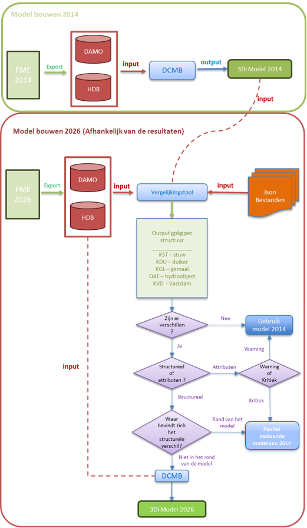
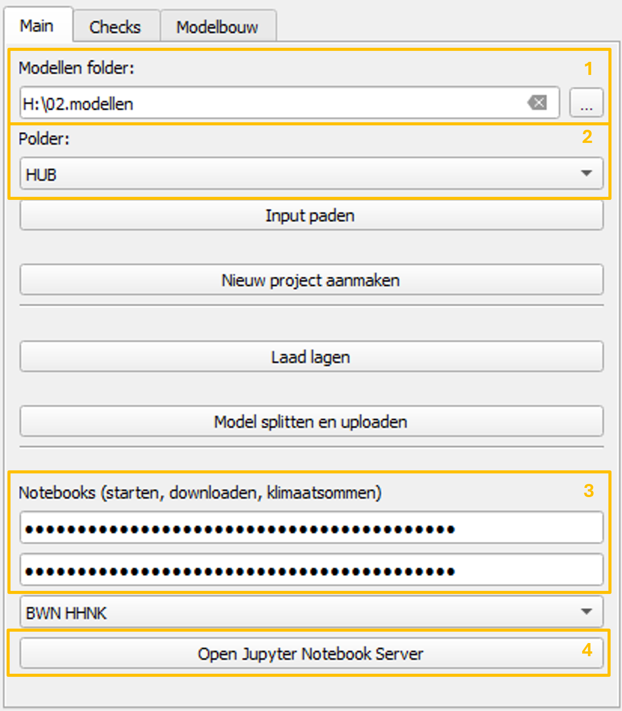
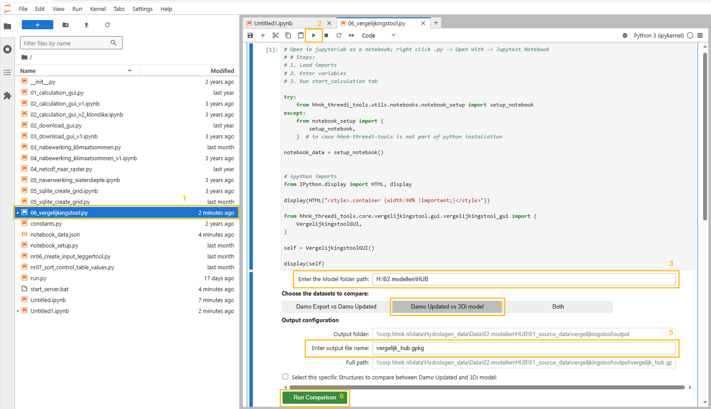

## **Vergelijkingstool**
Binnen HHNK worden 3Di modellen opgebouwd met brongegevens uit DAMO en de lokale HDB-database. Deze gegevens worden via FME geëxporteerd. Met de vergelijkingstool kunnen modelleurs verschillen inzichtelijk maken tussen een recente DAMO- en HDB-export en een bestaand 3Di model. Daarnaast kan dezelfde export worden vergeleken met een oudere DAMO- en HDB-dataset. De tool vergelijkt onder andere:

| Onderdeel | Controle |
| --- | --- |
| Watergangen | Aanwezigheid, geometrie en attributen |
| Kunstwerken | Verschillen in ligging en kenmerken |
| Peilgebieden | Controle van actuele grenzen en waterpeilen |
| Modelinput | Vergelijking tussen de bestaande modelgegevens en de nieuwe DAMO en HDB export |

Het doel is niet om automatisch te bepalen wat “goed” of “fout” is, maar om verschillen zichtbaar te maken, zodat daarna een inhoudelijke beoordeling kan worden uitgevoerd.

---

## Workflow

Op basis van de vergelijking kan worden beoordeeld of het bestaande model nog geschikt is voor hergebruik, met enkele aanpassingen kan worden bijgewerkt, of opnieuw moet worden opgebouwd.

Het onderstaande stroomschema toont de algemene workflow en de bijbehorende besluitvorming. Het jaar 2014 wordt hierin alleen gebruikt als voorbeeld van een oudere brondata-export. Het diagram laat zien hoe de resultaten van de vergelijkingstool kunnen worden gebruikt om een onderbouwde keuze te maken tussen hergebruik, aanpassing of nieuwbouw van het model.



## Benodigde input

De vergelijkingstool verwacht dat de invoerbestanden volgens een vaste mappenstructuur zijn opgeslagen. Het model moet minimaal de volgende mappen bevatten:
```text
model_folder/
    ├── 00_config
    ├── 01_source_data
    ├── 02_schematisation
    ├── 03_3di_results
    ├── 04_test_results
    └── Notebooks
```

Binnen deze structuur leest de tool de gegevens uit de volgende locaties:
```text
model_folder/
    ├── 01_source_data/
    │   ├── DAMO.gpkg                        ← Oude DAMO-export
    │   ├── HDB.gpkg                         ← Oude HDB-export
    │   └── vergelijkingstool/
    │       ├── input_nieuwe_export/
    │       │   ├── DAMO.gpkg                ← Nieuwe DAMO-export
    │       │   └── HDB.gpkg                 ← Nieuwe HDB-export
    │       └── output/
    │           └── vergelijkingstool_output.gpkg
    └── 02_schematisation/
        └── 00_basis/
            └── HUB.gpkg                     ← Bestaand 3Di model
```
      
Om de vergelijkingstool goed te laten werken, moet eerst vanuit FME een nieuwe export van DAMO en HDB worden gemaakt. Deze meest recente export wordt opgeslagen in de map `input_nieuwe_export`. Voor het model HUB is dat de volgende locatie:

<p align="center">
<code>H:\02.modellen\HUB\01_source_data\vergelijkingstool\input_nieuwe_export</code>
</p>

Daarnaast moeten ook de oude DAMO en HDB bestanden in `01_source_data` aanwezig zijn en moet het bestaande 3Di model beschikbaar zijn in de map van de basisschematisatie:

<p align="center">
<code>H:\02.modellen\HUB\02_schematisation\00_basis</code>
</p>

Deze vaste mappenstructuur is noodzakelijk voor de werking van de vergelijkingstool, ongeacht of de vergelijking **`Damo Updated vs 3Di model`** of **`Damo Updated vs Damo Old`** wordt uitgevoerd. Als de bestanden niet volgens deze structuur zijn opgeslagen, kan de vergelijkingstool de benodigde invoer niet correct vinden en zal de tool niet goed werken.
---

## **Handleiding**

De `vergelijkingstool` wordt gebruikt vanuit de QGIS-plugin en wordt vervolgens uitgevoerd vanuit JupyterLab.

De workflow bestaat uit twee hoofdonderdelen:

1. JupyterLab openen vanuit de QGIS-plugin.
2. De `vergelijkingstool` uitvoeren vanuit het notebook.

---

### 1. JupyterLab openen vanuit de QGIS-plugin

Het eerste deel van het proces wordt uitgevoerd vanuit het hoofdtabblad van de plugin.



#### **Stap 1. De modellenmap selecteren**

In het veld *“Modellen folder”* moet de hoofdmap worden geselecteerd waarin de modellen zijn opgeslagen. Deze map is de basismap van waaruit de plugin de beschikbare modellen zoekt.

#### **Stap 2. De polder of het model selecteren**

In het veld *“Polder”* moet de polder of het model worden geselecteerd waarmee gewerkt gaat worden. Nadat de modellenmap is geselecteerd, toont de plugin de beschikbare opties in deze lijst.

#### **Stap 3. De API keys controleren**

Voordat verder wordt gegaan, moet worden gecontroleerd of de benodigde *API keys* correct zijn ingesteld en opgeslagen in de juiste map. Deze API keys zijn nodig om de notebooks verbinding te laten maken met de vereiste services en correct uit te voeren.

#### **Stap 4. De Jupyter Notebook Server openen**

Klik vervolgens op de knop *“Open Jupyter Notebook Server”*. Deze knop start de Jupyter Notebook Server en opent JupyterLab in de standaardbrowser.

---

### 2. De vergelijkingstool uitvoeren vanuit JupyterLab

Zodra JupyterLab in de browser is geopend, moet het bestand worden geopend en uitgevoerd dat hoort bij de `vergelijkingstool`.



#### **Stap 1. Het bestand `06_vergelijkingstool.py` openen**

Zoek in het linkerpaneel van JupyterLab het bestand `06_vergelijkingstool.py`.

Om het bestand correct te laten werken, moet het met **Jupytext** als notebook worden geopend.

Doe dit als volgt:

* Klik met de rechtermuisknop op `06_vergelijkingstool.py`
* Selecteer **Open With**
* Selecteer **Jupytext Notebook**

Hiermee wordt het `.py` bestand geopend als een uitvoerbaar notebook binnen JupyterLab.

#### **Stap 2. Het notebook uitvoeren**

Zodra het bestand als notebook is geopend, klik je op de knop *Run*. Deze knop voert de hoofdcel uit en toont de grafische interface van de `vergelijkingstool` binnen het notebook.

#### **Stap 3. Het modelpad controleren**

In het veld *“Enter the Model folder path”* moet de locatie van het model waarmee gewerkt wordt worden gecontroleerd of ingevoerd. Dit pad moet overeenkomen met het model dat eerder in de QGIS-plugin is geselecteerd.

#### **Stap 4. Het type vergelijking selecteren**

Selecteer vervolgens de optie **`Damo Updated vs 3Di model`**.

DDeze optie vergelijkt de laatste FME-export van de DAMO- en HDB-bestanden met het bestaande 3Di model. De nieuwe DAMO- en HDB-export wordt gelezen vanuit de map `input_nieuwe_export`. Het bestaande 3Di model wordt gelezen vanuit de map van de basisschematisatie: `02_schematisation/00_basis`.

De volledige mappenstructuur en de exacte locaties van deze bestanden zijn beschreven in de paragraaf [Benodigde input](#benodigde-input)

Deze structuur is noodzakelijk om de vergelijkingstool correct te laten werken. Als de mappenstructuur niet correct is ingericht, kan de `vergelijkingstool` de benodigde bestanden niet vinden en zal de tool niet goed werken.

#### **Stap 5. De vergelijking uitvoeren**

Wanneer alle instellingen klaarstaan, klik je op de knop *“Run Comparison”*. De tool voert de vergelijking tussen de geselecteerde databases uit en genereert het outputbestand. De volledige locatie van het gegenereerde bestand wordt weergegeven in het veld *“Full path”*. Dit `.gpkg` bestand kan daarna in QGIS worden geopend om de gevonden verschillen te beoordelen.

---

## Interpretatie van de resultaten

De output van de `vergelijkingstool` moet niet alleen worden geïnterpreteerd als een lijst met fouten.  
De resultaten dienen als ondersteuning om te beoordelen of het bestaande model nog kan worden hergebruikt, gedeeltelijk moet worden geactualiseerd of beter opnieuw kan worden opgebouwd met recentere brongegevens.

De beoordeling moet zich vooral richten op:

- Het type verschil: `attribuut verschillen` of `structuurverschillen`.
- De classificatie van het verschil: `Warning` of `Critical Error`.
- De locatie van het verschil binnen het systeem.
- De mogelijke hydraulische invloed op het model.
- De complexiteit van een eventuele handmatige correctie.

Als algemene richtlijn geldt:

| Situatie | Mogelijke beslissing |
| --- | --- |
| Er zijn geen relevante verschillen | Het bestaande model hergebruiken |
| Er zijn vooral verschillen in attributen | Het bestaande model actualiseren |
| Er zijn kritieke structurele verschillen in belangrijke delen van het systeem | Overwegen om het model opnieuw op te bouwen |
| De verschillen liggen aan de randen van het model of zijn geïsoleerde gevallen | Beoordelen of ze handmatig kunnen worden gecorrigeerd |

Ook als er bijvoorbeeld veel verschillen in de attributen zijn kan het efficiënter zijn om het model opnieuw op te bouwen. De uiteindelijke beslissing moet door de modelleur worden genomen op basis van een inhoudelijke beoordeling van de lagen die in QGIS zijn gegenereerd. Voor een uitgebreidere beschrijving van het beoordelingsproces en de vastlegging van de beslissing, zie het criteria-document:

[Document met criteria voor de vergelijkingstool](https://corphhnk.sharepoint.com/:w:/s/ROKHydrologischeAdviesdiensten/IQBLc8cGy5ggRKOJ338Pqq9pAeQFvm9HCoX5xgaFdGa_pqI?e=hvBwLz)

Ten slotte kan het zijn dat de adviseur van watersystemen reden ziet om het model aan te passen of opnieuw op te bouwen op basis van de bestaande resultaten.

---
## Vastlegging van de beoordeling

Na het uitvoeren van de vergelijkingstool moet de beoordeling van de resultaten worden vastgelegd in een apart Word-document. Dit document wordt gebruikt om de keuze te onderbouwen of een bestaand 3Di model kan worden hergebruikt, moet worden aangepast, of opnieuw moet worden opgebouwd.

Nadat de vergelijkingstool is gebruikt, wordt het document geplaatst in de map van de vergelijkingstool: `H:\02.modellen\HUB\01_source_data\vergelijkingstool`.

In dit document legt de modelleur vast welke beslissing is genomen op basis van de resultaten van de vergelijkingstool. Het `.gpkg` outputbestand van de vergelijkingstool blijft de basis voor de inhoudelijke beoordeling in QGIS. Het Word-document is bedoeld als formele vastlegging van de gemaakte keuze en de belangrijkste aandachtspunten voor vervolgacties.

---
## Aanbevolen werkwijze in het kort

1. Controleer eerst of de gebruikte DAMO en HDB export recent is.
2. Open het resultaat in QGIS.
3. Beoordeel de belangrijkste verschillen.
4. Vergelijk de gemarkeerde objecten met de oorspronkelijke modelgegevens.
5. Bespreek twijfelgevallen met de inhoudelijk verantwoordelijke adviseur.
6. Documenteer welke verschillen moeten worden gecorrigeerd en welke kunnen worden geaccepteerd.

---

## Contact

Voor vragen over de inhoud van het model:

**Modelleur:** Juan Acosta  
**Team:** Hydrologie / HHNK

Voor technische problemen met de tool kan contact worden opgenomen met de beheerder van de vergelijkingstool.