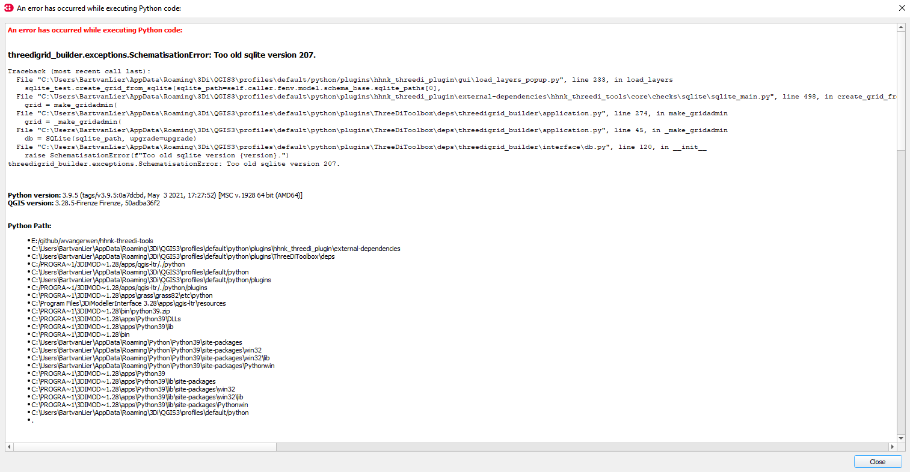
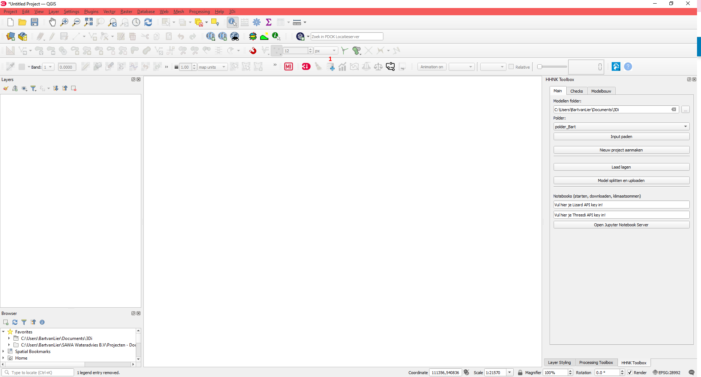
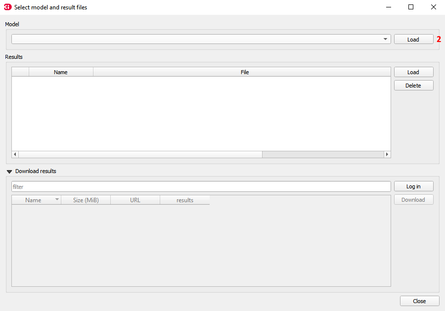
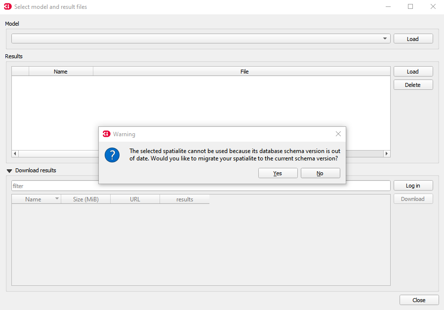
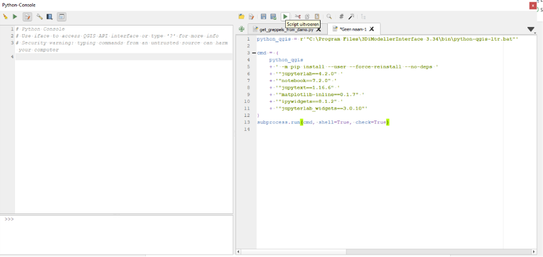

## **Bekende problemen**

### Oude sqlite error
Wanneer in de aangeleverde data nog een .sqlite zit die in een oudere versie van 3Di is gemaakt, kan het voorkomen dat onderstaande foutmelding wordt weergegeven:



Deze error kan op de volgende manier opgeloste worden:

1. Ga naar ``select 3Di results`` (1)

      

2. Klik op ``load`` (2)

   

3. Ga naar de map waar je data hebt opgeslagen, zie ook [project starten](b_project_starten.md)
4. Vervolgens ga je naar het volgende pad: `C:\Users\{gebruiker}\Documents\3Di\'polder_x'\02_schematisation\00_basis` en dubbelklik je op het .sqlite bestand. 
5. Nadat je hier op hebt geklikt, krijg je onderstaande waarschuwing: 

   

   Klik op `yes`. De .sqlite staat nu in een versie die ingeladen kan worden in 3Di zonder foutmelding. 

   `{gebruiker}` is de naam van de Windows-gebruiker.

### JupyterLab/Notebook opent niet vanuit de HHNK-plugin

Wanneer JupyterLab of de Jupyter Notebook Server niet goed opent vanuit de HHNK-plugin in de 3Di Modeller Interface, kan bijvoorbeeld de volgende foutmelding verschijnen:

```text
TypeError: sequence item 1: expected str instance, NoneType found
```

Deze foutmelding kan erop wijzen dat de benodigde JupyterLab/Notebook-packages niet correct beschikbaar zijn in de Python-omgeving die door de 3Di Modeller Interface wordt gebruikt.

De plugin bevat een environment-referentiebestand op de volgende locatie:

```text
C:\Users\<USERNAME>\AppData\Roaming\3Di\QGIS3\profiles\default\python\plugins\hhnk_threedi_plugin\env\environment.yml
```

Vervang `<USERNAME>` door je eigen Windows-gebruikersnaam.

Let op: dit YAML-bestand wordt gebruikt als referentie, maar QGIS/3Di activeert deze environment niet automatisch. Daarom moeten de benodigde Jupyter-packages worden geïnstalleerd in de Python-omgeving die door de 3Di Modeller Interface wordt gebruikt.

#### Installatie van JupyterLab/Notebook

Open de **QGIS Python Console** binnen de 3Di Modeller Interface en voer het volgende uit:

```python
import subprocess

python_qgis = r'"C:\Program Files\3DiModellerInterface 3.34\bin\python-qgis-ltr.bat"'

cmd = (
    python_qgis
    + ' -m pip install --user --force-reinstall --no-deps '
    + '"jupyterlab==4.2.0" '
    + '"notebook==7.2.0" '
    + '"jupytext==1.16.6" '
    + '"matplotlib-inline==0.1.7" '
    + '"ipywidgets==8.1.2" '
    + '"jupyterlab_widgets==3.0.10"'
)

subprocess.run(cmd, shell=True, check=True)
```

We gebruiken `python-qgis-ltr.bat`, omdat dit verwijst naar de Python-omgeving die door de 3Di Modeller Interface wordt gebruikt:

```text
C:\Program Files\3DiModellerInterface 3.34\bin\python-qgis-ltr.bat
```

Sluit daarna de 3Di Modeller Interface volledig af en start het programma opnieuw op.

 

> **Let op:** installeer of update niet handmatig packages zoals `numpy`, `matplotlib`, `h5py`, `scipy`, `geopandas`, `rasterio` of `Fiona` in de user environment. Deze packages kunnen de 3Di/QGIS-omgeving verstoren. De installatiestap hierboven installeert alleen de Jupyter-gerelateerde packages die nodig zijn om JupyterLab/Notebook vanuit de HHNK-plugin te kunnen gebruiken.

#### Mogelijke foutmelding: `AttributeError: _ARRAY_API not found`

Een andere foutmelding die kan optreden bij het openen van JupyterLab/Notebook is:

```text
AttributeError: _ARRAY_API not found
```

Deze foutmelding betekent waarschijnlijk dat `numpy` in de user environment is geïnstalleerd. Dit kan de 3Di/QGIS-omgeving verstoren.

Controleer eerst waar `numpy` geïnstalleerd is:

```python
import subprocess

python_qgis = r'"C:\Program Files\3DiModellerInterface 3.34\bin\python-qgis-ltr.bat"'

subprocess.run(
    python_qgis + " -m pip show numpy",
    shell=True,
    check=True
)
```

Als bij `Location` een pad in de user environment staat, bijvoorbeeld:

```text
C:\Users\<USERNAME>\AppData\Roaming\Python\Python39\site-packages
```

dan kan `numpy` uit de user environment worden verwijderd met:

```python
import subprocess

python_qgis = r'"C:\Program Files\3DiModellerInterface 3.34\bin\python-qgis-ltr.bat"'

subprocess.run(
    python_qgis + " -m pip uninstall -y numpy",
    shell=True,
    check=True
)
```

Start daarna de 3Di Modeller Interface opnieuw op.

Met deze stappen worden de benodigde Jupyter-packages geïnstalleerd in de Python-omgeving die door de 3Di Modeller Interface wordt gebruikt. Dit maakt het mogelijk om de Jupyter Notebook Server via de HHNK-plugin te openen. Als er daarna nog foutmeldingen optreden, controleer dan eerst of er geen conflicterende packages in de user environment zijn geïnstalleerd.
