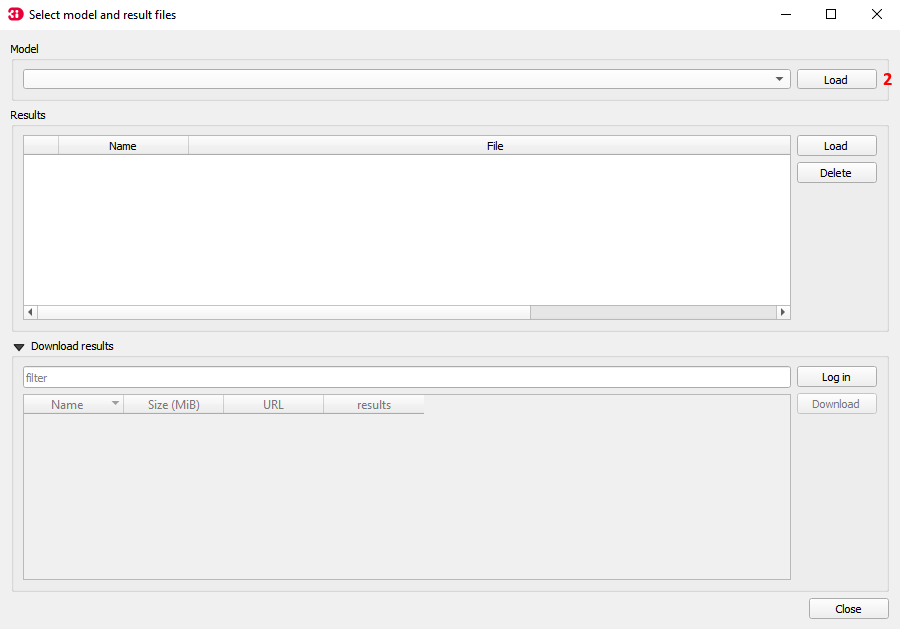

## **Bekende problemen**

### Oude sqlite error
Wanneer in de aangeleverde data nog een .sqlite zit die in een oudere versie van 3Di is gemaakt, kan het voorkomen dat onderstaande foutmelding wordt weergegeven:

Deze error kan op de volgende manier opgeloste worden:

1. Ga naar ``select 3Di results`` (1)

      

2. Klik op ``load`` (2)

   

3. Ga naar de map waar je data hebt opgeslagen, zie ook [project starten](b_project_starten.md)
4. Vervolgens ga je naar het volgende pad: `C:\Users\{gebruiker}\Documents\3Di\'polder_x'\02_schematisation\00_basis` en dubbelklik je op het .sqlite bestand. 
5. Nadat je hier op hebt geklikt, krijg je onderstaande waarschuwing: 

   

   Klik op `yes`. De .sqlite staat nu in een versie die ingeladen kan worden in 3Di zonder foutmelding. 

   `{gebruiker}` is de naam van de Windows-gebruiker.