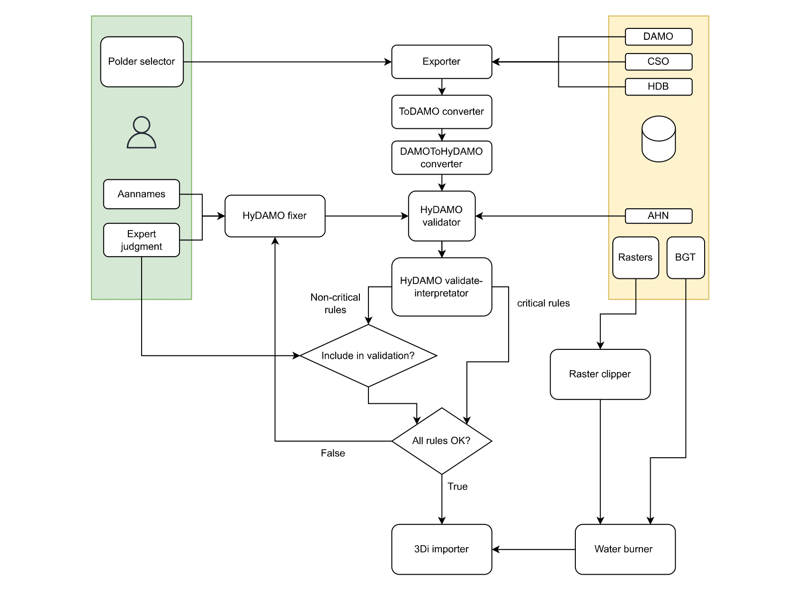

# Architectuur, code & tests
**Doel:** Uitleggen hoe het systeem op hoofdlijnen werkt en hoe de onderdelen samenhangen. Beschrijven van de rol van elke codecomponent en de interne structuur. Uitleg over tests en testdatasets.   
**Lezerspubliek:** Ontwikkelaars & architecten

## 1. Uitgangspunten
Bij ontwikkeling van de Schematisation Builder zijn steeds de volgende uitgangspunten gehanteerd.
* Transparantie: Het is eenvoudig te achterhalen waar gegevens vandaan komen: de gegevensbron, aannames en keuzes die gemaakt zijn.
* Interactief: Een proces waarin de modelleur keuzes voorgelegd krijgt, in plaats van dat de software aannames doet waar de modelleur geen weet van heeft. 
* Eenvoudiger proces: Versimpelen van het dataverwerkings- en modelleerproces, inclusief het documenteren van wat en waarom.
* Modulaire opzet: Ontwikkeling van goed onderhoudbare, modulaire software, waarbij datavalidatie en conversie worden gescheiden. Van elke component is duidelijk beschreven wat die doet; elke component doet één ding, dit wordt niet door elkaar gemengd.
* HyDAMO implementatie: Volledige integratie van HyDAMO als standaard voor data-uitwisseling, met ondersteuning voor aanvullende validaties.
* Cyclisch modelleren: Onjuiste gegevens worden zoveel mogelijk in de brondata aangepast. Hierbij wordt aangesloten op het Mutatie Meldingen Systeem van team GEO.
* Samenwerking met 3Di: Samenwerking met 3Di om zo min mogelijk zelf te ontwikkelen, maar waar mogelijk gebruik te maken van bestaande tools en expertise.
* Eén taal/platform: Vereenvoudiging door over te stappen op één programmeertaal en platform (Python), ter vervanging van de huidige combinatie van verschillende systemen.

## 2. Systeemstroomschema
Het stroomschema geeft een overzicht van het volledige conversie- en validatieproces van brondata naar een 3Di schematisatie. Het proces start bij de gebruiker, die via de Folder selector de bronbestanden selecteert en, indien nodig, aannames toevoegt of wijzigt.

De bestanden worden vervolgens verwerkt door de Exporter, die de ruwe data beschikbaar maakt. Daarna doorloopt de data twee opeenvolgende conversiestappen: de ToDAMO converter en de DAMO_to_HyDAMO converter, waarbij de data wordt omgezet naar het HyDAMO-formaat met correcte attributen en schema’s.

Na de conversie volgt de HyDAMO-validator, die de gegevens controleert op basis van vooraf gedefinieerde validatieregels. De gebruiker deelt de regels als kritisch of niet-kritisch. Als alle kritische validatieregels correct zijn, gaat het proces verder met de 3Di-importer. Met behulp van de Vector Data Importer in de Modeller Interface worden alle lagen in een 3Di schematisatie geladen.

Bij aanwezige kritische fouten wordt geprobeerd deze te corrigeren met de HyDAMO-fixer, automatisch of met input van de gebruiker. De aangepaste HyDAMO-data wordt opnieuw geverifieerd in de validator, en het proces kan worden herhaald totdat alle fouten zijn opgelost. Uiteindelijk wordt de HyDAMO data omgezet naar een 3Di-schematisatie. Ook de bronrasters worden geclipt en voorbewerkt tot schematisatierasters, die bij de schematisatie worden geplaatst.

## 3. Overzicht componenten
_Lijst van modules en hun verantwoordelijkheden._

| Type | Volgorde | Module | Rol | Bestand |
|------|----------------|--------|-----|---------|
| Kernlogica | A | Database exporter | Genereert een ruwe export op basis van een polder polygoon. | /hhnk_threedi_tools/core/schematisation_buider/ DB_exporter.py |
| Kernlogica | B | Intermediate converter | Zet ruwe export om in DAMO formaat. | /hhnk_threedi_tools/core/schematisation_buider/ intermediate_converter.py |
| Kernlogica | C | DAMO naar HyDAMO converter | Zet DAMO om in HyDAMO formaat. | /hhnk_threedi_tools/core/schematisation_buider/ DAMO_HyDAMO_converter.py |
| Kernlogica | D | HyDAMO validator | Trapt validatieregels af op HyDAMO bestand. | /hhnk_threedi_tools/core/schematisation_buider/ HyDAMO_validator.py |
| Kernlogica | E | HyDAMO fixer | Interpreteert validatieresultaten en biedt mogelijkheden tot automatische fixes. | /hhnk_threedi_tools/core/schematisation_buider/ ... |
| Kernlogica | F | 3Di converter | Zet het (verbeterde) HyDAMO bestand om in een 3Di schematisatie | /hhnk_threedi_tools/core/schematisation_buider/ HyDAMO_conversion_to_3di.py |
| Interfaces |   | ... | ... | /hhnk_threedi_tools/core/schematisation_buider/ schematisation_builder.py |
| Interfaces |   | ... | ... | /hhnk_threedi_plugin/gui/ schematisation_builder.py |

---

### A. Database exporter
_functionaliteit / waarom nodig_

_code opbouw_

---

### B. Intermediate converter
De `IntermediateConverter` class vormt een schakel tussen de ruwe exportbestanden (DAMO, CSO & HDB) en de uiteindelijke HyDAMO/3Di-invoer, door de ruwe exportbestanden om te zetten in DAMO-formaat volgens standaard. De intermediate converter zorgt voor:
* Inlezen en valideren van lagen.
* Bewerken en verrijken van data (IDs, geometrie, koppelingen).
* Schrijven van consistente outputs.

De code is opgebouwd rond een parent klasse en meerdere child klassen.

### **IntermediateConverter** (parent class)
| Type | Inputlagen | Output |
|------|------------|---------|
| Parent klasse | generiek (verschilt per child) | Consistente dataflow en output naar GeoPackage |

| Functie | Beschrijving | Helper functies |
|---------|--------------|-----------------|
| `load_layers()` | Laadt benodigde lagen in het interne `_Data` object | – |
| `process_data()` | Abstract: wordt overschreven in child class om data te bewerken | – |
| `write_outputs()` | Schrijft gewijzigde lagen naar GeoPackage | – |

### **GemaalIntermediateConverter**
| Type | Inputlagen | Output |
|------|------------|---------|
| Child class | `gemaal`, `pomp`, `hydroobject` | Gemaal- en pomptabellen met koppelingen en correcties |

| Functie | Beschrijving | Helper functies |
|---------|--------------|-----------------|
| `load_layers()` | Laadt gemaal-, pomp- en hydroobjectlagen | – |
| `update_gemaal_layer()` | Verwerkt pomplagen en koppelt deze aan gemaal | `_add_column_gemaalid`, `_add_column_globalid`, `_adjust_pomp_maximalecapaciteit`, `_make_pomp_layer` |
| `write_outputs()` | Schrijft lagen naar GeoPackage | – |

### **PeilgebiedIntermediateConverter**
| Type | Inputlagen | Output |
|------|------------|---------|
| Child class | `peilgebiedpraktijk` | Opschoning en voorbereiding voor validatie (nog beperkt) |

| Functie | Beschrijving | Helper functies |
|---------|--------------|-----------------|
| `load_layers()` | Laadt peilgebiedpraktijk | – |
| `update_peilgebied_layer()` | Placeholder, nog niet geïmplementeerd | – |
| `write_outputs()` | Schrijft peilgebiedlagen naar GeoPackage | – |

### **ProfileIntermediateConverter**
| Type | Inputlagen | Output |
|------|------------|---------|
| Child class | `hydroobject`, `gw_pro`, `gw_prw`, `gw_pbp`, `iws_geo_beschr_profielpunten`, `peilgebiedpraktijk` | Profiel-tabellen en gekoppelde hydroobjecten |

| Functie | Beschrijving | Helper functies |
|---------|--------------|-----------------|
| `load_layers()` | Laadt hydroobject- en profielgerelateerde tabellen | – |
| `process_linemerge()` | Voegt hydroobjecten samen per peilgebied (linemerge) | – |
| `create_profile_tables()` | Bouwt tabellen: `profielgroep`, `profiellijn`, `profielpunt` | `_assign_hydroobject_ids` |
| `connect_profiles_to_hydroobject_without_profiles()` | Koppelt profielen aan hydroobjecten zonder profiel | `_add_z_to_point_geometry_based_on_column`, `_drop_z_from_linestringz_geometry` |
| `write_outputs()` | Schrijft profiel- en hydroobjectlagen naar GeoPackage | – |

### **_Data**
| Type | Inputlagen | Output |
|------|------------|---------|
| Helper class | Afhankelijk van aangeroepen converter | Consistente dataset en toegang tot tabellen |

| Functie | Beschrijving | Helper functies |
|---------|--------------|-----------------|
| Opslag & beheer | Houdt lagen als GeoDataFrames bij, gedeeld tussen converters | – |
| Properties | Toegang tot tabellen via `self.data` | – |

---

### C. DAMO naar HyDAMO converter
De `DAMO_to_HyDAMO_Converter` class zet een DAMO GeoPackage om naar een HyDAMO GeoPackage, waarbij domeinwaarden worden vertaald en extra velden zoals NEN3610id en statusobject worden toegevoegd. Het zorgt ervoor dat de attributen voldoen aan het HyDAMO schema en schrijft de geconverteerde lagen naar een nieuwe geopackage.

Het omzetten van domeinwaarden is voor dit project overbodig geworden, omdat de tekstwaarden van de domeinen inmiddels direct beschikbaar zijn in de DAMO-database van het waterschap. Daarom kan de stap convert_domain_values worden overgeslagen (`convert_domain_values: bool = False`).

In de onderstaande tabel is een overzicht te vinden van de functies, hun beschrijvingen en de interne helperfuncties die ze aanroepen.

| Type | Inputlagen | Output |
|------|------------|--------|
| Converter Class | DAMO GeoPackage (`damo_file_path`) | HyDAMO GeoPackage (`hydamo_file_path`) |

| Functie | Beschrijving | Helper functies |
|---------|-------------|--------------------------------|
| `__init__()` | Initialisatie van converter met paden, lagen, schema's, logger, opties voor domain conversion en statusobject | `_get_schema_path()`, `_retrieve_damo_domain_mapping()` |
| `run()` | Start het conversieproces, roept `convert_layers()` aan | `convert_layers()` |
| `convert_layers()` | Loopt door de lagen, converteert naar HyDAMO en schrijft naar geopackage | `_convert_attributes()`, `_add_column_NEN3610id()`, `_add_column_status_object()` |
| `_convert_attributes(layer_gdf, layer_name)` | Zet kolomnamen lowercase en converteert waarden per HyDAMO schema | `_convert_column()` |
| `_convert_column(column, column_name, layer_name)` | Converteert individuele kolomwaarden naar juiste type en domein | `_get_field_type()`, `_convert_domain_values()` |
| `_get_field_type(column_name, layer_name)` | Haalt veldtype op uit HyDAMO schema | – |
| `_convert_domain_values(object_name, column_name, column)` | Zet domeinwaarden om naar descriptieve HyDAMO-waarden | – |
| `_add_column_NEN3610id(layer_gdf, layer_name)` | Voegt NEN3610id toe aan laag gebaseerd op code/id/naam | – |
| `_add_column_status_object(layer_gdf, layer_name)` | Voegt statusobject toe en valideert waarden | – |
| `_get_schema_path(schema_path, schema_basename, schema_version)` | Bepaalt pad naar schema als dit niet expliciet is gegeven | – |
| `_retrieve_damo_domain_mapping()` | Parseert DAMO XML schema en maakt dicts van domeinen en objecten | – |

#### Properties
| Property | Beschrijving |
|----------|-------------|
| `hydamo_definitions` | Laadt en retourneert de HyDAMO schema-definities uit JSON bestand |

### D. HyDAMO validator
De class `HyDAMO_validator` wordt gebruikt om HyDAMO-bestanden te controleren op consistentie en correctheid volgens de geldende validatieregels. 

De class leunt volledig op de functionaliteiten van de `HyDAMOValidatieModule`. Dit is een [fork](https://github.com/HHNK/HyDAMOValidatieModule) van de [officiële hydamo_validation-module van Het Waterschapshuis](https://github.com/HetWaterschapshuis/HyDAMOValidatieModule). Voor dit project zijn [custom functies](https://github.com/HHNK/HyDAMOValidatieModule/blob/main/hydamo_validation/functions/custom.py) toegevoegd om specifieke validatieregels af te kunnen dwingen en logging te integreren.

Code-opbouw
1. Voorbereiding van bestanden: het HyDAMO-bestand en de validatieregels worden naar een werkmap gekopieerd.
2. Initialisatie validator: een validator-object wordt aangemaakt met de gewenste coverages (key: "AHN", value: padverwijzing naar map met index.shp en rasters) en output types (geopackage, csv, geojson).
3. Uitvoering validatie: het validator-object voert de validatie uit, schrijft de resultaten weg in de werkmap en retourneert een samenvatting van de resultaten.

**[Validatieregels & aannames](c_validatieregels_aannames.md)** 

---

### E. HyDAMO fixer
_functionaliteit / waarom nodig_

_code opbouw_

---

### F. 3Di converter
HyDAMO_conversion_to_3di mogelijk straks niet meer relevant door volledige QGIS integratie. Anders is het netjes om HyDAMO_conversion_to_3di.py te vernoemen naar HyDAMO_3Di_converter.py voor uniformiteit.

## 4. Testoverzicht
- **Unittests** – Controleren individuele functies/klassen in isolatie.  
- **Integratietests** – Controleren dat componenten (exporter, (hy)damo converter, validator, fixer, schematisation converter) goed samenwerken.  
- **End-to-end tests** – Controleren van de volledige datastroom: export → omzetten naar (hy)damo → valideren → verbeteren → her-valideren → omzetten naar schematisatie (op objectniveau, danwel voor de gehele set).  

| Testbestand | Type test | Status | Scope | Input dataset | Output dataset | Beschrijving | Testvariabelen |
|----------|-----------|--------|-------|------------------------|-------------------------|-------------|----------------|
| test_create_schematisation_rasters.py | Unit | 🟢 Getest | Aanmaak van schema-rasters uit bronbestanden | `source_data` (DEM, GLG/ GGG/ GHG, infiltratie, frictie, landuse, polder, waterdeel) | `model/schema_base/rasters` (DEM, landuse) | Test controleert of `create_schematisation_rasters` correcte rasters genereert op basis van brondata | - `dst.dem.exists()` (voor en na) - `dst.dem.shape == [6962, 7686]` - `dst.landuse.sum() == 234612304.0` |
| test_DAMO_HyDAMO_converter.py | Unit | 🟢 Getest | Conversie van DAMO → HyDAMO (inclusief veldtypes en attributen) | `schematisation_builder/DAMO.gpkg` | `HyDAMO_*.gpkg` (gegenereerd in temp-dir) | Test controleert of converter een HyDAMO-bestand genereert met extra kolommen (o.a. `NEN3610id`), juiste veldtypes en correcte domeinwaarden | - `hydamo_file_path.exists()` - `"NEN3610id" in columns` - Domeinwaarden (code vs. beschrijving) - Datatypes (`float64` voor capaciteit) |
| test_db_exporter.py | Unit | 🟢 Getest (mits DB beschikbaar) | Export van DAMO/CSO-tabellen naar geopackage | `schematisation_builder/area_test_sql_helsdeur.gpkg`, `model_test/01_source_data/polder_polygon.shp` | `test_damo_gemaal_helsdeur.gpkg`, `test_export.gpkg` | Test controleert of `db_exporter` tabellen en subtabel correct exporteert, inclusief domeinwaarden en foutafhandeling | - `output_file.exists()` - `code == "KGM-Q-29234"` - `len(pomp_gdf) == 4` - Domeinomzetting (`functiegemaal`) - `logging_DAMO == []` |
| test_flow_profiles.py | End-to-end | 🟠 Gedeeltelijk getest (skip bij Python < 3.12) | Volledige flow van profielverwerking: DAMO/CSO → intermediate → HyDAMO → validatie | `schematisation_builder/raw_export.gpkg`, coverage-data (`schematisation_builder/dtm/index.shp`) | `damo.gpkg`, `HyDAMO.gpkg`, validatie-output (`results.gpkg`, csv, geojson) | Test controleert de volledige profielketen: laden, linemerge, profielcreatie en koppeling, berekening diepste punten, export naar HyDAMO en validatie met regels | - Laagchecks: `hydroobject`, `peilgebiedpraktijk` - Profielpunt koppeling aan profiellijn - Profiellijn koppeling aan profielgroep - Profielgroep koppeling aan hydroobject - Diepste punten per profiellijn en hydroobject - Connectie hydroobjecten zonder profiel - HyDAMO export aanwezig - Validatieregels: &nbsp;&nbsp;100: `isascending` &nbsp;&nbsp;101: `hydroobject_breedte` &nbsp;&nbsp;102: `jaarinwinning` &nbsp;&nbsp;103: `max_cross_product` &nbsp;&nbsp;104: `afstandnatprofiel` &nbsp;&nbsp;105: `dieptenatprofiel` &nbsp;&nbsp;106: `nr_of_profielpunten` &nbsp;&nbsp;108: `maximalehoogteprofiel` &nbsp;&nbsp;109: `breedteprofiel` |
| test_gemaalintermediateconverter.py | Unit | 🟢 Getest | Conversie van gemaal- en pomplagen uit DAMO/CSO naar intermediate | `schematisation_builder/raw_export.gpkg` | `damo.gpkg` (met lagen `gemaal`, `pomp`) | Test controleert of `GemaalIntermediateConverter` correcte lagen genereert met geldige relaties en unieke IDs | - Output-bestand bestaat - `gemaal`-laag niet leeg - `pomp`-laag niet leeg - Kolom `globalid` aanwezig, niet null en uniek in beide lagen - Elke `pomp.gemaalid` verwijst naar bestaand `gemaal.globalid` |
| test_HyDAMO_validator.py | Unit | 🟢 Getest (skip bij Python < 3.12) | Validatie van HyDAMO-bestand met regels en coverages | `schematisation_builder/HyDAMO.gpkg`, coverage-data (`schematisation_builder/dtm/index.shp`) | Validatie-output (`datasets/HyDAMO.gpkg`, `results.gpkg`, csv, geojson) | Test controleert of `validate_hydamo` succesvol draait en valideerresultaten wegschrijft | - `result_summary["success"] == True` - Validatie-outputbestanden bestaan (`datasets/HyDAMO.gpkg`, `results.gpkg`) - Coverages worden meegenomen (AHN) - TODO’s voor ontbrekende lagen (`brug`, `stuw`, `gemaal`, `pomp`) |
| test_schematisation_builder.py | End-to-end | 🟠 Gedeeltelijk getest (skip bij Python < 3.12 of zonder DB settings) | Volledige flow: DAMO → HyDAMO → validatie | `test_schematisation_builder/01_source_data/DAMO.gpkg` (gegenereerd in test) | `HyDAMO.gpkg`, `log.log`, validatie-output (`results.gpkg`) | Test controleert of `make_validated_hydamo_package` een compleet pakket aanmaakt en bestanden correct worden weggeschreven | - `DAMO.gpkg` bestaat - `HyDAMO.gpkg` bestaat - `log.log` bestaat - Validatieresultaat `results.gpkg` bestaat |
| _test_....py_ | _..._ | 🔴 Niet getest | _..._ | _.../....gpkg_ | _.../....gpkg_ | _..._ | _..._ |

### Testomgeving opzetten en tests uitvoeren
_Hier linken naar doc threedi-tools_  

### Testdata en integratie
...

- Alle tests draaien automatisch bij pull requests.  
- Mergen vereist dat alle tests slagen.  