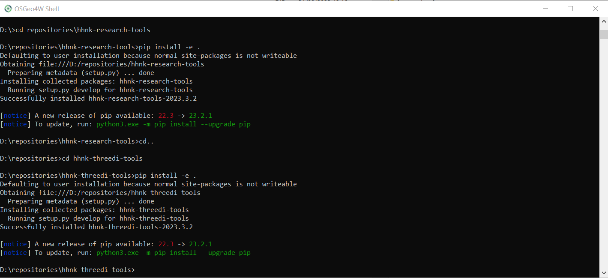
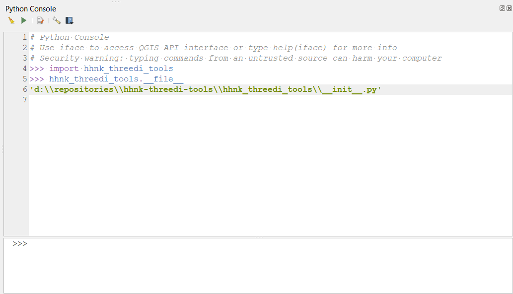

# Handleiding voor ontwikkelaars

## Installatie van modules in edit-mode
Je voegt `hhnk-research-tools` en `hhnk-threedi-tools` op de volgende wijze toe aan de QGIS omgeving vna de Modellers Interface
1. Zorg voor een lokale clone van de repositories
2. Open de OSGeo4W shell en navigeer naar de het pad in hhnk-research-tools waar setup.py staat. Voer in:
```
pip install -e .
```
3. Herhaal hetzelfde voor hhnk-threedi-tools



4. Verifieer of de modules nu naar de repositories verwijzen in de Python-console van de Modellers Interface. Voer in de Python console:

```
import hhnk_threedi_tools
hhnk_threedi_tools.__file__
```

Je moet nu het pad naar de `__init__.py` in de repository van hhnk_threedi_tools terug krijgen:



Note: Wanneer je niet het pad naar de repository terug krijgt:
- bestaat de module hhnk_threedi_tools niet, dan is er iets niet goed gegaan bij stap 2 en 3. Verifieer in de OSGeo4W of de modules editable staan geinstalleerd met `pip list`. De modules en paden missen hier waarschijnlijk. Voer stap 2 en 3 opnieuw uit.
- verwijst ht pad niet naar de resporitory maar naar de plugin-dir, dan komt dat omdat daar de plugin nog staat. Verwijder `hhnk-research-tools` en `hhnk-threedi-tools` uit `c:\Users\{user}\AppData\Roaming\3Di\QGIS3\profiles\default\python\plugins\hhnk_threedi_plugin\external-dependencies`

## Testen van de plugin
Om (een branch van) de plugin en modules te testen, voer je de volgende de volgende handelingen uit:
0. zorg voor lokale clones van `hhnk-research-tools`, `hhnk-threedi-tools` en `hhnk-threedi-plugin` en zorg dat je de[Installatie in edit-mode](#installatie-van-modules-in-edit-mode) hebt uitgevoerd.
1. zorg dat je een kopie hebt van `c:\Users\{user}\AppData\Roaming\3Di\QGIS3\profiles\default\python\plugins\hhnk_threedi_plugin\api_keys.txt`
2. verwijder de folder `c:\Users\{user}\AppData\Roaming\3Di\QGIS3\profiles\default\python\plugins\hhnk_threedi_plugin`
3. kopieer de folder `hhnk_threedi_plugin` naar `c:\Users\{user}\AppData\Roaming\3Di\QGIS3\profiles\default\python\plugins`
4. kopieer je `apy_keys.txt` naar `c:\Users\{user}\AppData\Roaming\3Di\QGIS3\profiles\default\python\plugins\hhnk_threedi_plugin\api_keys.txt`
5. Herstart de Modeller Interface