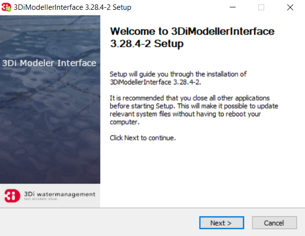
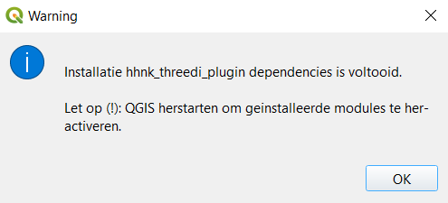

# Installatie instructies

De HHNK Toolbox is te installeren in de volgende twee stappen:

1. [Installatie 3Di Modeller Interface (QGIS)](#installatie-3di-modeller-interface-qgis)
2. [Installatie HHNK Toolbox Plugin](#installatie-hhnk-toolbox-plugin)
3. [Datachecker en modelbuilder](#datachecker-en-modelbuilder)
4. [Python env](#python-env)

Wanneer er tijdens de installatie zaken niet gaan zoals verwacht, kun je kijken bij [bekende problemen](#bekende-problemen).

## Installatie 3Di Modeller Interface (QGIS)
### 1. Installatie van de Modeller Interface
Download de MI versie die op de <a href="https://github.com/threedi/hhnk-threedi-plugin/releases/latest">release</a> pagina van de hhnk plugin staat.

:warning: LET OP: deze versie kan afwijken van de versie die op de 3Di docs staat. :warning:

Voor verdere installatie instructies kan je deze <a href="https://docs.3di.live/f_3di_instruments_and_downloads.html#di-instruments-and-downloads" target="_blank">Installatie handleiding</a> raadplegen. Voer de installatie van de Modeller Interface uit.



### Installatie en activatie van de 3Di Toolbox plugin
<span style="color:red"> BvL: is dit nog van belang? Aangezien de Toolbox in de nieuwste versie van 3Di niet meer werkt.</span>  

Bij het starten van de Modeller Interface wordt de 3Di Toolbox geinstalleerd:

 

Na de installatie van de 3Di Toolbox moet je de Modeller Interface (zoals gevraagd) herstarten:


Kijk, na herstart, of de 3Di Toolbox goed is geinstalleerd en geactiveerd. Navigeer naar `plugins > manage and install plugins`:


## Installatie HHNK Toolbox Plugin
Download de laatste `hhnk_threedi_plugin.zip` [hier](https://github.com/threedi/hhnk-threedi-plugin/releases/latest/download/hhnk_threedi_plugin.zip). 

Navigeer naar `plugins > manage and install plugins`. In de Plugin Manager, klik op `install from ZIP`


Selecteer de zip-file van de plugin en klik op `Install Plugin`. Negeer de security warning.


De plugin wordt nu geinstalleerd in de Modeller Interface, inclusief alle ontbrekende modules:


Na installatie moet je, zoals aangegeven, de Modeller Interface opnieuw starten:



Als alles goed is gegaan, is de plugin nu klaar voor gebruik:


Ga naar [gebruik plugin](../4_gebruik_plugin/gebruik_plugin.md) om met de plugin aan de slag te gaan.

## Bekende problemen

###
Je kunt de plugin ook downloaden via de release-pagina op GitHub <a href="https://github.com/threedi/hhnk-threedi-plugin/releases/latest" target="_blank">https://github.com/threedi/hhnk-threedi-plugin/releases/latest</a>:


### Directe installatie in plugin-folder
Als de installatie via de plugin manager niet (soepel) verloopt, kun je de zip-file ook direct uitpakken in de plugin map. Deze staat in:

`c:\Users\{gebruiker}\AppData\Roaming\3Di\QGIS3\profiles\default\python\plugins\` 

`{gebruiker}` is de naam van de Windows-gebruiker waarbij de plugin geïnstalleerd is.

N.B. Na het uitpakken van de zip-file moet je zorgen dat de plugin staat aangevinkt in de plugin-manager, en de installatie van de plugin verder wordt uitgevoerd zoals beschreven bij [installatie](#installatie-hhnk-toolbox-plugin).

### Inconsistente Python omgeving
De plugin is getest in een Python omgeving beschreven in deze Conda [environment.yml](https://github.com/threedi/hhnk-threedi-plugin/blob/main/hhnk_threedi_plugin/env/environment.yml). Het kan zijn dat de Python versie en/of modules geïnstalleerd in de Modeller Interface en 3Di Toolbox niet (meer) compatible zijn met de geteste versie van de HHNK Toolbox. Als dat zo is, krijg je bij start van de installatie de volgende melding:


Zolang de plugin werkt, kun je deze melding negeren/verhelpen, maar uiteindelijk zal de HHNK Toolbox plugin éérst goed getest moeten worden in de gebruikte MI versie.

# Datachecker en modelbuilder
In de HHNK omgeving draait de modelbuilder op de srv155 in `D:\modelbuilder`. De code staat in de map code en komt van de repo: https://github.com/hhnk-git/hhnk-modelbuilder. Daarnaast gebruikt hij data van de `\\corp.hhnk.nl\data\Hydrologen_data` (vaste input, niet in github) en je eigen FME export in de map data/input. In de map data staan ook nog enkele kleinere input bestanden.

Het draaien van de modelbuilder kan via visual studio, gebruik de python enviroment `threedipy` (zie [phyton-env](#python-env) voor installatie). Start de visual code niet met de .bat waarmee deze vanuit de 3DI Modeller Interface op start, maar gewoon vanuit de snelkoppeling van windows. Met de volgende bestanden zijn de datachecker en modelbuilder te draaien. Pas voor de modelbuilder de naam en polder-id van je model aan.

`modelbuilder\code\datachecker\datachecker_visual_studio.py`

`modelbuilder\code\modelbuilder\modelbuilder_visual_studio.py`


# Python env
Om te kunnen ontwikkelen afzonderlijk van QGIS is de python environment `threedipy` opgezet. Om dit te kunnen installeren is een installatie van [Miniforge](https://github.com/conda-forge/miniforge) nodig. Anaconda Navigator werkt met conda ipv mamba en is daardoor erg traag met solven van environments. Zowel miniforge als Anaconda Navigator installeren wordt afgeraden ivm conflicten van paden. Bij HHNK gebruiken we `Miniforge-pypy3`.

Installatie van de env gaat met de volgende stappen:

1. Kopieer 
[environment_services.yml](https://github.com/threedi/hhnk-threedi-plugin/blob/main/hhnk_threedi_plugin/env/environment_services.yml) naar `C:\users\%user%\environment_services.yml`

2. Open *Miniforge Prompt* met admin rechten

3. `cd %homepath%`

4. Verwijderen bestaande env:\
    `mamba remove --name threedipy --all`\
    :warning: Let op dat `C:\ProgramData\miniforge-pypy3\envs\threedipy` ook echt weg is! Als er locks op zitten is, server herstarten. :warning:

5. Nieuwe installatie:\
    `mamba env create -f environment_services.yml`

5. Of installatie bijwerken (als env hierna niet meer werkt, doe dan een verse installatie):\
    `mamba env update -f environment_services.yml`

6. Bij een nieuwe installatie van miniforge is het ook nodig om mod_spatialite te installeren. De foutmelding die je dan krijgt geeft aan wat je moet doen:
    ```
    Download mod_spatialite extension from http://www.gaia-gis.it/gaia-sins/windows-bin-amd64/
    and place into anaconda installation C:\ProgramData\miniforge-pypy3\mod_spatialite-5.0.1-win-amd64.
    ```
    hhnk-research-tools pakt hem dan verder op.