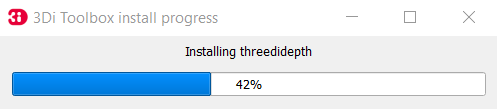
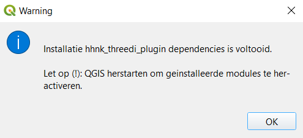
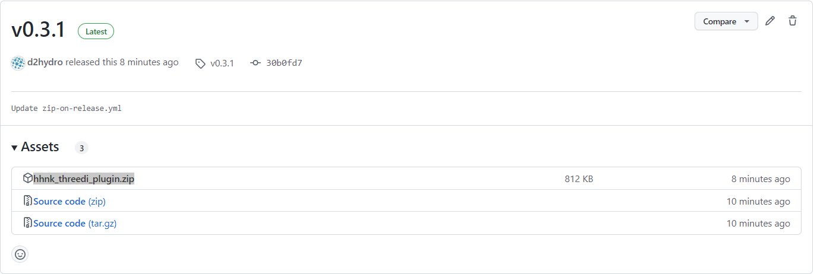
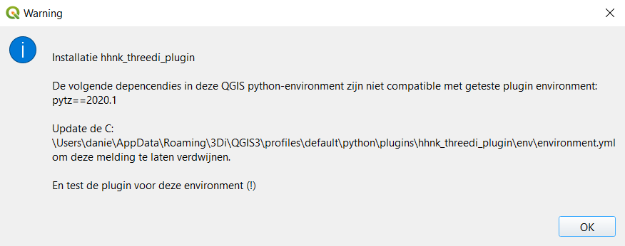

# Installatie instructies

De HHNK Toolbox is te installeren in de volgende twee stappen:

1. [Installatie 3Di Modeller Interface (QGIS)](#installatie-3di-modeller-interface-qgis)
2. [Installatie HHNK Toolbox Plugin](#installatie-hhnk-toolbox-plugin)
3. [Datachecker en modelbuilder](#datachecker-en-modelbuilder)

Wanneer er tijdens de installatie zaken niet gaan zoals verwacht, kun je kijken bij [bekende problemen](#bekende-problemen)

## Installatie 3Di Modeller Interface (QGIS)

### Installatie van de Modeller Interface

Het installeren van de 3Di Modeller Interface kun je uitvoeren met deze <a href="https://docs.3di.live/f_3di_instruments_and_downloads.html#di-instruments-and-downloads" target="_blank">Installatie handleiding</a>. Voer de installatie van de Modeller Interface uit.

### Installatie en activatie van de 3Di Toolbox plugin
Bij het starten van de Modeller Interface wordt de 3Di Toolbox geinstalleerd:

Na de installatie van de 3Di Toolbox moet je de Modeller Interface (zoals gevraagd) herstarten:

Kijk, na herstart, of de 3Di Toolbox goed is geinstalleerd en geactiveerd. Navigeer naar `plugins > manage and install plugins`:

## Installatie HHNK Toolbox Plugin
Download de laatste `hhnk_threedi_plugin.zip` [hier](https://github.com/threedi/hhnk-threedi-plugin/releases/latest/download/hhnk_threedi_plugin.zip). 

Navigeer naar `plugins > manage and install plugins`. In de Plugin Manager, klik op `install from ZIP`

Selecteer de zip-file van de plugin en klik op `Install Plugin`. Negeer de security warning.

De plugin wordt nu geinstalleerd in de Modeller Interface, inclusief alle ontbrekende modules:

Na installatie moet je, zoals aangegeven, de Modeller Interface opnieuw starten:

Als alles goed is gegaan is de plugin nu klaar voor gebruik:

## Bekende problemen

###
Je de plugin ook downloaden via de release-pagina op GitHub <a href="https://github.com/threedi/hhnk-threedi-plugin/releases/latest" target="_blank">https://github.com/threedi/hhnk-threedi-plugin/releases/latest</a>:

### Directe installatie in plugin-folder
Als de installatie via de plugin manager niet (soepel) verloopt, kun je de zip-file ook direct uitpakken in de plugin map. Deze staat in:

`c:\Users\{gebruiker}\AppData\Roaming\3Di\QGIS3\profiles\default\python\plugins\` 

`{gebruiker}` is de naam van de Windows-gebruiker waarbij de plugin geinstalleerd is.

N.B. Na het uitpakken van de zip-file moet je zorgen dat de plugin staat aangevinkt in de plugin-manager, en de installatie van de plugin verder wordt uitgevoerd zoals beschreven bij [installatie](#installatie-hhnk-toolbox-plugin)

### Inconsistente Python omgeving
De plugin is getest in een Python omgeving beschreven in deze Conda [environment.yml](https://github.com/threedi/hhnk-threedi-plugin/blob/main/hhnk_threedi_plugin/env/environment.yml). Het kan zijn dat de Python versie en/of modules geinstalleerd in de Modeller Interface en 3Di Toolbox niet (meer) compatible zijn met de geteste versie van de HHNK Toolbox. Als dat zo is, krijg je bij start van de installatie de volgende melding:

Zolang de plugin werkt, kun je deze melding negeren/verhelpen, maar uiteindelijk zal de HHNK Toolbox plugin éérst goed getest moeten worden in de gebruikte MI versie.

# Datachecker en modelbuilder
In de HHNK omgeving draait de modelbuilder op de srv155 in D:\modelbuilder. De code staat in de map code en komt van de repo: https://github.com/hhnk-git/hhnk-modelbuilder. Daarnaast gebruikt hij data van de \\corp.hhnk.nl\data\Hydrologen_data (vaste input, niet in github) en je eigen FME export in de map data/input. In de map data staan ook nog enkele kleinere input bestanden.

Het draaien van de modelbuilder kan via visual studio, gebruik de interperter threedipy van anaconda. Start de visual code niet met de .bat waarmee deze vanuit de 3DI Modeler Interface op start, maar gewoon vanuit de snelkopping van windows. Met de volgende bestanden zijn de datachecker en modelbuilder te draaien. Pas voor de modelbuilder de naam en polder-id van je model aan.

modelbuilder\code\datachecker\datachecker_visual_studio.py

modelbuilder\code\modelbuilder\modelbuilder_visual_studio.py

Om de anaconda omgeving bij te werken gebruik je de volgende  stappen:

1. kopieer https://github.com/threedi/hhnk-threedi-plugin/blob/main/hhnk_threedi_plugin/env/environment_services.yml naar D:\modelbuilder\update_threedipy
2. open anaconda prompt met admin rechten
3. conda activate threedipy
4. D:
5. cd D:\modelbuilder\update_threedipy
6. conda env update --file environment_services.yml
