# Uitleg tests en functionaliteit

Op deze pagina vind je de inhoudelijke uitleg van de plugin functionaliteit.

1. [Algemene concepten](#algemene-concepten)
    1. [Standaard project indeling](#standaard-project-indeling)
    2. [QGIS project](#qgis-project)
    
2. [Modelstaat aanpassen](#modelstaat-aanpassen)
3. [Sqlite tests](#sqlite-tests)
    1. [Data verificatie](#data-verificatie)
        1. [Ondoorlatend oppervlak](#ondoorlatend-oppervlak)
        2. [Gebruikte profielen](#gebruikte-profielen)
        3. [Gestuurde kunstwerken](#gestuurde-kunstwerken)
        4. [Bodemhoogte stuw](#bodemhoogte-stuw)
        5. [Geometrie](#geometrie)
        6. [Bodemhoogte kunstwerken](#bodemhoogte-kunstwerken)
        7. [Algemene tests](#algemene-tests)
        8. [Geïsoleerde watergangen](#geisoleerde-watergangen)
     2. [Eenmalige tests](#eenmalige-tests)
        1. [Maximale waarde DEM](#maximale-waarde-dem)
        2. [Ontwateringsdiepte](#ontwateringsdiepte)
        3. [Oppervlaktewater](#oppervlaktewater)
    
4. [0d1d tests](#1d2d-tests)
5. [Bank levels](#bank-levels)
6. [1d2d tests](#1d2d-tests)

##### Linkjes 3.1.1 t/m 3.1.8 en 3.2.1 t/m 3.2.3 werken niet?

## Algemene concepten

### Standaard project indeling

De HHNK Toolbox werkt het makkelijkst wanneer een project op een bepaalde manier is ingedeeld. Als een project op die manier is ingedeeld worden de meeste paden automatisch ingevuld wanneer je een polder selecteert. De indeling is als 
volgt:

#### Indeling project map:

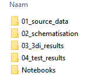

#### Indeling 01_source_data:

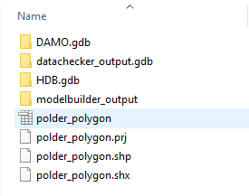 
##### DIT LIJKT OOK VERANDERD TE ZIJN. WAT IS MINIMAAL NODIG?

Nodig voor tests:

    DAMO.gdb
    datachecker_output.gdb
    HDB.gdb
    polder_polygon (alle extensies) > DEZE EXTENSIES ZITTEN ER NIET MEER IN?

Indeling 01_source_data/modelbuilder_output:

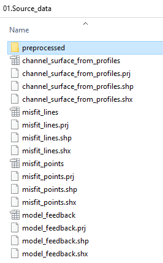

Nodig voor tests:

    channel_surface_from_profiles (shapefile uit modelbuilder)

#### Indeling 02_schematisation:

In deze map moet minimaal de map ``00_basis`` zitten. De andere modelstaten worden gegenereerd bij het ['splitten'](usage.md#5-modelstaten-maken) van de modellen of wanneer nieuwe revisies worden gemaakt. De Excel bestanden bevatten de instellingen voor het genereren van de verschillende modelstaten. > KLOPT DIT?  

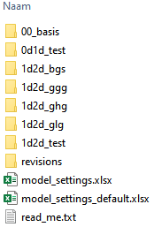 

Nodig voor tests: 
##### SQLITE ZIT NIET MEER IN DIT PAD. HOE ZIT DIT PRECIES?

    model.sqlite

Indeling 02.Model/rasters: HOE ZIT DIT IN DE NIEUWSTE VERSIE?

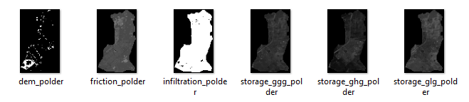

Nodig voor tests:
    
    dem_[polder] (waar [polder] de naam van de polder is)

#### Indeling 03_3di_results

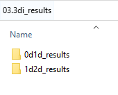

In de mappen zijn de resultaten te vinden van de simulaties die gemaakt zijn. De conventie van de naam van de mappen is als volgt:

```{naam schematisatie} #{revisie nummer} {model type}```

Bijvoorbeeld:

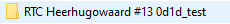

#### 04_test_results

De ```04_test_results``` map is de map die (standaard) wordt gebruikt door de plugin om resultaten van tests op te slaan. De indeling van deze map wordt bepaald door de plugin en is als volgt:

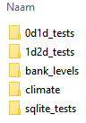

De ```0d1d_tests``` en de ```1d2d_tests``` mappen worden verder ingedeeld per gebruikte 3Di revisie:

Bijvoorbeeld:

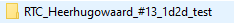

Alle mappen in ```Output``` zijn op het diepste niveau als volgt opgedeeld:

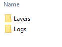 > VERANDERD IN DE NIEUWSTE VERSIE?

De ```Logs``` map bevat de resultaten in een menselijk leesbaar formaat. De ```Layers``` map bevat de brondata voor lagen in ```QGIS```. Alle bestanden in deze twee mappen worden automatisch vervangen wanneer een test opnieuw wordt 
aangezet. Je kunt deze bestanden dus ook niet gebruiken als basis voor andere lagen in je project. Als je de eerdere resultaten van een test wil behouden, kun je het best een andere output map specificeren.

### ```QGIS``` project

De meeste tests die deel uitmaken van de toolbox voegen, als onderdeel van hun output, een kaartlaag (of meerdere 
kaartlagen) toe aan het op dat moment geopende ```QGIS```-project. Elke test beheert zijn eigen ```QGIS layer group``` 
en diens subgroepen. De hoofdgroepen zijn als volgt:

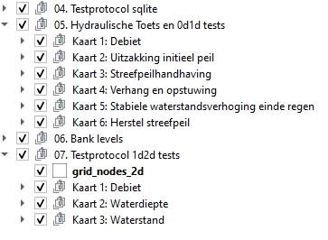

Wanneer je een test opnieuw aanzet worden deze lagen automatisch verwijderd en opnieuw aangemaakt. Als je de lagen wilt behouden (bijvoorbeeld ter vergelijking), dan kun je bijvoorbeeld de hoofdgroepen hernoemen. Let op: je zult in dit geval ook een andere output map moeten specificeren.

## Modelstaat aanpassen

Het aanpassen van de modelstaat is een hulpmiddel om te zorgen dat het rekenen met een model zo foutloos mogelijk gebeurt. Binnen de werkwijze van HHNK worden twee belangrijke model toetsingen gedaan:

1. 0d1d toetsing van het model t.b.v. de hydraulische randvoorwaarde (alleen watersysteem)
2. 1d2d toetsing van het model t.b.v. klimaatsommen (watersysteem, maaiveld en bodem)

Door de modelstaat aan te passen worden specifieke instellingen in het model aangepast. In de map van de [schematisatie](#indeling-02_schematisation) staat in de ``model_settings.xlsx`` per modelstaat wat de instellingen zijn. Deze manier heeft voordelen ten opzichte van het werken met aparte modellen, omdat andere wijzigingen in het model (zoals het aanpassen van een duiker) dan niet in twee modellen hoeft te worden doorgevoerd. De aanpassingen in het model die worden gedaan bij het aanpassen van de modelstaat hebben betrekking op de uitwisseling tussen het watersysteem (1D) en het maaiveld (2D). 

Met deze aanpassingen in gedachten worden drie modelstaten onderscheiden:

1. Niet gedefinieerd/uit modelbuilder

    Van een model in deze staat wordt voor conversie aangenomen dat het een model betreft dat in de staat is zoals het uit de modelbuilder komt.


2. Hydraulische toets staat (0d1d staat)

    Van een model in deze staat wordt aangenomen dat:

    * In tabel ```v2_global_settings``` '0d1d_test' staat bij ``name`` en dat de sturing is uitgeschakeld (```control_group_id``` is ```NULL```/leeg).
  
    * De volgende tabellen in het model staan: 
    ##### WAAR ZOUDEN DEZE MOETEN STAAN, WANT IK ZIE ZE NIET TUSSEN DE LAGEN STAAN

            backup_channels
            backup_manholes
            backup_controlled_weir_widths
            backup_global_settings
    
3. 1d2d toets staat
    
    Van een model in deze staat wordt aangenomen dat:
    * In tabel ```v2_global_settings``` '1d2d_test' staat bij ``name` en sturing aan staat (```control_group_id``` is niet ```NULL```/leeg).
      
    * De tabel ```backup_global_settings``` bestaat. 
##### IK ZIE DEZE TABEL NERGENS?

Het is belangrijk dat de gedetecteerde staat overeenkomt met de daadwerkelijke staat van het model, aangezien de gedetecteerde staat van het model bepaalt welke aanpassingen er worden gedaan. > IK SNAP DIT STUK NIET

Aanpassingen per staat 
##### IK ZOU ONDERSTAANDE GRAAG EEN KEER UITGELEGD KRIJGEN

Van modelbuilder staat naar hydraulische toets/0d1d staat:

| Tabel in model                 |  Aanpassingen                          |
|------------------------------- | -------------------------------------- |
| v2_global_settings             | Verwijderen rijen waar ```name``` niet '0d1d_test' is.<br>Aanpassen ```control_group_id``` naar ```NULL```. |
| v2_manhole                     | Aanpassen ```calculation_type``` naar '1' |
| v2_channel                     | Aanpassen ```calculation_type``` naar '101' |
| v2_weir                        | Aanpassen ```width``` naar ```width``` * 10 voor gestuurde stuwen |

Van modelbuilder staat naar 1d2d staat:

| Tabel in model                 | Aanpassingen 'Berekenen uit 3Di resultaat'              | Aanpassingen 'Uit backup van eerdere 1d2d staat'  |
|------------------------------- | ------------------------------------------------------- | ------------------------------------------------- |
| v2_global_settings             | Verwijderen rijen waar ```name``` '0d1d_test' is.       | Verwijderen rijen waar ```name``` '0d1d_test' is. |
| v2_cross_section_location      | Oude waarden in ```bank_level``` vervangen voor berekende bank levels. | Oude waarden in ```bank_level``` vervangen door waarden in ```backup_bank_levels``` |
| v2_manhole                     | Toevoegen nieuw berekende manholes. | - |

Van hydraulische toets/0d1d staat naar 1d2d staat:

| Tabel in model                 |  Aanpassingen 'Berekenen uit 3Di resultaat'               | Aanpassingen 'Uit backup van eerdere 1d2d staat'  |
|------------------------------- | --------------------------------------------------------- | ------------------------------------------------- |
| v2_global_settings             | Verwijderen rijen waar ```name``` '0d1d_test' is.<br>Rijen toevoegen uit ```backup_global_settings``` waar ```name``` niet '0d1d_test' is. | Geen verschil |
| v2_channel                     | Aanpassen ```calculation_type``` naar originele waarde uit ```backup_channels``` | Geen verschil |
| v2_weir                        | Aanpassen ```width``` naar originele waarde uit ```backup_controlled_weir_widths``` | Geen verschil |
| v2_manhole (update)            | Aanpassen ```calculation_type``` naar originele waarde uit ```backup_manholes``` | Geen verschil |
| v2_manhole (nieuw)             | Toevoegen nieuw berekende manholes. | - |
| v2_cross_section_location      | Oude waarden in ```bank_level``` vervangen voor berekende bank levels. | Oude waarden in ```bank_level``` vervangen door waarden in ```backup_bank_levels``` |

## Sqlite tests

De sqlite tests zijn bedoeld om te checken of het model geschikt is om mee te rekenen. Hieronder worden de tests inhoudelijk toegelicht.

### Data verificatie
##### Code is veranderd, waardoor niet meer gelinkt kan worden naar onderstaande testen.
<a name="ondoorlatend-oppervlak"></a>
1. Ondoorlatend oppervlak

   Berekent het oppervlak van de polder op basis van de ```polder_shapefile``` en het ondoorlatend oppervlak in het model. Het verschil tussen de twee zou niet te groot moeten zijn.

<a name="gebruikte-profielen"></a>
2. Gebruikte profielen
   
   Koppelt de v2_cross_section_definition laag van het model (discrete weergave van de natuurlijke geometrie van de watergangen) aan de v2_channel laag (informatie over watergangen in het model). Het resultaat van deze toets is een weergave van de breedtes en dieptes van watergangen in het model ter controle.
 
<a name="gestuurde-kunstwerken"></a>
3. Gestuurde kunstwerken
   
   Deze test selecteert alle gestuurde kunstwerken (uit de v2_culvert, v2_orifice en v2_weir tabellen van het model) op basis van de v2_control_table. Per kunstwerk worden actiewaarden opgevraagd. Per gevonden gestuurd kunstwerk
   wordt ook relevante informatie uit de HDB database toegevoegd, zoals het streefpeil en minimale en maximale kruinhoogtes.

<a name="bodemhoogte-stuw"></a>
4. Bodemhoogte stuw
    
   Deze test vergelijkt de minimale kruinhoogte uit de sturingstabel met de aanliggende watergangen. Als de bodemhoogte van de watergang hoger ligt dan de minimale kruinhoogte moet hier nog iets in worden aangepast door in de
   v2_cross_section tabel het reference_level aan te passen. Deze aanpassingen worden automatisch gegenereerd en ter goedkeuring aan de gebruiker voorgelegd.

<a name="geometrie"></a>  
5. Geometrie

   Deze test checkt of de geometrie van een object in het model correspondeert met de start- of end node in de v2_connection_nodes tabel. Als de verkeerde ids worden gebruikt geeft dit fouten in het model.
   
<a name="bodemhoogte-kunstwerken"></a> 
6. Bodemhoogte kunstwerken

   Test checkt of de kruinhoogte of bodemhoogte van een kunstwerk lager ligt dan de bodemhoogte van aanliggende watergangen. Als dit zo is moet dat worden aangepast om met het model te kunnen rekenen.
   
<a name="algemene-tests"></a> 
7. Algemene tests
   
   De algemene tests is een collectie van checks op fouten die ervoor zorgen dat het model niet kan worden opgebouwd of waardoor er niet meer gerekend kan worden. In het resultaat wordt onderscheid gemaakt tussen fouten en waarschuwingen. Fouten moeten worden opgelost, waarschuwingen zijn aandachtspunten. In de resultaten wordt omschreven wat het probleem is.

<a name="geisoleerde-watergangen"></a>    
8. Geïsoleerde watergangen

   Test bepaalt welk aandeel van watergangen geen verbinding heeft met het maaiveld (isolated). Het aandeel mag niet te groot zijn omdat neerslag de watergangen dan onvoldoende kunnen bereiken.
   
### Eenmalige tests

De eenmalige tests zijn er om een aantal randvoorwaarden te controleren. Als geverifieerd is dat hieraan is voldaan dan hoeven ze niet opnieuw te worden gedraaid.

<a name="maximale-waarde-dem"></a> 
1. Maximale waarde DEM

   Als de maximale waarde in de DEM te hoog is, duidt dat meestal op een fout in het bestand (de nodata waarde is waarschijnlijk verkeerd ingevoerd). Deze test berekent deze maximale waarde.

<a name="ontwateringsdiepte"></a>   
2. Ontwateringsdiepte
   
   Deze test controleert of het initiële water niveau per polder onder de oppervlakte hoogte uitgelezen uit de DEM ligt. Het initiële water niveau moet onder het oppervlak liggen.

<a name="oppervlaktewater"></a>   
3. Oppervlaktewater

   Deze test controleert per peilgebied in het model hoe groot het gebied is dat het oppervlaktewater beslaat in het model. Dit totaal is opgebouwd uit de ```storage_area``` uit de ```v2_connection_nodes``` tabel opgeteld bij het 
   oppervlak van de watergangen (uitgelezen uit de ```channel_surface_from_profiles```) shapefile. Vervolgens worden de 
   totalen per peilgebied vergeleken met diezelfde totalen uit de DAMO database. De resultaten geven een indicatie van over- of onderschatting van het oppervlaktewater in het model.
   
## 0d1d tests/hydraulische toets

Als de sqlite tests zijn uitgevoerd, eventuele aanpassingen zijn gemaakt en het model is opgebouwd voor rekenen met 3Di wordt de hydraulische toets gedraaid. Deze toets is een test bui ontworpen om de 0d1d aspecten van het model te 
controleren.

Deze test werkt het best wanneer het model in de juiste staat is (zie [Model staat aanpassen](#modelstaat-aanpassen)).

De test bui begint met een droge dag, vijf dagen neerslag (14,4 mm/dag) en dan twee dagen droog.

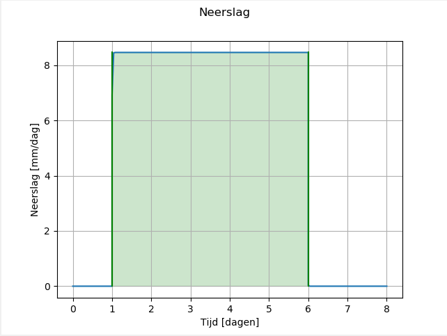

Het resultaat van het simuleren van deze bui kan vervolgens worden geanalyseerd met de HHNK Toolbox. De kaarten die het resultaat zijn van die analyse kunnen worden gebruikt om eventuele onrealistische resultaten te vinden die worden veroorzaakt door fouten in het model.

De tests die worden gedaan door de Toolbox zijn onderverdeeld in:
* 0d1d test

  In deze test worden de 1d nodes uit het 3Di resultaat gefilterd en op vaste tijdstappen de waterstand voor deze nodes
  uitgelezen. Deze tijdstappen zijn:
   * Aan het begin van de som
   * Aan het begin van de regen
   * Een dag voor het einde van de regen
   * Aan het einde van de regen
   * Aan het einde van de som

  Op basis van deze informatie worden de volgende waarden bepaald (in centimeters):
   * Het verschil in waterstand tussen het begin van de som en het begin van de regen (uitzakking initieel peil)
   * Het verschil in waterstand tussen het begin van de regen en het einde van de regen (streefpeilhandhaving)
   * Het verschil in waterstand tussen het einde van de regen en een dag daarvoor (stabiele waterstandsverhoging einde regen)
   * Het verschil in waterstand tussen het einde van de regen en het einde van de som (herstel streefpeil)
   
  
* Hydraulische test

  In deze test worden eveneens de 1d nodes uit het 3Di resultaat gefilterd. Voor kunstwerken en watergangen corresponderend met deze nodes worden de waterstanden aan het begin en einde van het scenario uitgelezen. Voor deze watergangen en kunstwerken wordt het volgende bepaald:
  
    * Het debiet in m3/s (q)
    * Het verhang (cm/km)
    * De stroomsnelheid in m/s (u)
    * De stroomrichting

Als er voldoende vertrouwen in de uitkomsten van het model is, kan het verhang over watergangen en kunstwerken worden vergeleken met geldende normen (bijvoorbeeld 4 cm/km).
    

## Bank levels

Als het 0d1d model is goedgekeurd kan deze test worden gedraaid. De bank levels test is grotendeels bedoeld om het model klaar te maken voor 3Di simulaties waarbij uitwisseling plaatsvindt tussen het watersysteem en het maaiveld.
Door de resultaten van de simulatie te analyseren wordt bepaald welke watergangen een 1d2d verbinding hebben over een levee heen. Voor deze watergangen wordt een bank level voorgesteld gelijk aan de hoogte van de levee om vroegtijdige 
uitwisseling te voorkomen. Voor overige watergangen is het voorgestelde bank level streefpeil + 10, waar het streefpeil bepaald wordt aan de hand van de ```connection_node_start_id``` die correspondeert met de watergang. 

Als een 1d2d verbinding op een connection node ligt wordt voorgesteld hier een manhole aan toe te voegen met drain level 
gelijk aan de levee hoogte.

Het draaien van de bank levels test kan worden gedaan met elk 3Di resultaat zolang het rekengrid niet is veranderd. De inhoud van het scenario is hierbij niet relevant.

## 1d2d tests

Wanneer de bank levels zijn bijgewerkt en waar nodig manholes zijn toegevoegd kan de 1d2d test worden gedraaid. Dit houdt in dat er opnieuw een test bui wordt gesimuleerd met 3Di.

Deze test werkt alleen wanneer het model in de 1d2d-toets-staat is ingesteld (zie [Model staat aanpassen](#modelstaat-aanpassen)).

De test bui begint in dit geval met een uur droog, dan twee uur regen (17,75 mm/uur), dan 12 uur droog.

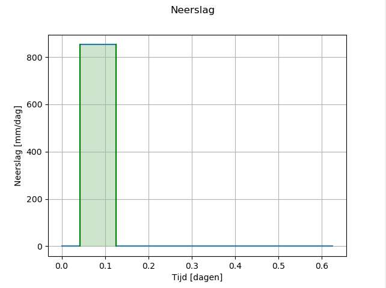

Het resultaat van het simuleren van deze bui met het model kan vervolgens worden geanalyseerd met de HHNK Toolbox. De kaarten die het resultaat zijn van die analyse kunnen worden gebruikt om eventuele onrealistische resultaten te vinden 
die worden veroorzaakt door fouten in het model.

Als de 1d2d test resultaten goedgekeurd zijn is het model klaar voor gebruik.

De test die worden gedaan door de Toolbox zijn als volgt onder te verdelen:

* Resultaat nodes inlezen

  Deze functie leest alle 2d nodes uit het 3Di resultaat en berekent de volgende waarden:
    * de minimale DEM waarde binnen het gebied van de betreffende node (geometrie is omgezet naar een vierkant)
    * het totale oppervlak dat de node beslaat
  
  Vervolgens wordt op drie tijdstappen (het begin van de regen het einde van de regen en het einde van de som) de volgende informatie berekend:
    * de waterstand op de genoemde tijdstappen
    * de hoeveelheid water (volume in m3) per tijdstap
    * het natte oppervlak per tijdstap (in m2)
    * opslag van regen in het gebied van de node (hoeveelheid water / totale oppervlak gebied)
  
  (* Wanneer het gaat om het standaard 1d2d test scenario)

* Stroomlijnen inlezen

  Deze functie leest alle stroomlijnen in uit het 3Di resultaat. Vervolgens wordt gekeken naar het type van de lijn (1D2D of 2D). Vervolgens wordt op drie tijdstappen (het begin van de regen het einde van de regen en het einde van de 
  som) het volgende bepaald:
    * De waterstand per tijdstap
    * Het debiet (q) in m3/s per tijdstap
    * De stroomsnelheid in m/s per tijdstap
    * De stroomrichting per tijdstap
    
* Waterstanden uitlezen

  Deze functie bepaalt de waterstanden op de gegeven tijdstappen op basis van het 3Di resultaat. Vervolgens wordt op basis van de DEM en de waterstand per tijdstap de waterdiepte bepaald.
  

