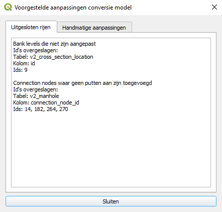

# Gebruikershandleiding

Voorstellen naamgeving BvL:

0d1d tests > watersysteem controle <br>
1d2d tests > ?

Deze pagina is bedoeld als handleiding om de HHNK Toolbox te gebruiken. 

Er zijn twee mogelijkheden om met de HHNK plugin aan de slag te gaan:
1. HHNK levert de benodigde data (model) aan
2. Gebruiker van de plugin bouwt een model vanaf de 'grond' op

Nadere informatie over de inhoud van de testen, benodigde data en het interpreteren van resultaten zijn te vinden via onderstaande links:
* Voor inhoudelijke uitleg van de tests, zie [Documentatie](tests_documentation.md).
* Voor uitleg over de benodigde data, zie [Bron data](needed_data.md).
* Voor uitleg over de interpretatie van resultaten, zie !!!
 
Volg onderstaande werkwijze als HHNK de benodigde data (model) aanlevert (optie 1).

1. [Map aanmaken](#1-map-aanmaken)
2. [Data kopiëren](#2-data-kopiëren)
3. [Model inladen](#3-model-inladen)
4. [Inladen resultaten tests (indien van toepassing)](#4-inladen-resultaten-tests-indien-van-toepassing)
5. [Modelstaten maken](#5)
6. [Berekeningen uitvoeren](#6-berekeningen-uitvoeren)

## 1. Map aanmaken 
Maak een nieuwe map aan in de verkenner (locatie staat vrij, maar raadzaam om lokaal te werken) met de naam van het aangeleverde gebied (bijvoorbeeld polder_X). Dat kan er als volgt uit zien: `C:\Users\{gebruiker}\Documents\3Di\polder_X`. 

`{gebruiker}` is de naam van de Windows-gebruiker.

## 2. Data kopiëren
Kopieer de aangeleverde data naar de map die in stap 1 is gemaakt. Hieronder is een voorbeeld te zien waaruit de aangeleverde data (deze kan qua inhoud verschillen) is opgebouwd.


## 3. Model inladen
Het model kan vervolgens ingeladen worden door bij `modellen folder` (1) door de volgende handeling: als je in stap 1 de map hebt aangemaakt in het pad: `C:\Users\{gebruiker}\Documents\3Di\polder_X`, kies je bij `modellen folder` het volgende pad om het model in te kunnen laden: `C:\Users\{gebruiker}\Documents\3Di`. Vervolgens kan bij `polder` (2) gekozen worden voor `polder_X`. 

`{gebruiker}` is de naam van de Windows-gebruiker.


## 4. Inladen lagen
Via de knop ``laad lagen`` (3) kun je diverse lagen inladen om inzicht te geven in het model.


##### AFBEELDINGEN NIET ZICHTBAAR IN GITHUB!

Vervolgens verschijnt het onderstaande scherm met een aantal keuzes: 


Afhankelijk van de tests die zijn uitgevoerd, kan er gekozen worden tussen het inladen van de van 0d1d, 1d2d of de klimaatsom resultaten. Indien er nog geen testberekeningen of klimaatsommen zijn gemaakt, klik dan hier: [Testberekeningen uitvoeren](#5-testberekeningen-uitvoeren)

Daarnaast kunnen nog een aantal andere opties aangevinkt worden:
* [Sqlite (3Di plugin)](#sqlite-3di-plugin)
* [Grid genereren](#grid-genereren)
* [Sqlite testen](#sqlite-testen)
* [Banklevel test](#banklevel-test)
* [Basis layout](#basis-layout)
* [Achtergrondkaarten](#achtergrondkaarten)

### Sqlite (3Di plugin)
Deze optie geeft de mogelijkheid om de schematisatie (.sqlite) van het model in te laden.

### Grid genereren
##### NIEUWE FOUTMELDING > ZIE LOGBOEK. GEEN IDEE HOE OP TE LOSSEN.

Bij het genereren van het grid kan het voorkomen dat er een foutmelding wordt weergegeven dat de .sqlite te oud is.  Ga naar [bekende problemen](#bekende-problemen) om de oplossing te bekijken.  

### Sqlite testen
De sqlite tests zijn bedoeld om het model te controleren op (potentiële) fouten in de data en deze te corrigeren waar nodig. Na de sqlite tests is het model klaar om op te bouwen en om de 0d1d toets te draaien (zie 
[0d1d toets/Hydraulische toets](tests_documentation.md#1d2d-tests)). Voor de inhoudelijke uitleg van de tests, zie:
[Sqlite tests](tests_documentation.md#sqlite-tests)

### Banklevel test
Door de ``banklevel test`` in te laden, kun je de resultaten inzien die volgen uit de test die is uitgevoerd. Verdere toelichting over de ``banklevel test`` is te vinden in [banklevel test](tests_documentation.md#bank-levels).

### Basis layout
Met het inladen van de ``basis layout`` krijg je inzicht in de resultaten die volgen uit controles die zijn uitgevoerd om te kijken of het model goed is opgebouwd vanuit de brondata of dat er nog data mist.

### Achtergrondkaarten
Met de optie ``achtergrondkaarten`` kun je verschillende soorten kaarten als achtergrond onder de schematisatie leggen. Dit is bijvoorbeeld handig om te controleren of een breedte van een watergang in het model overeenkomt met de breedte op de luchtfoto. 

Onderstaande stappen zijn uit te voeren als er nog geen testberekeningen en testen voor het model zijn uitgevoerd.

## 5. Modelstaten maken
Als er nog geen modelstaten en testberekeningen uitgevoerd zijn, kunnen de volgende stappen doorlopen worden:

1. Klik op ``Model splitten en uploaden`` (4). 


2. Hierna wordt het volgende scherm weergegeven:

De modelsplitter geeft de mogelijkheid om een aantal modelstaten te genereren, zoals in het vak met de ``1`` is te zien. De modelstaten voor de te genereren modellen staan automatisch in het rechtervak met daarboven ``Enabled``. In het rechtervak laat je de modelstaten staan waarvan je een model wil laten maken. Als je een bepaalde modelstaat niet nodig hebt, kun je deze naar het linkervak slepen met daarboven ``Disabled``.  
3. Druk op ``Run: Model Splitter`` (2) om de modelsta(a)t(en) die onder ``Enabled`` staan te genereren
4. Geef een ``Commit message`` mee (3)
5. Upload de modelsta(a)t(en) door op ``Upload modelversion(s)`` te klikken (4)

## 6. Berekeningen uitvoeren
Nadat stap 5 is uitgevoerd, kunnen (test)berekeningen uitgevoerd gaan worden. Hieronder wordt toegelicht hoe een (test)bereking gestart kan worden:
1. Voer je Lizard API key (5) en 3Di API key (6) in. Indien je nog geen API key(s) hebt, klik <a href="https://demo.lizard.net/management/personal_api_keys" target="_blank">hier</a> voor een Lizard API key en klik <a href="https://management.3di.live/personal_api_keys" target="_blank">hier</a> voor een 3Di API key. 

2. Klik op ``Open Jupyter Notebook Server`` (7) om het notebook te openen voor het starten van de (test)berekeningen. Je wordt doorverwezen naar een lokale server en het volgende scherm komt tevoorschijn:

3. Om een simulatie te starten, kun je het beste gebruik maken van de meest recente versie van ``xx_calculation_gui_vx``. Door te dubbelklikken op de nieuwste versie, word je doorgestuurd naar het volgende scherm:

4. Doorloop nu de eerste stap door ergens te klikken in het veld met ``#imports`` en vervolgens crtl + enter. Dit levert het onderstaande invoerscherm op:

5. Loop vervolgens stap voor stap de volgende punten af:

   1. ``Login with API keys``: voer hier de Lizard en 3Di API keys in
   2. ``Search for schematisation on 3Di``: typ de naam van het model in en klik vervolgens op ``Search``
   3. ``Select schematisation and model``: kies hier de modelstaat onder ``Schematisation`` en kies bij ``Revision`` voor de door te rekenen revisie. Het ``3Di model`` wordt automatisch ingevoerd, waarna bij ``Organisation`` gekozen kan worden voor de organisatie waar de simulatie gedraaid moet worden
   4. ``Select rain event``: maak hier een keuze voor de neerslagsituatie die bij de modelstaat hoort
   5. ``Select output folder/name``: kies hier de ``Sub folder`` waar de resultaten weggeschreven moeten worden 
   6. ``Select settings to include``: deze optie geeft de mogelijkheid om een aantal opties aan te vinken voor de naverwerking van de resultaten 
   ##### NOG UITLEGGEN GEVEN WAT DE PROCESSING INHOUDEN?
   7. ``Start simulation``: de simulatienaam wordt automatisch gegenereerd op basis van de schematisatie die gebruikt wordt. Om de berekening te kunnen starten, moet eerst een simulatie aangemaakt worden middels de ``Create simulation`` knop. ERROR STARTEN SIMULATIE, ZIE OOK LOGBOEK

## 7. Resultaten downloaden
Naast het starten van simulaties, is het downloaden van de resultaten van de (test)berekeningen mogelijk middels het notebook. Hieronder is toegelicht hoe dat in zijn werk gaat:

1. Om een simulatie te downloaden, kun je het beste gebruik maken van de meest recente versie van ``xx_download_gui_vx``. Door te dubbelklikken op de nieuwste versie, word je doorgestuurd naar het volgende scherm:

2. Doorloop nu de eerste stap door ergens te klikken in het veld met ``#imports`` en vervolgens crtl + enter. Dit levert het onderstaande invoerscherm op:


3. Loop vervolgens stap voor stap de volgende punten af:

   1. ``Login with API keys``: voer hier de Lizard API key in
   2. ``Search for simulation on lizard``: typ de naam van de te downloaden simulatie in en klik vervolgens op ``search``
   3. ``Select simulation results``: hier komt een overzicht te staan met de simulaties die overeenkomen met de zoekterm ingevoerd in stap 2. Selecteer de de simulatie of simulaties die je wil downloaden
   4. ``Select filetype``: selecteer hier welke ``File results``, ``Raster results``, eventueel welk ``Timestep raster`` en de ``Resolution`` gedownload moet worden
   5. ``Select output folder/name``: kies hier de ``Sub folder`` waar de resultaten weggeschreven moeten worden 
   6. ``Download selected``: klik op ``Download`` om de resultaten te downloaden
   7. ``Download klimaatsommen``: klik op ``Download batch`` om een batch te downloaden 
   ##### WAT IS DE NAAM VAN DE FOLDER ERUIT DIE GEMAAKT MOET WORDEN ALS DE BATCH FOLDER NOG NIET BESTAAT? IN MIJN MAP STAAT batch_results, MAAR DEZE WORDT NIET GEZIEN IN HET NOTEBOOK

## 8. Model testen uitvoeren
De plugin heeft de mogelijkheid om een aantal testen voor het model en de testberekeningen uit te voeren:
* [Sqlite checks](#sqlite-checks)
* [0d1d tests](#0d1d-tests)
* [Bank levels](#bank-levels)
* [1d2d tests](#1d2d-tests)
* [Klimaatsommen](#klimaatsommen)

### Sqlite checks 
##### NAAMGEVING STAAT DOOR ELKAAR HEEN? Ene keer sqlite checks andere keer sqlite testen
De sqlite tests zijn bedoeld om het model te controleren op (potentiële) fouten in de data en deze te corrigeren waar nodig. Na de sqlite tests is het model klaar om op te bouwen en om de 0d1d toets te draaien (zie 
[0d1d toets/Hydraulische toets](tests_documentation.md#1d2d-tests)). Voor de inhoudelijke uitleg van de tests, zie:
[Sqlite tests](tests_documentation.md#sqlite-tests)

### 0d1d tests
De ```0d1d tests``` zijn bedoeld om de resultaten van de [0d1d toets/Hydraulische toets](tests_documentation.md#0d1d-testshydraulische-toets) te analyseren.

### Bank levels
Voor meer informatie over de inhoud van de test, zie: [Bank levels](tests_documentation.md#bank-levels)

### 1d2d tests
De ```1d2d tests``` zijn bedoeld om de resultaten van de [1d2d toets](tests_documentation.md#1d2d-tests) te analyseren.

### Klimaatsommen
##### NOG AANVULLEN!!!

Volg onderstaande werkwijze als je het model vanaf de 'grond' gaat opbouwen (optie 2)

## Plugin overzicht


1. [Polder selecteren](#1-polder-selecteren)
2. [Nieuw project aanmaken](#2-nieuw-project-aanmaken)
3. [Modelstaat aanpassen](#3-modelstaat-aanpassen)
4. [Sqlite tests](#4-sqlite-tests)
5. [0d1d tests](#5-0d1d-tests)
6. [Bank levels](#6-bank-levels-test)
7. [1d2d tests](#7-1d2d-tests)

## 1. Polder selecteren

Selecteer een project map (zie [Standaard project indeling](tests_documentation.md#indeling-project-map) voor uitleg over de standaard indeling voor een project). Het is handig maar niet noodzakelijk om een project volgens de standaard indeling in te richten. De meeste functionaliteit van de plugin is alleen beschikbaar wanneer een project is geselecteerd.

## 2. Nieuw project aanmaken

Wanneer je op deze knop klikt, opent zich een nieuw venster:


Selecteer een map om het nieuwe project in aan te maken (veld 1). Geef het nieuwe project een naam (de conventie is om het project de naam van het gebied te geven, waar het model een weergave van is) in veld 2.

Wanneer je op 'Project aanmaken' klikt wordt er een lege mappenstructuur aangemaakt volgens de standaard projectindeling 
(zie [project indeling](tests_documentation.md#indeling-project-map)). In de verschillende mappen worden ```readme``` files 
aangemaakt waarin staat welke files in welke map wordt gezocht.

Het resultaat ziet er als volgt uit:


## 3. Modelstaat aanpassen

Wanneer je op deze knop klikt open zich een nieuw venster:


1. Selecteer een model
   
2. Zodra een model is geselecteerd wordt de huidige staat gedetecteerd (zie 
   [Modelstaat aanpassen](tests_documentation.md#modelstaat-aanpassen)). Het is belangrijk dat de gedetecteerde staat 
   klopt.
3. Kies de staat om het model naar om te zetten
4. Deze sectie wordt beschikbaar als we bij 3 '1d2d toets' als nieuwe staat hebben geselecteerd. Er zijn twee opties 
   wanneer we het model omzetten naar de 1d2d toets staat: <br>
   4a. We can calculate the correct configuration from a 3Di result 
   * 4a.1 <br>
     Bereken de 1d2d staat op basis van een 3Di resultaat:
     Selecteer een 3Di resultaat map (bevat een ```.nc``` en een ```.h5``` file). Dit resultaat wordt alleen gebruikt om 
     het rekengrid te bepalen. Het maakt dus niet uit of het resultaat een 0d1d of 1d2d som betreft.
       
    * 4a.2 <br>
    Selecteer de datachecker geodatabase die bij het model hoort. <br>
     
    4b. Je kunt er ook voor kiezen om een eerdere 1d2d staat te gebruiken voor het omzetten van het model, mits er een 
    backup beschikbaar is. Deze backup is ook beschikbaar als de ```bank levels``` al eerder zijn berekend.
   
Wanneer je op 'OK' klikt worden alle benodigde aanpassingen berekend en voorgelegd aan de gebruiker:


In sommige gevallen kunnen de nieuwe waarden handmatig worden aangepast. In sommige gevallen kunnen bepaalde rijen 
worden uitgesloten zodat ze niet worden meegenomen in het aanpassen van het model.

Controleer de voorgestelde aanpassingen en klik op 'Aanpassingen uitvoeren' om ze door te voeren. Als er handmatige 
aanpassingen zijn gedaan of er rijen zijn uitgesloten dan worden deze wijzigingen weergegeven zodat ze kunnen worden 
opgeslagen:


## 4. Sqlite tests

De sqlite tests zijn bedoeld om het model te controleren op (potentiële) fouten in de data en deze te corrigeren waar nodig. Na de sqlite tests is het model klaar om op te bouwen en om de 0d1d toets te draaien (zie 
[0d1d toets/Hydraulische toets](tests_documentation.md#1d2d-tests)). Voor de inhoudelijke uitleg van de tests, zie:
[Sqlite tests](tests_documentation.md#sqlite-tests)

Wanneer je op deze knop klikt open zich een nieuw venster:


1. Polder: alleen-lezen veld waarin de huidige project map wordt weergegeven
2. Output map: selecteer de map waar de resultaten in worden opgeslagen (hoeft geen bestaande map te zijn)
3. Model: selecteer een model (```*.sqlite```)
4. DEM: selecteer het DEM raster (```*.tif```)
5. Datachecker: selecteer datachecker output (```*.gdb```)
6. Channel surface from profiles: selecteer shapefile (```*.shp```)
7. HDB: selecteer HDB database (```*.gdb```)
8. DAMO: selecteer DAMO database (```*.gdb```)
9. Polder shapefile: selecteer polder shapefile (```*.shp```)
10. Data verificatie: selecteer tests
11. Eenmalige tests: selecteer tests

Klik op 'OK' om de tests te starten. De resultaten worden weergegeven als de tests uitgevoerd zijn:


1. De resultaten van sommige tests worden gevisualiseerd als ```QGIS``` lagen. Deze lagen worden toegevoegd aan het 
   ```layers panel``` in ```QGIS```. De bronnen voor deze lagen zijn ```geopackages (.gpkg)```. Deze files worden 
   automatisch aangemaakt en opgeslagen in de gekozen ```Output map```, in de ```Layers``` submap.
   
2. Een overzicht van de test resultaten wordt weergegeven in de ```Sqlite tests``` tab in de toolbox.

De test resultaten worden ook als ```.csv``` files in de gekozen ```Output map``` in de ```Logs``` submap.

## 5. 0d1d tests


De ```0d1d tests``` zijn bedoeld om de resultaten van de 
[0d1d toets/Hydraulische toets](tests_documentation.md#0d1d-testshydraulische-toets) te analyseren.

1. Selecteer 3Di resultaten map: map waarin de 0d1d/hydraulic 3Di test resultaten per revisie staan opgeslagen
   
2. Selecteer 3Di revisie: format is normaal gesproken {polder name}{revision number}{type of test} (map die 
   ```.nc``` en ```.h5``` files bevat).
   
3. Toont de geselecteerde revisie
4. Selecteer map om resultaten in op te slaan

Wanneer je op 'Begin tests' klikt word je gevraagd het 3Di scenario te bevestigen. Het scenario moet overeenkomen met 
het 0d1d toets/hydraulische toets scenario om geldige resultaten te genereren. Als het scenario bevestigd is, worden de 
tests gestart.


Resultaten van de tests worden als lagen toegevoegd aan ```QGIS```:


De bronnen voor deze lagen zijn ```geopackages (.gpkg)```. Deze files worden automatisch aangemaakt en opgeslagen in de 
gekozen ```Output map```, in de map met de naam van de geselecteerde ```revisie```, in de ```Layers``` submap. De test 
resultaten worden ook als ```.csv``` files in de gekozen ```Output map```, in de map met de naam van de geselecteerde 
```revisie```, in de ```Logs``` submap.

## 6. Bank levels test


Voor meer informatie over de inhoud van de test, zie: [Bank levels](tests_documentation.md#bank-levels)

1. Selecteer 3Di resultaten map: map waarin de 0d1d/hydraulic 3di test resultaten per revisie staan opgeslagen
   
2. Selecteer 3Di revisie: format is normaal gesproken {polder name}{revision number}{type of test} (map die 
   ```.nc``` en ```.h5``` files bevat).
   
3. Toont de geselecteerde revisie
4. Selecteer model (```*.sqlite```)
5. Selecteer datachecker output geodatabase (```.gdb```)
6. Selecteer map om resultaten in op te slaan

Klik op 'Begin tests' om de tests te starten. De bank levels test genereert voorgestelde aanpassingen aan het model, die 
aan de gebruiker worden voorgelegd:


Je kunt manholes deselecteren die je niet aan het model wil toevoegen. Waar nodig kun je de voorgestelde bank levels 
handmatig aanpassen. Klik op 'Aanpassingen uitvoeren' om de voorgestelde wijzigingen door te voeren. Als er handmatige 
aanpassingen zijn gemaakt of er rijen zijn uitgesloten, dan worden die wijzigingen weergegeven zodat de gebruiker ze 
kan opslaan.



Resultaten van de tests worden als lagen toegevoegd aan ```QGIS```:


De bronnen voor deze lagen zijn ```geopackages (.gpkg)```. Deze files worden automatisch aangemaakt en opgeslagen in de 
gekozen ```Output map```, in de ```Layers``` submap. De test resultaten worden ook als ```.csv``` files in de gekozen 
```Output map``` in de ```Logs``` submap.

## 7. 1d2d tests


De ```1d2d tests``` zijn bedoeld om de resultaten van de [1d2d toets](tests_documentation.md#1d2d-tests) te analyseren.

1. Selecteer 3Di resultaten map: map waarin de 0d1d/hydraulic 3Di test resultaten per revisie staan opgeslagen
   
2. Selecteer 3Di revisie: format is normaal gesproken {polder name}{revision number}{type of test} (map die 
   ```.nc``` en ```.h5``` files bevat).
   
3. Toont de geselecteerde revisie
4. Selecteer DEM raster (```.tif```) 
5. Selecteer model (```.sqlite```)
6. Selecteer map om resultaten in op te slaan

Wanneer je op 'Begin tests' klikt word je gevraagd het 3Di scenario te bevestigen. Het scenario moet overeenkomen met 
het 1d2d toets scenario om geldige resultaten te genereren. Als het scenario bevestigd is worden de 
tests gestart.


Resultaten van de tests worden als lagen toegevoegd aan ```QGIS```:


De bronnen voor deze lagen zijn ```geopackages (.gpkg)```. Deze files worden automatisch aangemaakt en opgeslagen in de 
gekozen ```Output map```, in de map met de naam van de geselecteerde ```revisie```, in de ```Layers``` submap. De test 
resultaten worden ook als ```.csv``` files in de gekozen ```Output map```, in de map met de naam van de geselecteerde 
```revisie```, in de ```Logs``` submap.

## Bekende problemen
### Oude sqlite error
Wanneer in de aangeleverde data nog een .sqlite zit die in een oudere versie van 3Di is gemaakt, kan het voorkomen dat onderstaande foutmelding wordt weergegeven: 

Deze error kan op de volgende manier opgeloste worden:

1. Ga naar ``select 3Di results`` (1)

2. Klik op ``load`` (2)

3. Ga naar de map waar je data hebt opgeslagen zie ook [map aanmaken](#1-map-aanmaken)
4. Vervolgens ga je naar het volgende pad: `C:\Users\{gebruiker}\Documents\3Di\polder_Bart\02_schematisation\00_basis` en dubbelklik je op het .sqlite bestand. 
5. Nadat je hier op hebt geklikt, krijg je onderstaande waarschuwing: 

Klik op `yes`. De .sqlite staat nu in een versie die ingeladen kan worden in 3Di zonder foutmelding. 

`{gebruiker}` is de naam van de Windows-gebruiker.